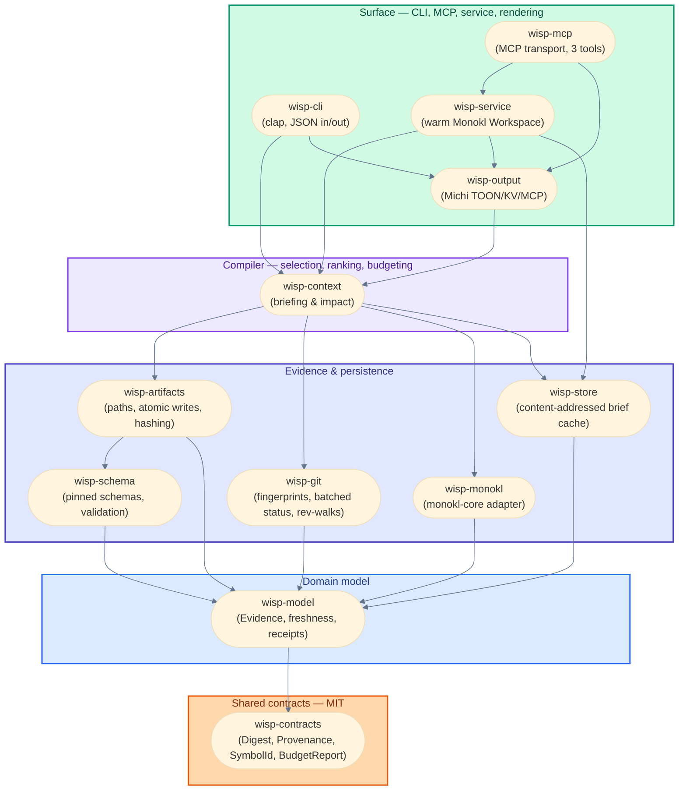

# Architecture

Prose companion to [`docs/02-architecture-and-contracts.md`](docs/02-architecture-and-contracts.md), which is the full contract. This is the map: what exists today, how it fits together, where to look next.

## System view

```text
                         canonical inputs
 ┌───────────────────────────────────────────────────────────────────┐
 │ Git worktree/history   docs/*.json   ADRs/docs   Monokl evidence   │
 └───────────────────────────────────────────────────────────────────┘
              │                 │              │              │
              └─────────────────┴──────┬───────┴──────────────┘
                                       ▼
                         wisp-workspace / wisp-context
                         validate · join · rank · bound · cite
                                       │
                   ┌───────────────────┴───────────────────┐
                   ▼                                       ▼
            rebuildable `.wisp/`                    typed result model
            brief cache / optional FTS                       │
                                                           ┌─┴──────────────┐
                                                           ▼                ▼
                                                    wisp CLI          wisp MCP
                                                    JSON/TOON          MCP result
```

## Crates

Arrows point from a crate to what it depends on. Layers are dependency depth, not license tiers, though the two coincide at the bottom: `wisp-contracts` and `wisp-model` are `MIT` and everything above them is `FSL-1.1-MIT` (D-021).



`wisp-fixtures` is test-only and sits outside the graph; it depends on `wisp-model` alone.

| Crate | Status | Responsibility |
| :--- | :--- | :--- |
| `wisp-model` | shipping | IDs, DTOs, provenance, freshness. Depends on nothing else in the workspace. |
| `wisp-schema` | shipping | Vendored, pinned JSON Schemas; draft-2020-12 validation. |
| `wisp-artifacts` | shipping | Canonical path resolution, atomic persist, content hashing, local Git state. Also ahead of spec — see below. |
| `wisp-cli` | shipping | `wisp artifact validate/persist/get/status`. JSON in, JSON out. |
| `wisp-fixtures` | stub | Reserved for fixture JSON and black-box test helpers; holds only a stage marker constant today. |
| `wisp-contracts` | not started | Shared interchange vocabulary — `Digest`, `Provenance`, `CapabilityPrecision`, `SymbolId`, `BudgetReport` — `MIT`. A workspace member published from this repository at its own version (D-027). No schemas; those are vendored from Wisp Plugins (Milestone 0, D-010). |
| `wisp-git` | not started | Fingerprints, one batched `git status`, path-filtered rev-walks via `gix`/`callisto-vcs` (Milestone 2, D-013). |
| `wisp-monokl` | not started | Adapter over `monokl-core`'s `Workspace`/`Snapshot`/batch API — library embed, no CLI adapter (Milestone 3, D-017). |
| `wisp-store` | not started | Content-addressed brief cache; FTS only when measured necessary. No SQLite artifact graph (Milestone 2, D-011). |
| `wisp-context` | not started | Briefing/impact compiler (Milestone 3). |
| `wisp-output` | not started | Michi TOON/KV/MCP rendering, and the conversion from `wisp-contracts` types into Michi's own rendering types (Milestone 4; Michi is a `git` + `rev` dependency during development — D-006, D-024). |
| `wisp-service` | not started | Optional daemon (Milestone 5). |
| `wisp-mcp` | not started | MCP transport (Milestone 4). |

Everything past `wisp-fixtures` is future milestone work per [`docs/03-delivery-plan.md`](docs/03-delivery-plan.md). Don't scaffold it early — a crate lands when its milestone starts.

## Current slice: WISP-001

The active unit is the spec@1 vertical slice: validate, persist, retrieve, hash, local Git state. See [`docs/spec/WISP-001/00-overview.md`](docs/spec/WISP-001/00-overview.md) for the prose spec and [`docs/specs/WISP-001.json`](docs/specs/WISP-001.json) for the machine contract.

## Ahead of spec

`wisp-artifacts` already ships `discover_graph`, `assemble_context`, and `ArtifactLink`/`ContextPackage` types — multi-artifact-type discovery, link resolution, and one-hop context assembly across `requirement@1`/`research-report@1`/`spec@1`/`plan@1`/`arch-model@1`. `wisp-schema`'s `Contract` enum embeds schemas for all five types.

None of this is in WISP-001's scope: its non-goals explicitly exclude other artifact types and impact/context work, reserved for Milestone 3. It works and is tested, but it landed without a spec, without a gate, and without anyone deciding it belongs in this crate. Reconcile before adding more: either fold it into a new gated spec, or hold the line at spec@1-only until WISP-001 actually closes. See [`docs/spec/WISP-001/02-decisions.md`](docs/spec/WISP-001/02-decisions.md).

## Known gaps

- **No fixtures in `wisp-fixtures`** — the fixture JSON files live under top-level `fixtures/` and are consumed directly by `wisp-cli`'s integration tests instead.
- **WISP-001 is ungated** — its plan (`docs/projects/WISP-001.json`) hasn't been through `navigator:challenger`, and its spec hasn't been through `scribe:exit-gate`. See the decisions doc for the specific defects.
- **The five crate `moon.yml` files are cache-unsound for in-repo dependencies.** Each runs `cargo <cmd> -p <crate>` and declares no `inputs`, so moon hashes each project over its own directory alone and no `dependsOn` edge compensates. A change to `wisp-model` does not invalidate `wisp-cli`'s cached test, so `just` can report green over code it never compiled. This is a scaffold bug, not a polyrepo concern — it predates any sibling-repository question. The fix is a shared `.moon/tasks/rust.yml` whose task inputs name the workspace `Cargo.toml` and `Cargo.lock` alongside the project glob, with each crate declaring `language: rust` and inheriting from it.
- **Two error-layer violations against [`docs/02` §12](docs/02-architecture-and-contracts.md).** `wisp-schema` derives `miette::Diagnostic` on `SpecValidationError` with `#[source_code]` and `#[label]` fields, though the domain layer is supposed to carry plain offsets and no rendering. `wisp-cli`'s `error_json` then hand-maintains a second code vocabulary that already disagrees with the derive's, emitting `schema_violation` where the derive says `wisp::schema::violation`; an MCP surface would need a third. Both fixes are M1 work: a `SchemaError` carrying `offset` and `len` as plain fields, and one transport diagnostic that CLI JSON, MCP, and Michi all read.
