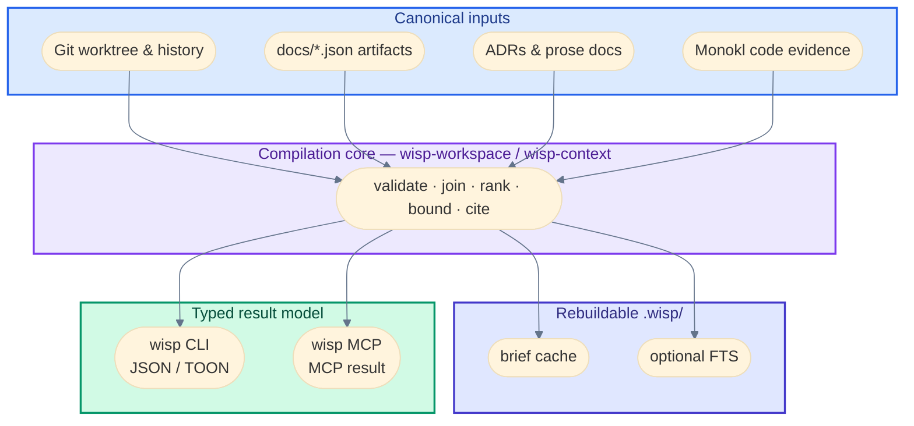
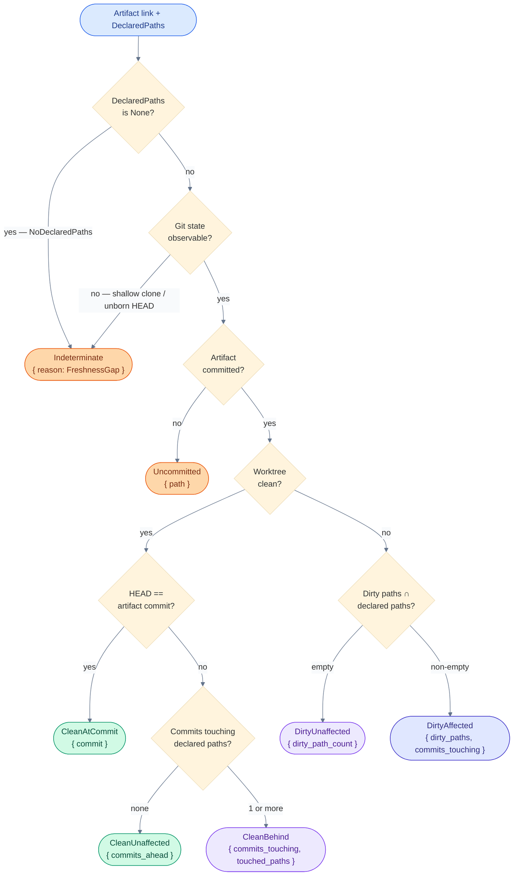
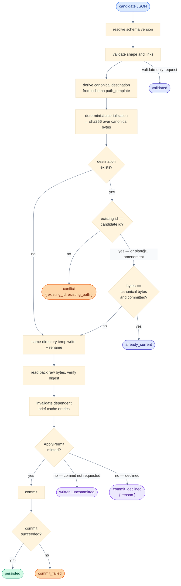
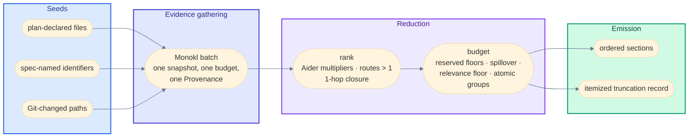
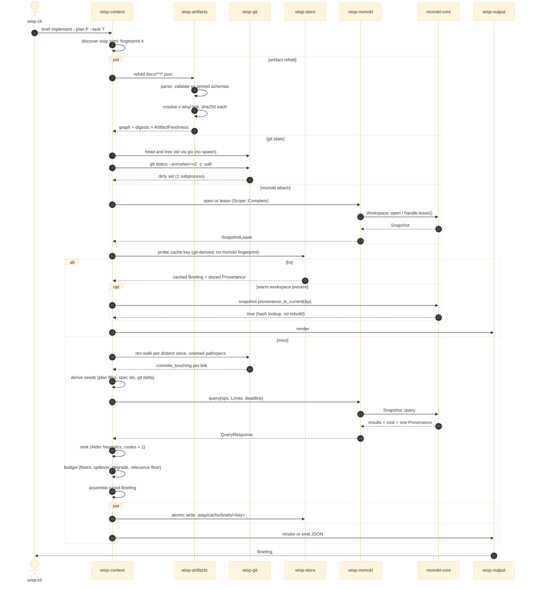

# Wisp: Architecture and Contracts

## 1. System view

Canonical inputs flow through one validation-and-compilation core; the CLI and MCP surfaces are thin renderings of the same typed result.



The library owns the behavior. The CLI and MCP must not reimplement artifact validation, cache invalidation, Git inspection, ranking, or response shaping.

## 2. Crate topography

### 2.1 Workspace crates

| Crate | Responsibility | Depends on |
| --- | --- | --- |
| `wisp-contracts` | Shared interchange vocabulary across Wisp, Monokl, and Lumen: `Digest`, `CapabilityPrecision`, `Diagnostic`, `Provenance`, `SymbolId` grammar, truncation/budget report shape. `MIT`. Value types only — nothing computed, no artifact schemas. Published from this workspace at its own version (D-027). | nothing |
| `wisp-model` | Public IDs, DTOs, `Evidence<T>`, `EvidenceSource`, `ArtifactFreshness`, `EvidenceFreshness`, receipts, query/result contracts | `wisp-contracts` |
| `wisp-schema` | Schema registry, validation, immutable schema-version resolution, link/path declarations read from schema metadata | model |
| `wisp-artifacts` | Canonical paths, deterministic serialization, atomic writes, hashing, link validation, conflict detection | model, schema |
| `wisp-git` | Repository discovery, HEAD/tree/worktree fingerprints, batched status, path-filtered commit walks | model; `gix` for objects/refs/walks, `git status` subprocess for worktree status (see D-013) |
| `wisp-monokl` | Typed adapter over Monokl's `Workspace`/`Snapshot`/batch-query library API | model; `monokl-core` only, never `monokl-agent` |
| `wisp-store` | Content-addressed brief cache; optional FTS over prose docs. No artifact graph — that's refolded in memory. | model |
| `wisp-context` | Context and impact compiler: selection, ranking, budgeting, evidence reduction, freshness decisions. Owns the only token budget and the `TokenMeasure` trait; `tiktoken-rs` is an optional feature and `ByteUpperBound` is the dependency-free default. | artifacts, git, monokl, store |
| `wisp-output` | TOON/KV/hints/MCP presentation via Michi | model/context; Michi |
| `wisp-service` | Optional long-lived workspace process holding a warm Monokl `Workspace` | context/output/store |
| `wisp-cli` | Clap boundary, JSON in/out, `miette` diagnostics | context/output |
| `wisp-mcp` | MCP transport; three tools mapped to library calls | service/output |
| `wisp-fixtures` | Fixture workspaces, contract fixtures, evaluation helpers | test-only |

`wisp-model` is deliberately boring and stable. It must not depend on Tokio, MCP transport types, Monokl implementation types, SQLite, or CLI formatting. It may depend on `wisp-contracts` — that crate exists precisely so `wisp-model` can name a `SymbolId` or a `CapabilityPrecision` without depending on Monokl.

`wisp-contracts` and `wisp-model` are `MIT`; every other crate in the table is `FSL-1.1-MIT` (D-021). The split is a license boundary as well as a dependency one: a third-party harness plugin may link the two permissive crates and nothing above them.

`monokl-core` and `michi` are unpublished sibling repositories. Both are declared as `git` dependencies pinned by `rev`, never as committed path dependencies (D-024). Local co-development uses a gitignored `.cargo/config.toml` `[patch]`; the committed lockfile must record a git source for both, which CI checks. See `docs/07-build-and-release.md`.

### 2.2 Implementation dependencies

| Concern | Recommendation | Rule |
| --- | --- | --- |
| JSON | `serde`, `serde_json` | Canonical artifact schemas remain separately versioned contracts |
| Schema | `schemars` plus a draft-2020-12 validator | Generated Rust schema is helpful; the pinned JSON schema is authoritative |
| Errors | `thiserror` | Domain crates expose typed errors, never CLI strings. One `#[non_exhaustive]` enum per crate. See §12. |
| Error transport | `wisp_contracts::Diagnostic` | One serde value serves CLI JSON, MCP `structuredContent`, and — through `wisp-output`'s conversion — Michi. Produced by one `WispDiagnostic` impl per domain enum. |
| CLI diagnostics | `miette` | `wisp-cli` only, over the transport value; the `miette::Diagnostic` derive appears in no other crate and `fancy` in no other `Cargo.toml` |
| Paths | `camino` | Workspace-facing paths use UTF-8 path types consistently |
| Hashes | `sha2` for artifacts, `blake3` for cache keys | OCI digest grammar `algorithm:hex`, always prefixed. `sha256:` for anything crossing a process boundary; `blake3:` allowed inside `.wisp/`. See D-009. |
| Atomic I/O | `tempfile`, `fs2` | Same-directory temp write + rename; inter-process writer coordination |
| Git objects/refs/walks | `gix` (or `callisto-vcs`, MIT/Apache-2.0) | Typed, in-process; preserve exact commit/tree IDs |
| Git worktree status | one `git status --porcelain=v2 -z --untracked-files=all` per workspace | `gix-status` is not yet a stabilization candidate; swap behind a trait when it is, with a benchmark |
| FTS | `rusqlite` + FTS5, only when measured necessary | Prose-doc search is the only trigger. See D-011. |
| CPU work | `rayon` | Independent CPU-bound collection/reduction only. Entered from a Wisp pool thread or the actor thread, never from a tokio worker or a `spawn_blocking` thread; nothing inside a rayon job calls `block_on` or `block_in_place`. See §7.3. |
| Service I/O | `tokio` | Optional service/MCP/watch boundary; never in models. Transport framing and JSON only — the bridge to analysis is a crossbeam channel out and a `tokio::sync::oneshot` back, never `spawn_blocking`. |
| Token measurement | `tiktoken-rs` ≥ 0.12, optional | `wisp-context` only, behind a feature. Construct through `*_singleton()`; 0.6's singleton returns `Arc<Mutex<CoreBPE>>` and serializes concurrent `encode`. |
| Tracing | `tracing` | Structured events; no raw sensitive content by default |
| Filesystem watch | `notify` | Service phase only, never required for correctness. Bazel's `--watchfs` history is the warning. |
| Snapshot/property tests | `insta`, `proptest` | Deterministic render and invalidation invariants |

Three exclusions: no async database abstraction, no code index (Monokl owns code search), no vector dependency in the initial build.

## 3. Evidence model

### 3.1 The wrapper

Every value Wisp reports is wrapped. This type makes "every claim carries its class" (PRINCIPLES) a compile-time property instead of a convention.

```rust
pub struct Evidence<T> {
    pub value: T,
    pub source: EvidenceSource,
    pub provenance: Provenance,      // wisp-contracts: agent, activity, inputs, workspace fingerprint
    pub freshness: EvidenceFreshness,
    pub routes: RouteSet,             // which derivation routes selected this item; §3.4
}

pub enum EvidenceSource {
    CanonicalArtifact   { artifact: ArtifactRef, content_hash: Digest },
    CanonicalGit        { revision: GitOid, dirty: bool },
    DerivedStructural   { analyzer: AnalyzerId, precision: CapabilityPrecision, scope: Scope },
    DerivedRelationship { rule: RuleId, inputs: Vec<EvidenceRef> },
    RetrievalCandidate  { query: QueryId, score: f32, rank: u32 },
    Presentation,
}
```

### 3.2 Rules that follow from the shape

**Precision lives inside `DerivedStructural`, not as a peer field.**
- A spec has no precision; a Git commit has none; a retrieval hit has a score, a different quantity.
- A flat `precision: Option<_>` invites the silent-upgrade bug the architecture forbids.

**Retrieval candidates cannot become evidence without confirmation.**
- Retrieval returns `Candidate<T>`; the only path to `Evidence<T>` is `confirm()`, which reads the current canonical source and returns `Result<Evidence<T>, Stale>`.
- A sum type, not a value plus a flag.

**Joins have one combinator.**
- `Evidence<A>::join(Evidence<B>) -> Evidence<(A, B)>`: freshness is the worst of the two, precision is the minimum over structural inputs, provenance inputs are unioned, source becomes `DerivedRelationship`.
- This is Glean's derived-fact rule (`O1 && … && On`) and the provenance-semiring `·` operator.
- A briefing is nothing but joins; one implementation means one place to test that a derived claim reports stale when any input is stale.

### 3.3 Provenance

Provenance answers three questions: who produced it (`AnalyzerId { name, version, config_hash }`), what operation (`OperationId { op, normalized_params }`), from which inputs (`Vec<InputRef { path, Digest }>`). Timestamps are display-only. Hashes decide.

Two wire rules the contracts crate fixes, because both are silent-corruption bugs rather than style: `WorkspaceFingerprint` serializes as hex strings, since a `u64` exceeds JavaScript's safe integer range and a rounded fingerprint never compares equal; and every timestamp, `observed_at` included, is epoch milliseconds as an integer, not a `SystemTime` object no non-Rust consumer expects. Wire keys are camelCase throughout.

### 3.4 Derivation routes

`AffectedBy` names *which* route selected an item. It is one enum, defined here and shared by the briefing and `wisp impact` (§10), because both answer the same question. Carrying a bare count in one place and a name in the other would be two mechanisms for one concept.

```rust
pub enum AffectedBy {
    TouchedFile         { path: Utf8PathBuf, since: CommitSha },
    DeclaredPath        { artifact: ArtifactRef, path: PathSpec },
    NamedIdentifier     { artifact: ArtifactRef, symbol: SymbolId },
    UpstreamLink        { from: ArtifactRef, field: LinkField },
    DownstreamDependent { of: ArtifactRef, field: LinkField },
    /// Monokl import-closure edge. Carries precision so a `Structural` edge is never
    /// presented as an `Exact` one.
    ImportClosure       { seed: Utf8PathBuf, hops: u8, precision: CapabilityPrecision },
    ConfigChange        { key: ConfigKey, from: Digest, to: Digest },
}

/// Non-empty by construction: an item with no route was never selected.
pub struct RouteSet(Vec<AffectedBy>);

impl RouteSet {
    /// # Errors
    /// Returns `EmptyRouteSet` when `routes` is empty.
    pub fn new(routes: Vec<AffectedBy>) -> Result<Self, EmptyRouteSet>;
    #[must_use] pub fn len(&self) -> usize;
    #[must_use] pub fn as_slice(&self) -> &[AffectedBy];
}
```

`routes.len()` is the multi-route ranking signal of §9.3 rule 4 and the hypothesis Q-013 tests. The set additionally says which routes, which is what a reader needs to judge the signal.

## 4. Freshness model

### 4.1 Two axes

Two axes, kept separate because they answer different questions.

```rust
/// Did the artifact's own bytes change since a consumer recorded them? Answerable with no Git.
pub enum ArtifactFreshness {
    Matches  { hash: Digest },
    Diverged { recorded: Digest, current: Digest },
    Missing  { expected_path: Utf8PathBuf },
}

/// Has the code an artifact-link points at moved since the artifact was committed?
pub enum EvidenceFreshness {
    CleanAtCommit   { commit: CommitSha },
    CleanUnaffected { artifact_commit: CommitSha, head: CommitSha, commits_ahead: u32 },
    CleanBehind     { artifact_commit: CommitSha, head: CommitSha, commits_touching: u32, touched_paths: Vec<Utf8PathBuf> },
    DirtyUnaffected { head: CommitSha, dirty_path_count: usize },
    DirtyAffected   { head: CommitSha, dirty_paths: Vec<Utf8PathBuf>, commits_touching: u32 },
    Uncommitted     { path: Utf8PathBuf },
    Indeterminate   { reason: FreshnessGap },
}
```

### 4.2 How a variant is chosen



`commits_touching` is path-filtered ("predates 7 commits to `auth.rs`"), never distance-from-HEAD. `Uncommitted` is where Q-002 and Q-010 meet: a never-committed artifact has no commit to measure from, and without this variant it reports as current. `Indeterminate` covers shallow clones, unborn HEAD, and an artifact with no declared paths — an unknown is never reported as `Clean`. No threshold constant lives in the enum; a briefing profile decides what warns.

### 4.3 Declared paths

`EvidenceFreshness` is computed against an artifact's *declared paths*: the workspace-relative locations the artifact itself names as the code it governs. Every type answers from its own schema fields or not at all. No path is inferred from prose, from an identifier, or from a filename resemblance.

| Artifact type | Declared paths come from | If absent |
| --- | --- | --- |
| `requirement@1` | nothing — no path-bearing field exists | `None { SchemaDeclaresNone }`. No inheritance: reaching a plan needs two reverse hops. |
| `research-report@1` | nothing — `findings[].evidence` is one free-text field holding "file path, URL, doc section, or test output" | `None { SchemaDeclaresNone }`. Prose is never path-parsed. |
| `spec@1` | nothing of its own; `api_surface[].name` is an identifier seed, not a path | Inherit the union of `plan@1.tasks[].files.*` over every plan whose `linked_spec` is this spec's id. No such plan: `None { NoInheritanceSource }`. |
| `plan@1` | `tasks[].files.create ∪ modify ∪ test`, as exact files. A requested task narrows to that task's `files.*`. | `None { FieldEmpty }` |
| `arch-model@1` | `modules[].path` as directory **prefixes**, plus `canonical_abstractions[].location` as exact files | `None { FieldEmpty }`. `invariants[].enforced_by` is free text and is never parsed. |
| `verdict@1` | `blockers[].location`, parsed best-effort as `path` or `path:line` | Unparseable entries raise `UnparseableLocation` and are excluded, never silently dropped. Zero parseable: `None { AllLocationsUnparseable }`. |
| `finding-report@1` | `findings[].file`, as exact files | `None { FieldEmpty }`. `modules_scanned` is excluded deliberately: it would make every report stale on any commit. |
| `changeset@2` | `files_changed ∪ tests_added ∪ criteria_evidence[].{test_file, implementation_file}`, as exact files | unreachable — `files_changed` has `minItems: 1` |

A `spec@1` inherits from the plans that link to it rather than reporting `Indeterminate` forever. Three constraints keep the reverse link honest.

1. **One hop, and only to an artifact with `Own` paths.** A `requirement@1` does not reach a plan through a spec. Two reverse hops fan out without bound and stop being a statement the requirement made.
2. **Only prospective path fields are inheritable.** `plan@1.tasks[].files.*` declares what will be touched. `changeset@2.files_changed` and `finding-report@1.findings[].file` record what was; they are `Own` for those artifacts and are never inherited upward. Otherwise a merged changeset would define what governs live work.
3. **Inheritance is labeled, never silent.** The result is `Inherited { from, rule, paths }`, and the enclosing `Evidence` carries `DerivedRelationship { rule: RuleId("declared-paths/inherit-from-plan"), inputs }`. §3.2's join rule then applies: a spec's freshness is never better than that of the plan it borrowed from.

```rust
/// A declared location. `Prefix` matches the directory and everything beneath it.
pub enum PathSpec {
    File   { path: Utf8PathBuf },
    Prefix { path: Utf8PathBuf },
}

pub enum DeclaredPaths {
    /// The artifact's own schema fields named these.
    Own(Vec<PathSpec>),
    /// Borrowed across one reverse link. `from` is the artifact that declared them.
    Inherited { from: ArtifactRef, rule: RuleId, paths: Vec<PathSpec> },
    /// Nothing declared. Feeds `EvidenceFreshness::Indeterminate`.
    None { reason: NoPathsReason },
}

pub enum NoPathsReason {
    /// The schema has no path-bearing field.
    SchemaDeclaresNone,
    /// The schema has one; this document left it empty.
    FieldEmpty { field: &'static str },
    /// A `spec@1` with no plan linking to it.
    NoInheritanceSource { sought: ArtifactType, via: &'static str },
    /// Every candidate location failed to parse.
    AllLocationsUnparseable { attempted: u32 },
}
```

`PathSpec` replaces a bare `Utf8PathBuf` because `arch-model@1.modules[].path` is a module root, not a file. Intersecting a dirty set against a directory as if it were a file reports `DirtyUnaffected` for every change inside that module — a false `Clean`, which is exactly what this section forbids.

`FreshnessGap` gains `NoDeclaredPaths { reason: NoPathsReason }`, so `Indeterminate` always says which of the four reasons applies. Resolution is pure over the refolded graph, and the returned paths are sorted and deduplicated so two refolds of one snapshot produce byte-identical output.

### 4.4 Cost

One `status()` per workspace for the dirty set, and one bounded rev-walk per distinct `since` commit over the union of all links' pathspecs, bucketed per link afterwards. Callisto's `commits_since_with_pathspec` (`rev_walk(head).with_hidden(since)`) is the reference implementation and is permissively licensed.

## 5. Monokl integration

### 5.1 Ownership boundary

| Owner | Owns |
| --- | --- |
| Monokl | Parsing and per-language capability; symbols, definitions, references, imports, exports, blocks, search; its content-hash parse cache and workspace index; the precision and provenance of each code result |
| Wisp | Mapping an artifact task to files/symbols/tests; mapping a Git delta to affected artifacts/invariants; enforcing artifact links, hashes, freshness; compiling a bounded briefing with provenance |

Wisp never copies Monokl's AST into its own store. It stores `Provenance` records — workspace fingerprint, input digests, `SymbolId`, operation, precision, scope — and revalidates them with `Snapshot::is_current(&provenance)`.

### 5.2 Library embedding, not a CLI adapter

Wisp embeds `monokl-core` as a Rust library from the start. There is no CLI-adapter phase; it would be thrown away. The contract Wisp depends on is Monokl spec 08 (`docs/spec/08-library-session-api.md`):

- **Session shape.** `Workspace::open(opts)` once per briefing (or once per service lifetime), `snapshot()` for an immutable `Snapshot`, `apply_change(Change)` when Wisp already knows what changed from Git.
- **One batch per briefing.** `Snapshot::query(&QueryRequest) -> QueryResponse`: one batch, one `Provenance`, one work ceiling, results index-parallel to ops. Intermediate results never enter model context.
- **Scope on every result.** `Scope::Complete | Partial(PartialScope { seeds, hops, max_neighbors_per_seed, max_total_nodes, analysed })`. Under `Partial`, `dependents`/`refs` return `Unsupported` — Wisp must request a complete-scope snapshot for reverse-closure evidence and label partial-scope results as such.
- **Per-edge precision.** `CapabilityPrecision` on `dependents`/`refs`; ambiguous resolution is a candidate set plus diagnostic, never a single target at lower precision.

A `wisp-service` holds one warm `Workspace`; one-shot CLI opens with `Lifetime::OneShot`.

### 5.3 Precision and scope are carried through

Every code-backed claim carries Monokl's precision *and* scope. An `Exact` TypeScript resolver edge, a `Structural` Rust module-walk edge, and a `Partial`-scope symbol listing are three different kinds of evidence and are labeled as such. Wisp never upgrades confidence, and never presents a partial-scope answer as complete.

### 5.4 The budget seam

`monokl-core` returns fully ranked, deduplicated, **uncapped** results plus a per-op cost record. It applies no token budget, links no tokenizer, and owns no allocation policy. `wisp-context` holds the only budget (D-023).

```rust
pub struct QueryResponse {
    /// `results.len() == ops.len()`, including failed and skipped ops.
    pub results:     Vec<OpOutcome>,
    /// `cost.len() == ops.len()`. What each op produced, in units core computes for free.
    pub cost:        Vec<OpCost>,
    pub provenance:  Provenance,
    pub diagnostics: Vec<Diagnostic>,
}

/// `wisp_contracts::OpCost`, reproduced. Counts are `u64` and `elapsed` is integer milliseconds — contracts rules.
pub struct OpCost {
    pub bytes:          u64,
    pub items_returned: u64,
    /// Pre-ceiling count. `items_total > items_returned` is the only "there is more" signal.
    pub items_total:    u64,
    pub elapsed_ms:     u64,
    pub precision:      CapabilityPrecision,
    /// The `Limits` work ceiling — a memory guard, not a budget — cut this op.
    pub ceiling_hit:    bool,
}
```

Three reasons the budget belongs to the caller, in decreasing weight.

1. **Wisp budgets across categories Monokl cannot see.** One global cap spans governing artifacts, criteria, invariants, code evidence, Git evidence, risks, and truncation (§9.4). A Monokl-side token budget is at best a sub-budget of that, so Wisp would have to guess the code split before knowing what the artifact sections cost, then measure the returned bytes again to place them against reserved floors. That is two passes plus a round trip to fix a bad guess; caller-side budgeting is one pass.
2. **A caller-supplied measure closure cannot be digested.** `OperationId { op, normalized_params: Digest }` has no way to represent a `Box<dyn Fn(&str) -> usize>`, so two requests with identical ops and different measures would share an `OperationId` and `provenance_is_current` would call a stale cached result current.
3. **No tokens-per-byte constant is both safe and useful.** Rust source measures 3.78 bytes per token; the adversarial worst case is 1.0. A constant of 3.78 overruns by up to 3.8× on minified or control-character-dense content, and a constant of 1.0 is the byte bound with extra ceremony.

Core keeps only `Limits { max_items_per_op, max_bytes_per_op }`, framed as a memory guard, with `items_total` reporting what the ceiling cut.

**Byte length is an exact upper bound on token count, not a heuristic.** All 256 single-byte tokens are present in both `cl100k_base` and `o200k_base`; BPE never splits below a byte and every merge strictly reduces the count, so a pretoken of *k* bytes encodes to between 1 and *k* tokens. The measured worst case is exactly 1.000 tokens per byte and never above. So `remaining_budget >= s.len()` admits an item under any measure with the tokenizer never invoked — a prefilter with zero false negatives, which on ordinary source admits the great majority of items for free.

```rust
/// Names the measure that produced a token count — `"bytes"`, `"cl100k_base"`, `"o200k_base"`. Wisp-local; recorded next to every token total in a `BudgetReport`, never sent to Monokl.
pub struct MeasureId(pub String);

pub trait TokenMeasure: Send + Sync {
    fn id(&self) -> MeasureId;
    /// Exact count under this measure. May be expensive.
    fn count(&self, s: &str) -> usize;
    /// A cheap ceiling: `count(s) <= upper_bound(s)` for every `s`. Never approximate downward.
    fn upper_bound(&self, s: &str) -> usize { s.len() }
}
```

`ByteUpperBound` is the default and needs no dependency; it underfills by roughly 3.8× on real code and never overfills. A tokenizer measure must fall back to `upper_bound` above a hard byte cap, because `byte_pair_merge` is quadratic in pretoken length and 200 KB of one unbroken run takes 8.59 s. Whichever measure ran is recorded alongside the token count — a token total with no statement of what counted is not a number a consumer can act on.

**Wisp depends on `monokl-core` only, never `monokl-agent`.** Monokl's CLI, wire types, allocation policy, and tokenizer choice are then free to change without a Wisp release, and Wisp's dependency on Monokl's license surface stays confined to core.

## 6. Artifact model and persistence

### 6.1 Canonical artifacts

Initial contracts are Wisp Plugins' versioned JSON schemas: `requirement@1`, `research-report@1`, `spec@1`, `plan@1`, `arch-model@1`, `arch-audit@1`, `verdict@1`/`verdict@2`, `finding-report@1`, `changeset@2`, `release-artifact@2`.

Schemas are authored in Wisp Plugins (`agent-plugins/shared/schemas/`), immutable by version, and vendored into Wisp at a pinned revision with a recorded checksum (D-010). Wisp never reads a mutable schema file from a sibling checkout and calls it `@1`. Only Wisp and Wisp Plugins consume these schemas; Monokl, Michi, Lumen, and Prism do not.

### 6.2 Links and paths are schema metadata

Cross-artifact links, hash-of relationships, and path templates are declared as `x-wisp-*` annotations in the schema, not hardcoded in Rust. External validators ignore unknown `x-` keywords, so the direct-artifact fallback is unaffected.

```json
"linked_spec":    { "type": "string", "x-wisp-link": { "target_type": "spec@1", "by": "id", "cardinality": "one", "resolution": "required" } },
"spec_file_path": { "type": "string", "x-wisp-link": { "target_type": "spec@1", "by": "path", "same_target_as": "linked_spec" } },
"spec_hash":      { "type": "string", "x-wisp-hash-of": { "link": "linked_spec", "algorithms": ["sha256"] } }
```

At the schema root: `"x-wisp-artifact": { "id_field": "linked_spec", "path_template": "docs/projects/{linked_spec}.json" }`.

`same_target_as` makes the id/path pair checkable. `x-wisp-hash-of` turns `plan@1.spec_hash` from a special case into a generic `ArtifactFreshness` check any artifact inherits. Backstage's catalog — relations derived from typed fields by a generic processor — is the precedent.

### 6.3 Persist pipeline



Hashing before the write is what makes `already_current` detectable; hashing after would overwrite the evidence.

### 6.4 Receipt states

| State | Meaning |
| --- | --- |
| `validated` | Shape and links check out; nothing written |
| `already_current` | Destination bytes equal the canonical bytes and are committed |
| `written_uncommitted` | Artifact written to its canonical path, not committed |
| `persisted` | Written and committed |
| `commit_declined { reason }` | `NotRequested \| ApprovalDenied \| NotARepository \| PolicyDisabled` |
| `commit_failed` | Commit attempted and failed |
| `conflict { existing_id, existing_path }` | Destination holds a different artifact id |

`commit_declined` is not an error and is not `commit_failed`, but it is always recorded — silence is never mistaken for a clean check. `persisted` without a commit is unrepresentable: the commit step takes a zero-sized `ApplyPermit` minted once from the CLI flag plus harness approval (Callisto's pattern).

Conflict rule: the destination's id must equal the candidate's id. For `plan@1`, equal `linked_spec` is an amendment (allowed overwrite per the constitution); unequal is a conflict.

```json
{ "status": "persisted", "artifact_type": "spec@1", "id": "SPEC-021", "path": "docs/specs/SPEC-021.json", "content_hash": "sha256:…", "source_revision": "git:abc123", "cache_invalidated": ["brief:implement:PLAN-014"] }
```

### 6.5 Direct-artifact fallback

Wisp is preferred but optional. A plugin can read `spec_file_path`/`plan_file_path`, validate against the pinned schema, and compute `sha256` with nothing but its language's standard library. That last property is why artifacts hash with SHA-256 and not BLAKE3.

## 7. Cache and store design

### 7.1 Three contents, three storage decisions

| Content | Storage | Why |
| --- | --- | --- |
| Artifact graph and links | in-memory refold from `docs/**/*.json` on every invocation | Bounded by human authorship — tens to low hundreds of documents. Milliseconds. Trivially satisfies "delete `.wisp/`, rebuild identically." |
| Brief cache | content-addressed files under `.wisp/cache/briefs/<key>` plus the `(source, Digest)` set each brief was derived from | Atomic writes and eviction for free; validity is the conjunction of input digests, so a miss reports *which* input moved |
| FTS over prose docs/ADRs | `rusqlite` + FTS5, **only if measured necessary** | The one part not bounded by artifact count |

Configuration lives in `wisp.toml` at the workspace root, Git-tracked (D-022). It is not under `.wisp/`: configuration is neither rebuildable nor derived, and `.wisp/` is the directory a workspace naturally gitignores, so config there would not survive a fresh clone and would silently change every artifact path for the next reader.

```text
wisp.toml            # workspace configuration, tracked
.wisp/
  cache/briefs/      # content-addressed compiled packets
  locks/             # writer coordination
  diagnostics/       # optional sanitized operational diagnostics
  fts.sqlite         # only if prose FTS is enabled
```

### 7.2 Cache validity

A brief is a derived fact, valid iff every input is valid. Probe and hit validation are separate steps, because conflating them makes every cache hit pay for a warm Monokl open.

**The probe key deliberately excludes Monokl's `WorkspaceFingerprint`.** Computing that fingerprint requires `Workspace::open`, which costs 150–400 ms warm at 5k files — more than the entire target hit path. The key is instead:

```text
blake3(
  wisp_version, schema_registry_version, config_fingerprint,
  head_tree_oid, blake3(git_status_porcelain_bytes),
  monokl_version, monokl_config_hash,
  sorted[(artifact_id, artifact_digest)],
  stage, plan_id, task_id, detail, budget, measure_id, section_order_policy
)
```

Git's tree oid plus a digest over the porcelain status output is a sound over-approximation of Monokl's fingerprint: every file Monokl analyzes is tracked, untracked-and-unignored, or ignored by both, so any change Monokl would observe changes this digest. Over-approximating produces false misses, never false hits.

**Monokl provenance is validated on the hit, not in the key.** The stored entry carries the `Provenance` it was built against. When a warm `Workspace` exists, the entry is confirmed with `Snapshot::provenance_is_current(&p)` — a hash-map lookup per input, no index rebuild. When none exists, the git-derived key stands alone and the brief records `ProvenanceCheck::GitDerived`, so a consumer can see which of the two checks actually ran rather than assuming the stronger one.

`config_fingerprint` is D-022's canonicalized, defaults-applied field set, never the file bytes. Wisp's global inputs — schema registry version, configuration fingerprint, Monokl version — invalidate everything derived, as a stated rule with a test (Nx's lockfile rule).

Filesystem mtime is never identity.

### 7.3 Multi-process safety

The preferred daemon mode is one workspace-scoped service owning the brief cache and a warm Monokl `Workspace`. One-shot CLI clients run read-only or rebuild work. Writers to `.wisp/cache/` take an `fs2` file lock. Wisp never writes Monokl's cache; it calls `flush_cache()` and lets Monokl own the lifecycle.

### 7.4 Threading model

**Tokio owns the transport edge only. Analysis runs on Wisp's own fixed-size pools. A tokio thread never calls into `monokl-core`, and a pool thread never calls `block_on`.** The two communicate in one direction: tokio to pool over a crossbeam channel, pool back to tokio over a `tokio::sync::oneshot`. rust-analyzer, `ty`, and `ruff` arrived at this shape independently; none puts an async runtime under the analysis path.

**An actor thread owns `Workspace` by value, and readers never touch it.** The current `Snapshot` is published beside the actor in an `RwLock<Arc<Snapshot>>`, and the write lock is held for one pointer store, never for a rebuild.

| Shape | Why not |
| --- | --- |
| `Mutex<Workspace>` | Every reader takes the lock merely to call `snapshot()`, and a writer starves them. `Workspace::open` is seconds and `apply_change` is 100 ms–1 s at 5k files; both become full-stop holds. |
| `RwLock<Workspace>` | Readers do release quickly, but `apply_change` holds the write lock for its whole duration and there is no way to express "keep serving the previous snapshot while the next one builds". |
| Actor plus published snapshot | `&mut self` for `apply_change` is free because the actor owns the value, and readers never queue behind it. |

**Queries run on a fixed pool of `min(available_parallelism(), 4)` threads, not `spawn_blocking`.** Tokio's blocking pool defaults to 512 threads with a queue that "does not apply any backpressure", its tasks cannot be aborted, and its own documentation directs CPU-bound work to a bounded executor instead. rayon compounds it: called from a non-rayon thread, `Registry::in_worker` injects the job and parks the caller on a latch, so the calling thread contributes no work and is consumed for the whole call.

**The pool cap is a memory bound first and a throughput choice second.** Each in-flight request holds a `SnapshotLease`, which is `!Clone` by construction so a request cannot fan one revision across its own subtasks or store it past its own lifetime. Live revisions are then `1 + pool_size`, with no bookkeeping.

A pinned `WorkspaceIndex` runs 9–14 MB at 5k files and 90–140 MB at 50k. Under the fixed pool of four, five live revisions cost 45–70 MB at 5k and 450–700 MB at 50k. Under tokio's default blocking pool, 513 live revisions cost 4.6–7.2 GB and 46–72 GB. That is the whole argument for the cap.

This is the mechanism behind M5's gate that two held snapshots across a change do not grow RSS without bound. A `live_leases` gauge is emitted to Lumen, so a leaked lease is observable rather than a slow climb.

rayon is entered only from a pool thread or the actor thread. Nothing inside a rayon job calls `block_on` or `block_in_place`, both of which can deadlock or stall shutdown under work-stealing re-entrancy.

## 8. Retrieval and vectors

For prose (decisions, specs, ADRs), FTS is the first mechanism and vectors are an optional later `wisp-semantic` feature. Vector rows carry source id and path, exact content digest and chunk bounds, model/provider/chunking version, and an opt-in privacy configuration. Vector retrieval returns `Candidate<T>`; `confirm()` reads the current canonical source before anything becomes `Evidence<T>`.

For code, structural retrieval through Monokl is the primary path. The precise claim: **structural retrieval beats embeddings at localization; embeddings beat lexical-only.** LocAgent's graph agent reaches 77.7 File Acc@5 where a code embedder gets 52.6 and BM25 gets 38.7. So "no code embeddings" is defensible only because Monokl supplies structural evidence — it is not a claim that lexical search suffices.

## 9. Context compiler

### 9.1 Compile pipeline



### 9.2 Briefing contract

`wisp-context` produces a typed `Briefing`. Sections, in emission order:

| Section | Contents |
| --- | --- |
| Request | stage, goal, workspace snapshot, task, budget |
| Governing artifacts | spec/plan/requirement/decision pointers with digests and `ArtifactFreshness` |
| Criteria | acceptance criteria relevant to the requested task |
| Architecture | applicable invariants, canonical abstractions, boundary rules |
| Code evidence | Monokl symbols/definitions/references/tests with per-item detail level, precision, scope |
| Git evidence | current delta, `EvidenceFreshness` per link, relevant commits |
| Risks/gaps | absent artifact, stale plan, `commit_declined` artifacts, suppressed warnings, unsupported language, `code_evidence_unavailable` |
| Truncation | itemized per category: omitted counts, omitted-for-budget vs omitted-below-floor, the count of items served at a lower detail level than requested, exact expansion query |
| Next actions | bounded, deterministic follow-up queries — not autonomous instructions |
| Restatement | task id and criterion ids, again |

Symbols and tests are one section with two budget categories; §9.3 rule 5 orders proving tests first within it.

Ordering is a named policy value, not hardcoded. The default puts session-stable material first (prompt-cache prefix hits and the primacy end of the position curve agree), bulk evidence in the middle, and what the model must act on — gaps, truncation, next actions, a restatement — at the recency end. Prism A/Bs this; the position-sensitivity literature does not reproduce cleanly on current models, so the default is a prior, not a result. `SectionOrder::new` rejects a sequence that is not a permutation of every `SectionKind`, so a policy cannot silently drop a section.

Sections are named struct fields rather than a `Vec<Section>`: their item types differ, and a typed briefing should be statically typed. Every type below lives in `wisp-model`; `SymbolId`, `Scope`, `CapabilityPrecision`, `Digest`, `Provenance`, `Diagnostic`, and `BudgetReport` come from `wisp-contracts`. No Monokl type is named.

```rust
pub struct Briefing {
    pub request:      Request,
    pub governing:    Vec<Evidence<ArtifactPointer>>,
    pub criteria:     Vec<Evidence<Criterion>>,
    pub architecture: Vec<Evidence<Invariant>>,
    pub code:         CodeEvidence,
    pub git:          GitEvidence,
    pub gaps:         Vec<Evidence<Gap>>,
    pub truncation:   TruncationRecord,
    pub next_actions: Vec<NextAction>,
    pub restatement:  Restatement,
    /// Emission sequence. A named policy, not a hardcoded order.
    pub order:        SectionOrder,
    /// One record for the whole compile, matching Monokl's one-batch-one-provenance rule.
    pub provenance:   Provenance,
}

pub struct Request {
    pub stage:    Stage,               // Implement | Review | ArchitectureAudit
    pub goal:     String,
    pub snapshot: WorkspaceSnapshot,   // head, tree oid, dirty fingerprint, config fingerprint
    pub task:     Option<TaskRef>,
    pub budget:   BudgetRequest,       // cap, requested detail, floor policy name, measure
}

pub struct CodeEvidence {
    pub symbols: Vec<Evidence<SymbolEvidence>>,
    /// Separate from `symbols` because §9.3 rule 5 orders proving tests ahead of inventory
    /// and §9.4 gives each its own reserved floor.
    pub tests:   Vec<Evidence<TestEvidence>>,
}

pub struct GitEvidence {
    pub delta:          Evidence<DeltaEvidence>,
    /// One entry per artifact link, carrying that link's `EvidenceFreshness` and the
    /// `DeclaredPaths` it was computed against.
    pub link_freshness: Vec<Evidence<LinkFreshness>>,
    pub commits:        Vec<Evidence<CommitEvidence>>,
}

pub struct Restatement {
    pub task:              Option<TaskRef>,
    pub criteria:          Vec<CriterionId>,
    pub governing_digests: Vec<(ArtifactRef, Digest)>,
}
```

The evidence catalogue is the set of `T` that `Evidence<T>` is instantiated at. It is closed: a briefing carries no untyped payload.

```rust
pub struct ArtifactPointer {
    pub artifact:  ArtifactRef,
    pub path:      Utf8PathBuf,
    pub digest:    Digest,                // sha256 over canonical bytes
    pub freshness: ArtifactFreshness,
    /// How the paths behind this pointer's `EvidenceFreshness` were obtained (§4.3).
    pub declared:  DeclaredPaths,
}

pub struct Criterion {
    pub id:            CriterionId,
    pub text:          String,
    pub source:        ArtifactRef,       // the spec@1 that states it
    pub is_error_case: bool,
    pub judgment_call: bool,
    /// From the plan task's `covers_criteria`. Empty means no task claims it.
    pub covered_by:    Vec<TaskRef>,
}

pub struct Invariant {
    pub name:      String,
    pub rule:      String,
    pub rationale: String,
    /// `None` is a machine-unenforced invariant, and is worth stating in the briefing.
    pub enforced_by: Option<String>,
    pub source:    ArtifactRef,
}

pub struct SymbolEvidence {
    pub symbol:    SymbolId,
    pub path:      Utf8PathBuf,
    /// Monokl's symbol kind as an opaque label: `wisp-model` must not name Monokl's enum.
    pub kind:      SymbolKindLabel,
    pub body:      SymbolBody,
    pub scope:     Scope,
    pub precision: CapabilityPrecision,
    pub roles:     SymbolRoles,           // Generated | Test occurrence bits
}

/// Detail is a sum type, not a level plus an optional body: `Path` carrying a body
/// is unrepresentable.
pub enum SymbolBody {
    Path,
    /// Signatures, fields, headers, module comments — Agentless's ~800-line form.
    Skeleton(SourceExcerpt),
    Full(SourceExcerpt),
}

/// Ordered so the degrade path is `cmp`, not a match ladder.
pub enum Detail { Path, Skeleton, Full }

pub struct SourceExcerpt {
    pub text:        String,
    pub start_line:  u32,
    pub end_line:    u32,
    /// Digest of the file the excerpt was cut from, so a cached brief can be revalidated.
    pub file_digest: Digest,
}

pub struct TestEvidence {
    pub symbol: SymbolId,
    pub path:   Utf8PathBuf,
    /// Non-empty means this test proves a selected criterion; empty means inventory.
    /// From `changeset@2.criteria_evidence` when one exists, from Monokl's `Test`
    /// occurrence role otherwise.
    pub proves: Vec<CriterionId>,
    pub body:   SymbolBody,
    pub roles:  SymbolRoles,
}

pub struct CommitEvidence {
    pub oid:     GitOid,
    pub subject: String,
    /// Only the intersection with declared paths. The full touched set is not evidence
    /// for this briefing and would blow the commits floor.
    pub touched: Vec<Utf8PathBuf>,
    /// Display only, epoch milliseconds. Hashes decide (§3.3).
    pub authored_at: EpochMillis,
}

pub struct DeltaEvidence {
    pub head:            CommitSha,
    pub dirty:           Vec<DirtyPath>,
    pub untracked_count: u32,
}

pub struct DirtyPath { pub path: Utf8PathBuf, pub status: WorktreeStatus }

pub struct LinkFreshness {
    pub from:      ArtifactRef,
    pub field:     LinkField,
    pub to:        ArtifactRef,
    pub freshness: EvidenceFreshness,
    pub declared:  DeclaredPaths,
}
```

Every gap carries the remedy that closes it. The rule that anything omitted is stated (§9.4) is worth little if the statement is not actionable.

```rust
pub struct Gap {
    pub kind:   GapKind,
    /// The deterministic call that resolves or investigates this gap. `None` only when
    /// no Wisp call can help, because the next step is a human decision.
    pub remedy: Option<NextAction>,
}

pub enum GapKind {
    ArtifactMissing         { expected: ArtifactRef, expected_path: Utf8PathBuf },
    ArtifactDiverged        { artifact: ArtifactRef, recorded: Digest, current: Digest },
    /// D-015: a declined commit is recorded, never silence.
    CommitDeclined          { artifact: ArtifactRef, reason: DeclineReason },
    /// From `DeclaredPaths::None`. Carries the reason, so `Indeterminate` is explained.
    NoDeclaredPaths         { artifact: ArtifactRef, reason: NoPathsReason },
    SpecFileUnset           { plan: ArtifactRef },
    PlanFileUnset           { plan: ArtifactRef },
    SpecDrift               { plan: ArtifactRef, recorded: Digest, current: Digest },
    /// Every acceptance criterion appearing in no task's `covers_criteria`.
    OrphanedCriterion       { criterion: CriterionId, spec: ArtifactRef },
    /// Monokl unavailable or a batch op failed. Carries Monokl's diagnostics verbatim.
    CodeEvidenceUnavailable { caused_by: Vec<Diagnostic> },
    /// A reverse-closure op requested under a partial-scope snapshot and refused.
    PartialScope            { op: OperationId, scope: Scope },
    UnsupportedLanguage     { path: Utf8PathBuf, extension: String },
    UnparseableLocation     { artifact: ArtifactRef, raw: String },
    SchemaViolation         { path: Utf8PathBuf, diagnostic: Diagnostic },
}
```

The truncation record is itemized because models cannot detect what is absent — a gap has no key to attend to.

```rust
pub struct TruncationRecord {
    pub per_category:   Vec<CategoryTruncation>,
    /// Atomic evidence groups dropped whole (D-018). One entry, not N items: "this
    /// criterion's evidence is absent" is the fact that matters.
    pub dropped_groups: Vec<GroupTruncation>,
    /// What the budgeter spent, and under which measure.
    pub budget:         BudgetReport,
}

pub struct CategoryTruncation {
    pub category:            Category,
    pub included:            u32,
    pub omitted_for_budget:  u32,
    pub omitted_below_floor: u32,
    /// Items served at a lower `Detail` than requested. §9.3 rule 7 degrades before
    /// dropping, so a record with only omission counts hides the commonest reduction.
    pub degraded_detail:     u32,
    /// The exact call that returns what was omitted.
    pub expansion:           NextAction,
}

pub enum Category { Governing, Criteria, Architecture, Symbols, Tests, Commits, Delta }
```

A next action is a deterministic Wisp call the agent can re-issue, never an instruction. `WispCall` renders to a CLI argv and to MCP `tools/call` params with one function each, so the same action is issuable from either surface — the property M4's parity gate already requires of results.

```rust
pub struct NextAction {
    pub id:     NextActionId,
    /// One clause naming what the call returns. Never an imperative.
    pub intent: String,
    pub call:   WispCall,
}

pub enum WispCall {
    Brief     { stage: Stage, plan: ArtifactId, task: Option<TaskId>, detail: Detail, budget: u32 },
    Artifacts { op: ArtifactOp },
    Check     { provenance: Digest },
    Impact    { paths: Vec<Utf8PathBuf>, closure: Closure },
}

/// A checked permutation of every `SectionKind`. Construction rejects a sequence that
/// drops a section: a policy that silently omits evidence would break D-008.
pub struct SectionOrder { name: PolicyName, sequence: Vec<SectionKind> }

pub enum SectionKind {
    Request, Governing, Criteria, Architecture, Code, Git, Gaps, Truncation, NextActions, Restatement,
}
```

One wire example, `briefing.code.symbols[0]`. Keys are camelCase, timestamps are epoch milliseconds, and digests carry their algorithm prefix.

```json
{
  "value": {
    "symbol": "monokl cargo wisp-context 0.1.0 budget/impl#[Budgeter]fit().",
    "path": "crates/wisp-context/src/budget.rs",
    "kind": "method",
    "body": {
      "detail": "skeleton",
      "text": "pub fn fit(&self, items: &[Ranked], cap: Tokens) -> Fitted",
      "startLine": 118,
      "endLine": 118,
      "fileDigest": "sha256:9f2c…"
    },
    "scope": { "kind": "complete" },
    "precision": "structural",
    "roles": []
  },
  "source": {
    "kind": "derivedStructural",
    "analyzer": { "name": "monokl", "version": "0.4.1", "configHash": "blake3:1a7e…" },
    "precision": "structural",
    "scope": { "kind": "complete" }
  },
  "provenance": {
    "agent":     { "name": "monokl", "version": "0.4.1", "configHash": "blake3:1a7e…" },
    "activity":  { "op": "symbols", "normalizedParams": "blake3:c40b…" },
    "inputs":    [{ "path": "crates/wisp-context/src/budget.rs", "content": "blake3:9f2c…" }],
    "workspace": { "head": "a3f19c4…", "config": "sha256:…" },
    "scope":     { "kind": "complete" },
    "precision": "structural",
    "observedAt": 1788445331000
  },
  "freshness": { "kind": "cleanAtCommit", "commit": "a3f19c4" },
  "routes": [
    { "kind": "declaredPath", "artifact": { "type": "plan@1", "id": "PLAN-014" },
      "path": { "kind": "file", "path": "crates/wisp-context/src/budget.rs" } },
    { "kind": "touchedFile", "path": "crates/wisp-context/src/budget.rs", "since": "9b21ee0" }
  ]
}
```

Two routes, so this item ranks above single-route peers. `precision` appears both inside `source.derivedStructural` and on the value; the value's copy is the per-item projection §5.3 requires, and the two must agree — a debug assertion in `Evidence::new` checks it.

### 9.3 Selection policy

1. Governing artifacts before supporting context.
2. Exact, complete-scope, current evidence before broad, partial, or low-precision evidence.
3. Select by explicit artifact link, task file declaration, Monokl impact edges, and Git delta. Never by similarity alone.
4. Rank with Aider's deterministic heuristics over a graph seeded by the plan's declared files, spec-named identifiers, and Git-changed paths: ×10 for artifact-mentioned identifiers, ×50 for files in the working set, ×0.1 for leading-underscore names and for identifiers defined in more than five files, `sqrt` damping on reference counts. Items selected by more than one route (`Evidence::routes > 1`) rank above single-route items.
5. Tests that prove selected criteria before unrelated test inventory. Carry Monokl's `Test`/`Generated` occurrence roles; down-rank generated code.
6. One hop of import closure from the seed set by default. Two hops only with a per-seed fan-out cap and skeleton detail — flattened two-hop expansion measures worse than no graph at all.
7. Three detail levels per code item: `Path`, `Skeleton` (signatures, fields, headers, module comments — Agentless's ~800-line form), `Full`. Degrade detail before dropping items.
8. Never include raw chain-of-thought or private session content.

### 9.4 Budget policy

One global cap, per-category reserved floors, spillover from higher to lower priority. Evidence groups are atomic: a criterion's whole evidence set is included or dropped and recorded — partial coverage of a criterion buys little, and starving a category is the dominant failure mode. A relevance floor drops items even under budget; width elasticity of evidence utilization is negative, so padding to the budget dilutes. Fit each budgeted tier with a binary search over prefix length (rendering is monotone in it) at a documented tolerance rather than an exact fit.

The truncation record is machine-readable and itemized. Models detect omitted content at roughly 70% F1 even in short contexts — a gap has no key to attend to — so anything omitted is stated.

### 9.5 End-to-end: `wisp brief implement`

The stages of `wisp brief implement --plan P --task T`, with the crate that owns each.

| # | Stage | Crate | Depends on | Concurrent with |
| --- | --- | --- | --- | --- |
| 0 | Config discovery and fingerprint | `wisp-cli` | — | — |
| 1 | Repository discovery, HEAD and tree oid | `wisp-git` | 0 | — |
| 2 | Artifact refold: walk, parse, validate, resolve links | `wisp-artifacts` | 0 | 3, 4 |
| 3 | Worktree status: one `git status` subprocess | `wisp-git` | 1 | 2, 4 |
| 4 | Monokl attach or open | `wisp-monokl` | 0 | 2, 3 |
| 5 | Cache probe against `.wisp/cache/briefs/<key>` | `wisp-store` | 1, 2, 3 | — |
| 6 | Freshness: rev-walks per distinct `since` over unioned pathspecs | `wisp-git` | 2, 3 | 4 |
| 7 | Seed-set derivation | `wisp-context` | 2, 3 | 4 |
| 8 | One `Snapshot::query` batch | `wisp-monokl` | 4, 7 | — |
| 9 | Rank | `wisp-context` | 6, 8 | — |
| 10 | Budget | `wisp-context` | 9 | — |
| 11 | Assemble typed `Briefing` | `wisp-context` | 10 | — |
| 12 | Cache write | `wisp-store` | 11 | 13 |
| 13 | Render or emit JSON | `wisp-output` | 11 | 12 |

Stages 2, 3, and 4 are mutually independent and are the whole concurrency opportunity: the refold is filesystem-and-CPU, `git status` is one subprocess, and the Monokl open is a rayon fan-out. Everything from 7 onward is strictly data-dependent. Stage 4 is skipped on a cache hit, along with 6 through 12.

Git state costs exactly two spawns' worth of work, and only one is a spawn: HEAD and tree oid come from `gix` in-process, and one `git status --porcelain=v2 -z --untracked-files=all` runs per invocation (D-013). `--porcelain=v2` because the four dirty `EvidenceFreshness` states need staged, unstaged, untracked, and renamed distinguished, which a flat changed-path list cannot supply. `Scope::Complete` is requested always for this stage: the batch issues `Refs` and `Dependents`, which are `Unsupported` under `Partial`. `wisp impact --closure direct` needs only forward closure and may run partial.



Seeds come from three routes, unioned, with `RouteSet` recording which selected each item: the task's `files.{create,modify,test}`, identifiers named in the covered acceptance criteria resolved to `SymbolId` where possible, and the Git delta from stages 3 and 6.

The batch is one `Snapshot::query`. For a task declaring three modify, one create, and two test files, a spec naming six identifiers, and a twelve-path delta:

| Ops | Form | Count | Purpose |
| --- | --- | --- | --- |
| 0 | `Symbols { files: modify ∪ create, detail: Full }` | 1 | working-set structure |
| 1 | `Symbols { files: test, detail: Full }` | 1 | proving tests |
| 2 | `Symbols { files: delta \ declared, detail: Lite }` | 1 | changed but undeclared, skeleton only |
| 3–8 | `Definition { symbol }` | 6 | one per spec identifier |
| 9–14 | `Refs { symbol, detail: Lite }` | 6 | callers of each; needs `Complete` |
| 15–18 | `Dependents { file }` | 4 | reverse edges into the working set; needs `Complete` |
| 19–22 | `Imports { file }` | 4 | one-hop forward closure |
| 23–26 | `Extract { file, span }` | 4 | spans the criteria cite |
| 27 | `Search { query, filter }` | 1 | fallback for criteria with no resolved identifier |

Twenty-eight ops, with deduplication collapsing the overlap where a delta path is also declared. Monokl's incremental and budget benchmarks specify a fixed ten-op batch, which under-measures the real workload by roughly threefold; the benchmark should use this shape.

Volumes on a 5,000-file repository holding 30 artifacts:

| Stage | Volume | Basis |
| --- | --- | --- |
| Artifact refold | 30 documents at 1–7 KB, ~90 KB total; ~10 schemas at 1–4 KB; ~40 link edges | measured over this repo's `docs/**/*.json` |
| `git status` | 1 spawn, ~5,000 index entries stat'd, output under 1 KB | extrapolated from a 338-file measurement |
| Rev-walks | 1–3 spawn-free `gix` walks, bounded by the hidden-tip frontier | artifacts land in batches, so distinct `since` commits are few |
| `WorkspaceIndex` resident | ~9–14 MB | linear scaling of Monokl's 90–140 MB at 50k |
| Seed set | 10–80 paths and identifiers | worked example above |
| Uncapped batch results | 2,000–5,000 symbols over ~60 files; 100–1,000 reverse edges; ~60 blocks at ~1 KB; 3–12 MB total | estimate, unmeasured |
| Post-budget briefing | 8,000 tokens ≈ 30 KB at the measured 3.78 bytes per token | measured ratio |
| Cache entry | 30–60 KB packet plus its input-digest set | derived |

Latency targets are budgets to enforce with a benchmark, not measurements. Wisp has none today.

| Scenario | p50 | p95 |
| --- | --- | --- |
| Cold one-shot: no Monokl cache, no `.wisp/` | 5 s | 8 s |
| Warm one-shot: Monokl cache present, brief cache miss | 700 ms | 1.2 s |
| Warm one-shot: brief cache hit | 120 ms | 250 ms |
| Service mode: brief cache miss | 250 ms | 500 ms |
| Service mode: brief cache hit | 30 ms | 60 ms |

Three things the table says. **Monokl's cold open dominates the cold path and is the single unvalidated input** — its own spec calls the sub-15-second target at 50k files "plausibly optimistic", and every cold figure here inherits that caveat, so Monokl's cold-open benchmark is a named M3 prerequisite. **The 120 ms warm hit is reachable only because the probe key excludes Monokl's fingerprint** (§7.2); including it would put a 150–400 ms warm open on every hit and make the hit path slower than the service-mode miss path. **Service mode's improvement on the miss path is entirely the avoided `Workspace::open`**, which is the justification for M5 stated as a number rather than an assertion.

## 10. CLI contract

Every automation-capable command supports `--format json`; text/TOON are presentation modes.

```bash
wisp artifact validate <candidate.json|-> --format json
wisp artifact persist  <candidate.json|-> --workspace . [--commit] --format json
wisp artifact get      SPEC-021 --workspace . --format json
wisp artifact status   SPEC-021 --workspace . --format json
wisp status  --workspace . --format json
wisp brief   implement --plan PLAN-014 --task T2 --detail skeleton --budget 8000 --measure bytes --format json
wisp impact  --paths src/retry/policy.rs --closure direct|deep --format json
wisp check   --provenance <file|-> --format json
wisp verify  workflow --scenario claude-spec_codex-plan --format json
```

`wisp impact` records *why* each artifact is affected, using the `AffectedBy` enum defined in §3.4 — the same values the briefing carries in `Evidence::routes`, not a parallel vocabulary. Like moon's `AffectedState`. Closure depth is a dial defaulting to `direct`.

`--budget` is meaningless without a unit, so `--measure bytes|cl100k|o200k` names it and defaults to `bytes` (§5.4). The emitted budget report states which measure produced the count.

CLI JSON is deterministic enough for snapshot tests. Human output uses `miette` and Michi only after the typed operation completes.

## 11. MCP contract

Three tools, namespaced `wisp_*`. Large catalogs measurably hurt tool selection; the literature is silent between one and three, and Sourcegraph's product answer (curate the default to eight, keep the rest reachable) argues for a few well-described tools over one with a mode enum.

| Tool | Maps to | Mutation | Why separate |
| --- | --- | --- | --- |
| `wisp_brief` | context compiler; one Monokl batch inside | no | expensive, once per stage; `response_format: concise \| detailed`, `detail: path \| skeleton \| full` |
| `wisp_artifacts` | list / get / validate / persist | persist only, explicit | canonical-provenance and mutation surface |
| `wisp_check` | freshness and provenance verification against a `Provenance` the agent holds | no | cheap, high-frequency; re-verify without re-paying for a briefing |

Batching lives inside `wisp_brief` — MCP has no batch tool call and no pagination on `tools/call`. Read-only resources may expose `wisp://workspace/<id>/artifact/SPEC-021`. Every result carries compact content plus complete `structuredContent` with a published `outputSchema`. Never fail closed on overflow: partial results plus an itemized truncation record, never "no content returned."

## 12. Errors and diagnostics

### 12.1 Three layers

| Layer | Type | Rule |
| --- | --- | --- |
| Domain | one `thiserror` enum per crate, `#[non_exhaustive]` | No `miette`, no rendered strings. Structured fields, including byte offsets, never a pre-formatted span. |
| Transport | `wisp_contracts::Diagnostic` | One serde value, produced by exactly one `WispDiagnostic` impl per domain enum. Consumed identically by CLI JSON and MCP `structuredContent`, and reaches Michi through `wisp-output`'s conversion. |
| Presentation | `miette` in `wisp-cli` only | One newtype over the transport value implements `miette::Diagnostic`. `fancy` is a `wisp-cli` feature and appears in no other manifest. |

The transport layer is what makes M4's gate — each tool's `structuredContent` byte-equals the CLI JSON result — a property of the type rather than a test over two hand-maintained match arms.

The reason for confining `miette` is not library hygiene; miette's own documentation restricts only the `fancy` feature to the top-level crate, and several respected crates derive `Diagnostic` in a library. Wisp's reason is that it has three consumers of the same failure and only one of them renders. A `miette` derive in a domain crate produces a vocabulary only the rendering consumer can read. oxc and ruff each own a diagnostic type for the same reason, and Wisp already has one.

```rust
/// The single conversion point. One impl per domain enum, in that enum's own crate.
pub trait WispDiagnostic {
    fn diagnostic(&self) -> Diagnostic;
}
```

Each crate owns one enum: `SchemaError`, `ArtifactError`, `GitError`, `MonoklAdapterError`, `ContextError`. Every one is `#[non_exhaustive]`, matching Monokl's own contract, so a new variant is never a breaking change for a downstream `match`.

`wisp-context` is the crate whose failures are mostly not errors. An unavailable Monokl, a partial scope, a divergent digest, and a declined commit are all `Gap` values inside a successfully returned `Briefing`. `ContextError` is reserved for cases where no briefing exists to put a gap in. That is D-019's never-fail-closed rule stated at the type level.

### 12.2 Mapping

One table decides the code, the exit status, and the MCP error flag. Nothing computes any of the three independently.

| Domain error | `Diagnostic.code` | CLI exit | MCP `isError` |
| --- | --- | --- | --- |
| `SchemaError::InvalidJson` | `wisp.schema.invalid_json` | 1 | true |
| `SchemaError::SchemaViolation` | `wisp.schema.violation` | 1 | true |
| `SchemaError::UnknownContract` | `wisp.schema.unknown_contract` | 1 | true |
| `SchemaError::SchemaChecksumMismatch` | `wisp.schema.checksum_mismatch` | 70 | true |
| `SchemaError::SchemaDefinition` | `wisp.schema.definition` | 70 | true |
| `SchemaError::UnsafeId` | `wisp.schema.unsafe_id` | 1 | true |
| `ArtifactError::Validation` | delegates to the inner `SchemaError` code | 1 | true |
| `ArtifactError::Conflict` | `wisp.artifact.conflict` | 1 | true |
| `ArtifactError::Absent` | `wisp.artifact.absent` | 1 | true |
| `ArtifactError::Filesystem` | `wisp.artifact.filesystem` | 74 | true |
| `ArtifactError::WriteVerificationFailed` | `wisp.artifact.write_verification_failed` | 74 | true |
| `ArtifactError::Serialization` | `wisp.artifact.serialization` | 70 | true |
| `ArtifactError::CommitFailed` | `wisp.artifact.commit_failed` | 1 | true |
| `GitError::NotARepository` | `wisp.git.not_a_repository` | 3 | true |
| `GitError::UnbornHead` | `wisp.git.unborn_head` | 0 | false |
| `GitError::ShallowClone` | `wisp.git.shallow_clone` | 0 | false |
| `GitError::StatusSubprocess` | `wisp.git.status_subprocess` | 74 | true |
| `GitError::RevWalk` | `wisp.git.rev_walk` | 74 | true |
| `GitError::NonUtf8Path` | `wisp.git.non_utf8_path` | 1 | true |
| `MonoklAdapterError::CodeEvidenceUnavailable` | `wisp.monokl.code_evidence_unavailable` | 0 | false |
| `MonoklAdapterError::VersionIncompatible` | `wisp.monokl.version_incompatible` | 3 | true |
| `MonoklAdapterError::ScopeInsufficient` | `wisp.monokl.scope_insufficient` | 0 | false |
| `MonoklAdapterError::ProvenanceStale` | `wisp.monokl.provenance_stale` | 0 | false |
| `ContextError::UnknownTask` | `wisp.context.unknown_task` | 1 | true |
| `ContextError::BudgetBelowFloors` | `wisp.context.budget_below_floors` | 2 | true |
| `ContextError::SectionOrder` | `wisp.context.section_order` | 3 | true |
| `ContextError::CacheCorrupt` | `wisp.context.cache_corrupt` | 0 | false |
| `ContextError::CodeEvidence` | delegates; `caused_by` carries Monokl's | 0 | false |

Exit codes are a small, stable, documented set: `0` ok or degraded with a gap, `1` the artifact or request is bad, `2` usage, `3` workspace or configuration, `70` a Wisp defect, `74` I/O. Degraded-but-emitted is exit `0` with a `Gap`, never a nonzero code — a nonzero exit on a successfully emitted partial briefing is failing closed. Michi's `DomainError::exit_code()` always returns `1`, so `wisp-cli` computes its status from the diagnostic code and does not route it through Michi.

`--format json` writes the diagnostic to stdout and exits with its mapped code; `--format human` renders `miette` to stderr. Both derive from the same value, so the two cannot drift.

### 12.3 How `MonoklError` crosses

**Wisp never matches `MonoklError` and never re-derives a Wisp code from it.** It is `#[non_exhaustive]`, and Monokl's own taxonomy records several unresolved contract gaps behind it — cache-corruption self-heal, the regex-term hard-fail asymmetry, the mid-walk non-UTF-8 skip. Matching variant by variant would bind Wisp to decisions Monokl has deliberately deferred.

1. `wisp-monokl` wraps the whole error in `MonoklAdapterError::CodeEvidenceUnavailable { source }`.
2. Its `WispDiagnostic` impl emits one Wisp code whose message is the source's `Display`, and whose `caused_by` holds every `Diagnostic` Monokl itself produced — batch-level and per-op alike.
3. A per-op failure becomes a `Gap::CodeEvidenceUnavailable` scoped to that op. One failed op never fails the batch and never fails the briefing.
4. A refusal under partial scope becomes `Gap::PartialScope`, not a code-evidence gap. A refusal and a failure are different facts.

Monokl's codes survive into Wisp's CLI JSON and MCP `structuredContent` unaltered, under their own namespace. That is what "never re-derived" means operationally: a Monokl code stays readable by a Monokl operator after crossing two process boundaries.

### 12.4 Known violations

Two, both in shipped code, both to fix before M1 closes.

- `wisp-schema` derives `miette::Diagnostic` on `SpecValidationError`, with `#[source_code]` and `#[label]` fields, violating §12.1's domain-layer rule. The fix is a `SchemaError` carrying `offset` and `len` as plain fields, with `wisp-cli` constructing the miette source and span from them.
- `wisp-cli`'s `error_json` hand-maintains a second code vocabulary that already disagrees with the derive's: it emits `schema_violation` where the derive says `wisp::schema::violation`, and an MCP surface would need a third. The fix is to delete it and serialize the diagnostic the domain error's `WispDiagnostic` impl produces.

## 13. Michi integration

Domain operations produce types, not strings. `wisp-output` depends on Michi as a `git` dependency pinned by `rev` during coordinated development (D-024); Wisp is not published until Michi has a versioned release. CLI JSON remains the portable contract.

**The dependency runs one way.** Michi does not depend on `wisp-contracts` or on anything else in Wisp (D-006). Its envelope slots take Michi-native rendering types, and `wisp-output` owns the conversion from `wisp_contracts::BudgetReport` and `wisp_contracts::Provenance` into them. Putting the conversion anywhere else would make Michi a consumer of Wisp's vocabulary and put Michi's publish behind Wisp's.

Michi's `AgentResponse` holds one section today. To render a briefing or a Monokl batch it needs a repeatable `section()`, a response-level budget slot, a provenance slot, and index-bearing per-op outcomes (its `PartialSuccess` is the right shape with `Vec<String>` widened). The two slot types are Michi's own, named there. Its MCP serialization is already correct. This is Michi work, tracked there.

Wisp never parses its own TOON output.

## 14. Other ecosystem integration

| Project | Relationship |
| --- | --- |
| **Callisto** | `callisto-vcs` and `callisto-model` are `MIT OR Apache-2.0`; only `callisto-graph` and the root are AGPL. `commits_since_with_pathspec` and `ApplyPermit` are reusable as code. Wisp does not couple to release planning. |
| **Lumen** | Measures whether Wisp improves agent behavior — context size, cache affinity, tool-loop cycles, retries, cost. Wisp emits sanitized tracing; transcripts never enter canonical knowledge without consent and a separate provenance class. |
| **Prism** | The quality gate. Two tiers: an intrinsic tier scoring emitted briefings directly against ground-truth changed lines (coverage, ranking, context efficiency, budget sweep — SWE-Explore's framing), and an extrinsic paired run (same harness with and without Wisp, ≥3 seeds, cost per solved task as the headline). See `docs/03-delivery-plan.md`. |
| **oxc-react-docgen** | Optional domain adapter for React workspaces, with its own digests and diagnostics. Not a substitute for Monokl. |
