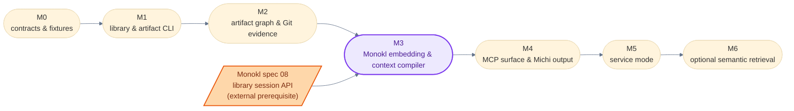

# Wisp: Delivery Plan and Acceptance Gates

## 1. Delivery principle

Build the durable, portable path before the convenient path. The first useful release validates, persists, inspects, and joins canonical artifacts with Git and Monokl evidence. MCP exposes that core; it is not the reason the core exists.

### Proposed artifact-only pilot

The [implementation handoff MVP](08-implementation-handoff-mvp.md) is a proposed small proof before the code-aware M3 briefing. It would check an explicit plan/spec selection and produce a bounded, read-only JSON handoff for Smith. It requires its own reviewed spec, plan, consumer fixtures, and value experiment; it does not close M0–M3, replace their acceptance gates, or authorize a release. D-028 records the proposed sequence. D-029 separately proposes narrowing the Michi publication gate; until accepted, D-006 and the [build-and-release guide](07-build-and-release.md) still apply.

## 2. Milestone map

### 2.1 Overview

| Milestone | Delivers | Gate | Depends on |
| --- | --- | --- | --- |
| M0 — contracts and fixtures | `wisp-contracts`, vendored Wisp Plugins schemas, `wisp-model`, `wisp.toml` schema, `x-wisp-*` annotations, fixture workspaces, corpus submodule | A no-Wisp fixture recomputes `sha256:` digests with stdlib only; `Candidate<T>` cannot reach a briefing without `confirm()`; reformatting `wisp.toml` leaves the workspace fingerprint unchanged | — |
| M1 — library and artifact CLI | `wisp-schema`, `wisp-artifacts`, `wisp artifact` subcommands, `wisp status` | All seven receipt states distinguished; `persisted` unconstructible without an `ApplyPermit`; one diagnostic vocabulary, no `miette` derive outside `wisp-cli` | M0 |
| M2 — artifact graph and Git evidence | In-memory graph refold, `wisp-git`, `DeclaredPaths`, `EvidenceFreshness`, `wisp impact`, brief cache, `wisp rebuild` | Deleting `.wisp/` and refolding produces byte-identical output for the same snapshot | M1 |
| M3 — Monokl embedding and context compiler | `wisp-monokl`, `wisp-context`, selection and budget policy, Prism harness | Prism intrinsic tier numbers reported at budgets {100, 300, 500}; stated p50/p95 latency targets met; no release without either | M2, Monokl spec 08 |
| M4 — MCP surface and Michi output | `wisp_brief`, `wisp_artifacts`, `wisp_check`, Michi adapter, harness examples | Each tool's `structuredContent` byte-equals the CLI JSON result | M3 |
| M5 — service mode | `wisp-service`/`wispd`, actor-owned `Workspace`, Git-delta `apply_change`, watcher, health and compatibility | Service results equal one-shot results for the same snapshot; live revisions never exceed `1 + MAX_QUERY_THREADS` under concurrent load | M4 |
| M6 — optional semantic retrieval | Opt-in `wisp-semantic` with a provider boundary and pinned embedding records | Wisp works fully with semantic retrieval disabled | M5 |

### 2.2 Dependency graph

### 2.3 Cross-repo prerequisite

Milestone 3 depends on Monokl shipping the library session API in its spec 08 (`Workspace`/`Snapshot`/`apply_change`/batch `query`/`SymbolId`/`Provenance`) for TypeScript and Rust. Milestones 0–2 proceed without it. Name the Monokl MVP milestone and track it here.

Two Monokl benchmarks are hard prerequisites rather than parallel work. The cold-open benchmark gates M3, because it is the single unvalidated input behind every Wisp cold-path latency target. The stale-snapshot RSS benchmark gates M5, because it supplies the per-index number D-026's revision bound multiplies. Monokl's batch benchmarks should also use a 28-op batch rather than the ten-op batch they specify: a real implementation briefing issues roughly 28 ops, so ten under-measures the workload threefold.

## 3. Milestones

### 3.1 M0 — contracts and fixtures

**Deliverables**

- **`wisp-contracts`** — `Digest`, `CapabilityPrecision`, `Diagnostic`, `Provenance`, `SymbolId` grammar, budget/truncation report shapes. Permissive license. No schemas.
- **Vendored schemas** — Wisp Plugins' `shared/schemas/` at a pinned revision with checksums in `schemas/PROVENANCE.md` (WISP-001 AC-002 is the seed).
- **`wisp-model`** — `Evidence<T>`, `EvidenceSource`, `ArtifactFreshness`, `EvidenceFreshness`, `Evidence::join`, `Candidate<T>::confirm`, receipt states, `AffectedBy` and `RouteSet`.
- **`wisp.toml` schema** — discovery walking up to the Git root, artifact locations, budget floors, the fingerprint field set, and the exhaustive-destructure guard that makes a new field a compile error until it is placed inside or outside the fingerprint (D-022).
- **Schema annotations** — `x-wisp-link` / `x-wisp-hash-of` / `x-wisp-artifact` on every pinned schema.
- **Fixture workspaces** — valid, invalid, stale, missing, uncommitted, cross-harness chains.
- **Corpus submodule** — the standalone fixture repository at a pinned gitlink, with the deterministic history D-025 requires: a commit touching declared paths, one touching only unrelated files, and one adding a file no artifact declares.
- **Compatibility statement** for direct-artifact fallback.

**Decisions required before closing**

- **Licensing is decided (D-021):** `wisp-contracts` and `wisp-model` are `MIT`, every other crate `FSL-1.1-MIT`. Michi and Monokl moved to `FSL-1.1-MIT` on 2026-09-04, so the suite links cleanly.
- **`wisp-contracts` is a workspace crate here (D-027).** Cut in this milestone, versioned independently, consumed by Monokl and Lumen; Wisp owns its cadence.

**Acceptance gates**

- A fixture validates every supported schema version without a mutable sibling checkout.
- Invalid properties, invalid IDs, and broken links fail with typed errors.
- A no-Wisp fixture consumes the same JSON directly and recomputes `sha256:` digests with stdlib only.
- `Evidence::join` reports the worst freshness and minimum precision of its inputs, under property test.
- A `Candidate<T>` cannot reach a briefing without `confirm()` — checked by type, not test.
- Reformatting `wisp.toml`, reordering its keys, or writing an explicit value equal to a default leaves the workspace fingerprint unchanged; changing any in-fingerprint value changes it.
- The corpus submodule checks out at its pinned gitlink and rebuilds a byte-identical history from its own build script.

### 3.2 M1 — library and artifact CLI

**Deliverables**

- **`wisp-schema`** — reads link and path declarations from schema metadata, not Rust.
- **`wisp-artifacts`** — hash-before-write, conflict detection, `ApplyPermit`-gated commit.
- **CLI** — `wisp artifact validate`, `get`, `list`, `persist`, `status`.
- **`wisp status`** — artifact graph and `ArtifactFreshness` without code intelligence.

**Acceptance gates**

- A failed validation leaves no canonical target and no cache mutation.
- A successful write is atomic under interruption simulation.
- Receipts distinguish all seven states; `persisted` is unconstructible without an `ApplyPermit`.
- Re-persisting identical bytes returns `already_current`; a different artifact at the same path returns `conflict`; an amended `plan@1` with equal `linked_spec` overwrites.
- `commit_declined` appears in the receipt and in `wisp status`.
- CLI JSON is snapshot-tested across supported platforms.
- One diagnostic vocabulary: no crate but `wisp-cli` derives `miette::Diagnostic`, and every emitted code comes from the mapping table in docs/02 §12.2 rather than a hand-maintained match.

### 3.3 M2 — artifact graph and Git evidence

**Deliverables**

- **Graph refold** — in-memory, link resolution from schema metadata, issues as non-fatal findings.
- **`wisp-git`** — HEAD/tree/worktree fingerprints; one batched `git status` per workspace; path-filtered commit walks via `gix`; VCS trait with subprocess and `gix` implementations.
- **`DeclaredPaths` and `PathSpec`** — per-type resolution from schema fields, `PathSpec::{File, Prefix}` so a module root is not intersected as if it were a file, one-hop `spec@1` inheritance from linking plans, and `NoPathsReason` feeding `Indeterminate`.
- **`EvidenceFreshness`** — computed per link against `DeclaredPaths`, with one rev-walk per distinct `since` over unioned pathspecs.
- **`wisp impact --closure direct|deep`** — `AffectedBy` on every edge.
- **Brief cache** — content-addressed under `.wisp/cache/briefs/`, keyed by input digest set.
- **`wisp rebuild`** — delete and recreate `.wisp/`.

**Acceptance gates**

- Deleting `.wisp/` and refolding produces byte-identical graph output for the same snapshot.
- Editing a spec changes its digest and marks linked plans `Diverged` and dependent briefs invalid.
- Editing an unrelated file yields `CleanUnaffected` and does not invalidate an unrelated brief.
- A never-committed artifact reports `Uncommitted`, never `CleanAtCommit`.
- An artifact with no declared paths reports `Indeterminate` naming which of the four reasons applies, never `Clean`.
- A change inside an `arch-model@1` module root marks that model `DirtyAffected`; a `Prefix` pathspec is never intersected as an exact file.
- A `spec@1` with a linking plan reports freshness inherited from that plan and labeled `Inherited`; one with no such plan reports `Indeterminate { NoInheritanceSource }`.
- Git subprocess count is one per `wisp` invocation regardless of artifact count.
- Concurrent readers cannot observe a partial brief cache entry.

### 3.4 M3 — Monokl embedding and context compiler

**Deliverables**

- **`wisp-monokl`** — over `monokl-core`'s `Workspace`/`Snapshot`/batch API. No CLI adapter.
- **`wisp-context`** — `brief implement`, `brief review`, `brief architecture-audit`.
- **Selection policy** — Aider-style deterministic ranking seeded from plan files, spec identifiers, Git delta; one-hop closure default; three detail levels.
- **Budget policy** — global cap, reserved floors, spillover, atomic evidence groups, relevance floor, itemized truncation record.
- **Section ordering** as a named policy value.
- **Prism intrinsic evaluation harness.**

**Acceptance gates**

- A Smith-style briefing retrieves the plan, linked spec, task criteria, declared files, proving tests, applicable invariants, and current delta in one Monokl batch.
- A `Diverged` spec hash surfaces in the briefing's governing-artifacts section and gaps.
- Every code item carries precision and scope; a partial-scope `dependents` request is refused and labeled, never silently short.
- Output stays under budget with an itemized record distinguishing omitted-for-budget from omitted-below-floor.
- Monokl unavailable produces an artifact-only briefing with a typed `code_evidence_unavailable` gap.
- `Snapshot::is_current` on a cached brief's provenance answers without an index rebuild.
- **The cache probe key excludes Monokl's `WorkspaceFingerprint`.** A warm brief-cache hit completes without opening a Monokl `Workspace`, and records which provenance check ran — `provenance_is_current` when a warm workspace exists, git-derived when none does.
- **Latency targets are met on the 5k-file corpus**, benchmarked rather than asserted: cold one-shot p50 5 s / p95 8 s, warm miss 700 ms / 1.2 s, warm hit 120 ms / 250 ms. Every cold figure inherits Monokl's cold-open number, which Monokl's own spec calls plausibly optimistic and has not validated, so Monokl's cold-open benchmark is a prerequisite for this gate rather than a parallel task.
- **Prism intrinsic tier passes** — on a frozen task set, line-level recall, nDCG@budget, and context efficiency are reported at budgets {100, 300, 500} lines, with the α-exposure sweep used to set the default budget. No release without the numbers.

### 3.5 M4 — MCP surface and Michi output

**Deliverables**

- **Three tools** — `wisp_brief`, `wisp_artifacts`, `wisp_check` with `outputSchema` and `structuredContent`.
- **Michi adapter** — once Michi supports multi-section responses, a `BudgetReport` slot, and a `Provenance` slot.
- **Harness adapter examples** — Claude, Codex, and direct CLI.

**Acceptance gates**

- Each tool's `structuredContent` byte-equals the CLI JSON result.
- Text/TOON is derived from the same typed result and never reparsed.
- Read-only tools cause no canonical file, Git, or cache-write side effect.
- Overflow returns partial results plus a truncation record, never empty.
- A harness without MCP gets the same semantic result from the CLI.

### 3.6 M5 — service mode

**Deliverables**

- **Optional `wisp-service`/`wispd`** — holds one warm Monokl `Workspace` and the brief cache lock.
- **Actor and pool model (D-026)** — an actor thread owning `Workspace` by value, the current `Snapshot` published beside it, `!Clone` request-scoped `SnapshotLease`, a fixed query pool of `min(available_parallelism(), 4)` bridged by a oneshot, and a `live_leases` gauge emitted to Lumen.
- **Git-delta-driven `apply_change`** into Monokl.
- **Filesystem watcher** as a latency optimization only.
- **Operational surface** — health, version/config compatibility, graceful cold fallback.

**Acceptance gates**

- Two clients query the same workspace concurrently without cross-request evidence leakage; each batch runs against one immutable snapshot.
- A source or artifact change invalidates precisely the dependent brief entries.
- Stopping the service leaves the CLI able to perform a correct cold query.
- Service results equal one-shot results for the same snapshot.
- **Memory bound benchmark.** Under saturating concurrent load across an `apply_change`, live revisions never exceed `1 + MAX_QUERY_THREADS`, asserted by the `live_leases` gauge, and RSS tracks that multiple of Monokl's per-index number rather than growing without bound. Monokl's stale-snapshot RSS benchmark supplies the per-index figure this multiplies.
- No tokio worker calls into `monokl-core`, and no `spawn_blocking` call appears on the analysis path.

D-032 proposes an additional gate: generated create, modify, delete, rename, configuration, and analyzer-version sequences should match a cold rebuild after each step. It is not an accepted M5 gate yet.

### 3.7 M6 — optional semantic retrieval

**Deliverables**

- **Opt-in `wisp-semantic`** — provider boundary, digest-and-version-pinned embedding records, `Candidate<T>` retrieval for prose.

**Acceptance gates**

- Wisp works fully with semantic retrieval disabled.
- A deleted or modified source invalidates its chunks immediately.
- Every result is a `Candidate` until `confirm()`.
- No document is sent to a provider by default.

## 4. Cross-harness scenarios

| Scenario | Expected durable chain |
| --- | --- |
| Claude spec → Codex plan | `spec@1` persisted; Codex reads it by path, writes `plan@1` with `spec_hash` |
| Codex plan → Claude implementation | Claude reads the persisted plan and spec, not a conversation copy |
| Architecture audit before planning | model missing → built once → later harness audits against it |
| Spec contradiction | corrected spec replaces same path with `superseded_by` set (Q-011) → amended plan replaces same path |
| No Wisp installed | direct JSON route preserves baseline; only enrichment is lost |
| Monokl unavailable | artifact/Git briefing continues with an explicit gap |
| Dirty worktree | briefing states `DirtyAffected` vs `DirtyUnaffected` per link |
| Commit declined | receipt and briefing gaps both show it |

## 5. Evaluation plan

### 5.1 The two Prism tiers

| Tier | Scores | Method | Reported |
| --- | --- | --- | --- |
| Intrinsic | Each emitted briefing against the ground-truth lines a successful solution touched | Deterministic scoring over a frozen task set, across a budget sweep | Line recall (file-level is solved; line-level is where agents sit at 0.15–0.19); nDCG@budget with gain = core lines covered; context efficiency = fraction of emitted lines inside core ∪ optional evidence |
| Extrinsic | Whether the briefing changes agent outcomes | Paired runs on a frozen task suite, same harness with and without the briefing, ≥3 seeds, per-cell wall-clock cap | p-values; cost per solved task as the headline, cost per run shown alongside |

Lumen inspects trajectories for retrieval and tool cycles.

### 5.2 Reading the numbers

A smaller briefing is an improvement only if correctness holds. Reference points: Agentless at $0.70 and 78K tokens per issue; SuperCoder's structural index at $2.30 per solve with a null per-run cost difference.

## 6. Non-goals for the first release

- native named-agent packaging for every harness
- arbitrary chat-history memory
- mandatory daemon installation
- embeddings or vector search
- copying Monokl's AST or index into Wisp
- remote multi-user synchronization
- autonomous commit, push, or PR creation
- a generalized DAG workflow engine
- a Monokl CLI adapter
