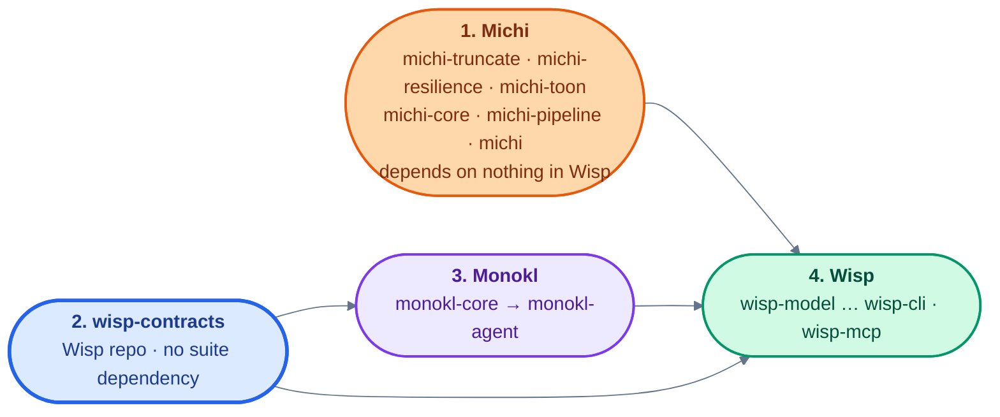

# Build and release across the Wisp repositories

Six repositories — Wisp, Monokl, Michi, Lumen, Prism, Callisto — stay separate. Each keeps its own moon workspace, its own `.prototools`, and its own `justfile`, and Callisto releases each one independently. This document covers what that costs and how each cost is paid: how an unpublished sibling crate resolves locally and in CI, what moon needs to stay cache-correct across a repository boundary, how release order is expressed, and where the shared integration fixture lives.

Every load-bearing claim about tool behavior below was executed rather than recalled, against Cargo 1.96.0, moon 2.4.5, proto 0.57.4, and just 1.58.0. Section 8's table marks which recommendations are forced by the tooling and which are judgment.

---

## 1. The constraint, and what it rules out

**The repos stay separate.** That is the input, not a conclusion. Everything below follows from it.

The consequence that decides the mechanism is that **moon cannot hash inputs outside its own workspace.** Four experiments on moon 2.4.5:

| # | Experiment | Result |
| :--- | :--- | :--- |
| M1 | `moon task a:echo` on a project declaring no `inputs` | Default inputs are exactly `.moon/*.{yml,yaml,jsonc,json,pkl,hcl,toml}` and `<project>/**/*`. Nothing else. |
| M2 | Task input `"../../../monokl/crates/monokl-core/**/*"` (project-relative) | `× tasks.echo.inputs[0]: parent directory traversal (..) is not supported` |
| M3 | Task input `"/../monokl/crates/**/*"` (workspace-relative) | Same error. Escaping is rejected in both forms. |
| M4 | Run task, modify a file outside the moon workspace, re-run | `a:echo (cached, 58da07ad)` — cache hit, the task never executed. Modifying a file *inside* the project produced a fresh hash and a real run. |

moon's documentation states the same thing twice: a project source "must be contained within the workspace boundary," and file patterns "*must not* traverse upwards with `..`." M2 and M3 confirm it is enforced at parse time, not by convention.

That rules out the obvious arrangement. Under a `path = "../monokl/crates/monokl-core"` dependency the sibling is invisible to moon's hash, so `moon run :test` in Wisp after editing `monokl-core` returns a cache hit and never invokes cargo. Since `just ci` delegates to `moon run :test` in every repo, a committed path dependency means the build system reports success without building. M4 is the demonstration, and no `moon.yml` authoring fixes it — M2 and M3 show there is no `inputs` value that expresses it.

Two further Cargo facts close off the workarounds:

- **`[patch]` is root-only.** A `[patch]` in a dependency's own manifest is ignored: a consumer path-depending on a crate whose manifest carries the patch fails with `error: no matching package named 'neverpub-zz9' found`. Every consuming workspace root must repeat the whole patch block by hand, and Monokl's patch of `wisp-contracts` does nothing for Wisp.
- **A path dependency leaves no checksum in `Cargo.lock`.** The lockfile entry carries `name` and `version` only — no `source`, no `checksum`. `cargo build --locked` therefore asserts nothing about a path-resolved sibling, and reproducibility would have to come from a pin file maintained outside Cargo.

This is not hypothetical. `prism/Cargo.toml` already declares `lumen-model = { path = "../lumen/crates/lumen-model" }` and three siblings, `prism/Cargo.lock` carries them with no source, and `prism/.github` holds issue templates and no workflows at all. The one repo that tried it has never run CI.

Under a `git` + `rev` dependency the sibling's identity is a string in `Cargo.toml` and a resolved SHA in `Cargo.lock`, both inside the workspace boundary and both hashable as ordinary moon inputs. That is the arrangement §2 specifies.

---

## 2. Cross-repo dependencies

### 2.1 Committed manifests use `git` + `rev`

```toml
# wisp/crates/wisp-monokl/Cargo.toml
[dependencies]
monokl-core = { git = "https://github.com/orin-axi/monokl", rev = "0000000000000000000000000000000000000000" }

# wisp/crates/wisp-output/Cargo.toml
[dependencies]
michi = { git = "https://github.com/orin-axi/michi", rev = "0000000000000000000000000000000000000000", features = ["serde"] }
```

The lockfile then records the full SHA and pins it:

```text
source = "git+https://github.com/orin-axi/monokl?rev=a90ff0c…#a90ff0c2960c46879a35f18e5e0bfeab54644c51"
```

CI checks out no sibling. Renovate handles the rev bumps: its cargo manager supports git dependencies including `rev`, `tag`, and `branch`, with `git-refs`/`git-tags` datasources, and runs `cargo update` to refresh the lockfile. Dependabot updates cargo git dependencies inside `Cargo.lock`, but its ability to rewrite a `rev =` pin in `Cargo.toml` is unconfirmed.

```json
{
  "$schema": "https://docs.renovatebot.com/renovate-schema.json",
  "extends": ["config:recommended"],
  "packageRules": [
    { "matchManagers": ["cargo"], "matchDepNames": ["monokl-core", "michi"], "schedule": ["before 9am on monday"], "automerge": false }
  ]
}
```

### 2.2 Local co-development uses a gitignored `[patch]`

A `[patch."<git url>"]` pointing at a local path redirects a `git` + `rev` dependency cleanly, and placing it in `.cargo/config.toml` rather than the manifest sidesteps the root-only rule — paths there resolve relative to the directory containing `.cargo`.

```toml
# wisp/.cargo/config.toml — gitignored, never committed
[patch."https://github.com/orin-axi/monokl"]
monokl-core = { path = "../monokl/crates/monokl-core" }

[patch."https://github.com/orin-axi/michi"]
michi = { path = "../michi" }
```

```gitignore
# wisp/.gitignore
/.cargo/config.toml
```

The `justfile` recipes that manage it:

```make
# Point siblings at local checkouts. Rewrites Cargo.lock; run `just unlink` before committing.
# MOON_CACHE=off is required while linked: with a path patch active Cargo.lock stops changing
# as the sibling is edited, so moon's hash goes stale (M4 again).
link:
    #!/usr/bin/env bash
    set -euo pipefail
    mkdir -p .cargo
    cat > .cargo/config.toml <<'EOF'
    [patch."https://github.com/orin-axi/monokl"]
    monokl-core = { path = "../monokl/crates/monokl-core" }

    [patch."https://github.com/orin-axi/michi"]
    michi = { path = "../michi" }
    EOF
    cargo metadata --format-version 1 > /dev/null
    echo "linked — use 'just test-linked', not 'just test'"

test-linked:
    MOON_CACHE=off moon run :test

unlink:
    rm -f .cargo/config.toml
    cargo metadata --format-version 1 > /dev/null
```

### 2.3 The lockfile hazard and the CI guard

**Activating the local patch rewrites `Cargo.lock` and drops the `source` line.** `cargo build --locked` still passes while the patch is active and fails once it is removed, so a lockfile committed from a patched tree breaks CI silently. The guard is mechanical:

```make
# Fails if Cargo.lock was generated with a local path patch active.
lock-check:
    #!/usr/bin/env bash
    set -euo pipefail
    for name in monokl-core michi; do
      grep -q "^name = \"$name\"$" Cargo.lock || { echo "::error::$name absent from Cargo.lock"; exit 1; }
      grep -A2 "^name = \"$name\"$" Cargo.lock | grep -q '^source = "git+' || {
        echo "::error::Cargo.lock records $name with no git source — generated with a local path patch active. Run 'just unlink', commit the regenerated lockfile."
        exit 1
      }
    done

ci-fast: lock-check fmt-check lint test audit doc-check
```

The same `link` / `unlink` / `lock-check` trio belongs in Prism's `justfile` against Lumen, which has the identical defect today.

---

## 3. The shared moon inputs contract

Wisp's moon layer is unsound before any cross-repo concern reaches it. Its five per-crate projects run `cargo build -p <crate>` and declare no `inputs`, so by M1 each is hashed over its own directory only: a change to `wisp-contracts` does not invalidate `wisp-model`'s cache, and no `dependsOn` edge compensates. Michi and Lumen avoid this by having one root project run `cargo --workspace` with `crates/**/*` and `Cargo.toml` as inputs.

Three more experiments give the fix and the distribution mechanism:

| # | Experiment | Result |
| :--- | :--- | :--- |
| M5 | Declare `inputs: ["src/**/*", "/Cargo.toml", "/Cargo.lock"]`, run, edit `Cargo.lock`, re-run | Hash moved and the task re-ran. A rev bump correctly busts the cache. |
| M6 | `.moon/tasks/rust.yml` defining a task with those inputs; project declares only `language: rust` | Inherited. Resolved inputs include `/Cargo.toml`, `/Cargo.lock`, the project glob, and `.moon/tasks/rust.yml` itself. |
| M7 | `extends:` in `.moon/workspace.yml` pointing at an HTTPS URL, and in `.moon/tasks/rust.yml` pointing at a relative file | Both fetched and parsed. The URL case reached the remote and failed only on the 404 body, proving the fetch path is live. |

The seam is `.moon/tasks/rust.yml` plus `extends`. It is not `.prototools`, which pins tool versions and has no repository, checkout, or dependency concept at all.

One file, hosted centrally:

```yaml
# rust-base.yml — the shared inputs contract. The point is /Cargo.toml and /Cargo.lock:
# a sibling's identity lives there under `git`+`rev`, and moon can hash it (M5).
fileGroups:
  sources: ["src/**/*"]
  manifests: ["/Cargo.toml", "/Cargo.lock", "moon.yml", "Cargo.toml"]

tasks:
  build:
    command: "cargo build --workspace"
    inputs: ["@group(sources)", "@group(manifests)"]
  test:
    command: "cargo nextest run --workspace"
    inputs: ["@group(sources)", "@group(manifests)", "tests/**/*"]
    deps: ["build"]
  lint:
    command: "cargo clippy --workspace --all-targets -- -D warnings"
    inputs: ["@group(sources)", "@group(manifests)"]
  audit:
    command: "cargo deny check advisories"
    inputs: ["/Cargo.lock", "/deny.toml"]
```

Each repo then carries one line:

```yaml
# <repo>/.moon/tasks/rust.yml
extends: "https://raw.githubusercontent.com/orin-axi/moon-config/v1/rust-base.yml"
```

M6 confirmed that a project declaring only `language: rust` inherits these, and that moon adds `.moon/tasks/rust.yml` to the resolved inputs, so changing the shared file invalidates everything correctly. Wisp's five per-crate `moon.yml` files then drop their `cargo -p <crate>` scripts and keep `language: rust` alone. That also removes the build-lock serialization Monokl's `justfile` documents at length: N crate projects each running `cargo -p` contend on one `target/` lock, which is why Michi and Lumen already use a single `--workspace` invocation.

`.prototools` cannot participate, but it should stop drifting. Today Wisp pins `rust = "1.96"` and everything else floats on `stable`; `cargo-deny` is pinned at `0.19`, at `0.16`, or absent depending on the repo. A shared crate compiled against floating stable in Monokl's CI and against 1.96.0 in Wisp's is a silent MSRV drift risk for `wisp-contracts`, which four of the six repos compile.

---

## 4. CI

`orin-dx/actions/setup-rust` is a thin seam: a bash step running `rustup toolchain install --profile minimal`, setting the default and looping over comma-separated `components` and `targets`, then `Swatinem/rust-cache@v2`. It performs no checkout and knows nothing about workspaces.

**A `setup-siblings` action is the wrong shape and is not proposed.** It would have to clone each sibling at a pinned SHA and rewrite paths, which means maintaining a pin file duplicating what `Cargo.lock` already does under `git` + `rev`, verified by nothing. Under §2 no sibling is ever checked out, so the question does not arise.

What is actually missing is a composite that absorbs the preamble the three CI-bearing repos each repeat. Lumen's `ci.yml` is nine setup steps for one `just ci`.

```yaml
# orin-dx/actions/setup-rust-workspace
# composite: setup-rust + moon/proto + just + cargo tools, one step instead of nine
inputs:
  components: { default: "clippy,rustfmt" }
  targets:    { default: "" }
  tools:      { default: "nextest,cargo-deny" }   # comma-separated, via taiki-e/install-action
  shared-key: { default: "" }                      # passed through to Swatinem/rust-cache
runs:
  using: composite
  steps:
    - uses: orin-dx/actions/setup-rust@v1.1
      with: { components: "${{ inputs.components }}", targets: "${{ inputs.targets }}", shared-key: "${{ inputs.shared-key }}" }
    - uses: moonrepo/setup-toolchain@v0
      with: { auto-install: true }
    - uses: extractions/setup-just@v2
    - uses: taiki-e/install-action@v2
      with: { tool: "${{ inputs.tools }}" }
```

Wisp has no `.github` directory at all today. Its first workflow:

```yaml
# wisp/.github/workflows/ci.yml
name: CI
on:
  push: { branches: [main] }
  pull_request:
  workflow_dispatch:
  repository_dispatch: { types: [upstream-changed] }

env: { CARGO_TERM_COLOR: always, CARGO_INCREMENTAL: "0", RUST_BACKTRACE: "1" }

jobs:
  ci:
    runs-on: ubuntu-latest
    steps:
      - uses: actions/checkout@v4
        with:
          submodules: recursive   # the fixture corpus; the ONLY cross-repo checkout
          fetch-depth: 0          # wisp-git tests read real history
      - uses: orin-dx/actions/setup-rust-workspace@v1
      - run: just lock-check      # the §2.3 guard
      - run: just ci

  # Upstream canary: monokl and michi push to main -> this runs against that SHA.
  upstream-head:
    if: github.event_name == 'repository_dispatch'
    runs-on: ubuntu-latest
    continue-on-error: true       # upstream HEAD moving is informational, not a Wisp failure
    steps:
      - uses: actions/checkout@v4
        with: { submodules: recursive }
      - uses: orin-dx/actions/setup-rust-workspace@v1
      - name: Repoint the dispatched sibling at its new SHA
        run: |
          mkdir -p .cargo
          printf '[patch."https://github.com/orin-axi/%s"]\n%s = { git = "https://github.com/orin-axi/%s", rev = "%s" }\n' \
            "${{ github.event.client_payload.repo }}" \
            "${{ github.event.client_payload.crate }}" \
            "${{ github.event.client_payload.repo }}" \
            "${{ github.event.client_payload.sha }}" > .cargo/config.toml
      - run: MOON_CACHE=off moon run :test
```

`MOON_CACHE=off` on the canary is not optional: the patch is a config file outside moon's inputs, so without it moon reports a cache hit on the previous run's hash.

The dispatch side is one job added to Monokl's and Michi's `ci.yml` on `push: main`:

```yaml
  notify-downstream:
    if: github.ref == 'refs/heads/main'
    needs: [lint, test]
    runs-on: ubuntu-latest
    steps:
      - run: |
          gh api repos/orin-axi/wisp/dispatches -f event_type=upstream-changed \
            -F client_payload[repo]=monokl -F client_payload[crate]=monokl-core \
            -F client_payload[sha]=${{ github.sha }}
        env: { GH_TOKEN: "${{ secrets.DOWNSTREAM_DISPATCH_TOKEN }}" }
```

This is what buys back the blast radius the separate-repos constraint costs: a breaking `monokl-core` change surfaces in Monokl's own CI run rather than weeks later in a Renovate pull request.

---

## 5. Release order

A crate uploaded to crates.io may not carry a `git` or bare `path` dependency, so every upstream must reach the registry before its consumers.



| Step | What | Mechanism | Blocked until |
| :--- | :--- | :--- | :--- |
| 1 | `michi-truncate`, `michi-resilience`, `michi-toon`, `michi-core`, `michi-pipeline`, `michi` | Michi's existing `callisto.toml`; Callisto orders within the workspace | Michi's "one real consumer integration test" gate — §7 |
| 2 | `wisp-contracts` | `cargo publish -p wisp-contracts` from the Wisp repo | nothing — see §7 |
| 3 | `monokl-core`, then `monokl-agent` | Monokl's `callisto.toml`, which does not exist yet; ordered within its workspace | step 2 |
| 4 | `wisp-model` … `wisp-cli`, `wisp-mcp` | Wisp's `callisto.toml`, which does not exist yet | steps 1, 2, and 3; Wisp D-006 already states this |

Michi goes first because it depends on nothing in Wisp — Wisp D-006 puts the conversion from `wisp_contracts::BudgetReport` and `Provenance` into Michi's own rendering types in `wisp-output`, so Michi never links `wisp-contracts`. Michi and `wisp-contracts` are therefore independent of each other and steps 1 and 2 can run in parallel. Between steps the downstream repo needs a pull request converting its `git` + `rev` line to a registry requirement.

**Prism is off this list and is broken today** for the reason §1 gives: `../lumen/crates/*` path dependencies, lockfile entries with no source, and no CI at all. It needs §2's treatment against Lumen independently of anything in Wisp.

### 5.1 What Callisto needs configured now

Four of the six repos need a `callisto.toml` before Callisto can release them. Wisp's:

```toml
# wisp/callisto.toml
[changesets]
dir = ".changeset"

[cascade]
mode = "out-of-range"
bump-severity = "patch"
peer-escalation = true

# The wisp-* crates version in lockstep, as Callisto's own workspace does.
[[fixed-group]]
name = "wisp"
members = ["wisp-model", "wisp-schema", "wisp-artifacts", "wisp-git", "wisp-monokl", "wisp-store", "wisp-context", "wisp-output", "wisp-service", "wisp-cli", "wisp-mcp"]

# wisp-contracts is deliberately in NO group.
[[package]]
match = "crates/wisp-contracts"
publish-to = ["crates-io"]
release-trigger = "changeset"
```

**`wisp-contracts` must be in no version group.** It is a Wisp workspace member published from this repository at its own version (D-027), so inside the `wisp` fixed group every `wisp-cli` patch would drag it, forcing a pointless requirement bump on Monokl and Lumen. It is cross-repo vocabulary and moves on its own changesets.

Wisp's release job also needs `version_command: "callisto version --refresh-lockfiles"`, since bumping interdependent Cargo packages leaves `Cargo.lock` stale and `callisto publish` runs `cargo publish --locked`.

### 5.2 Ordering is a human checklist, not a Callisto feature

Expression is already Cargo's job. "Wisp requires `monokl-core` ≥ X" is an ordinary version requirement, `callisto-manifests` preserves it through CST edits, and `cargo publish --locked` enforces it. Ordering and cascade are the parts Callisto does not do across repositories: the words `polyrepo`, `multi-repo`, and `cross-repo` appear nowhere in Callisto's README, `ARCHITECTURE.md`, or `docs/`, `[[fixed-group]]` and `[[linked-group]]` take bare package names resolved inside one `callisto.toml`, and `callisto-graph` builds from a single `workspace_root`.

**Nothing is built to close that gap.** Callisto releases each repository on its own, and a person runs the order across them. That is the design, not a deferral — a suite-wide release is rare enough and deliberate enough that a checklist is cheaper than a cross-repo release engine and fails more visibly when it goes wrong.

The checklist, run in order:

1. Release Michi through its own `callisto.toml`. It waits on nothing.
2. `cargo publish -p wisp-contracts` from the Wisp repo, then open the pull request in Monokl converting its `wisp-contracts` requirement to the new registry version.
3. Release Monokl through its `callisto.toml`, then open the pull requests in Wisp converting the `monokl-core` and `michi` `git` + `rev` lines to registry requirements.
4. Release the Wisp crates through Wisp's `callisto.toml`.

Each step ends when the downstream conversion pull request merges and CI is green on it. A step is never started before the one above it has.

`callisto-validate`'s package-discovery guard is not an obstacle here: it verifies that every workspace package appears in `callisto.toml`, and an external dependency is not a workspace package.

---

## 6. The integration fixture repository

**Its own repository, `orin-axi/wisp-corpus`, consumed as a git submodule.** Wisp's evidence model is defined over git history — D-013 batches `git status`, D-014 defines freshness as commit distance filtered by declared paths — so the fixture must be a real repository with its own commits and stable SHAs. A tree checked into `wisp/crates/wisp-fixtures/` has no independent history and cannot exercise any of it. A tarball loses history entirely.

The submodule also solves pinning for free. The gitlink recorded in the superproject tree *is* the pin, versioned atomically with the commit that needs it, enforced by `actions/checkout`. It is the one place where a cross-repo checkout is warranted, and the only one §2 leaves.

```text
orin-axi/wisp-corpus/                  # standalone repo, frozen deterministic history
  build.sh                             # regenerates the history byte-identically
  .gitattributes                       # * -text — see the open items
  src/index.ts                         # seeded from monokl/docs/spec/01 §2795ff
  src/components/{Button.tsx,HardcodedStyles.tsx}
  src/hooks/useCart.ts
  src/utils/{format,validation}.ts
  py/                                  # second language: exercises AnalyzerRegistry with >1 analyzer
  docs/specs/SPEC-001.json             # spec@1, no declared paths — the Indeterminate freshness case
  docs/plans/PLAN-001.json             # plan@1, files.create/modify/test point into src/
```

`build.sh` pins `GIT_AUTHOR_DATE` and `GIT_COMMITTER_DATE` per commit so the SHAs are reproducible. The history must contain at least one commit touching `PLAN-001`'s declared paths, one touching only unrelated files, and one adding a file no artifact declares. Without the second, "distance from HEAD" and "distance filtered by declared paths" give the same answer and D-014 is untested.

| Consumer | Path | Mechanism |
| :--- | :--- | :--- |
| `monokl-core` | `crates/monokl-core/tests/fixtures/corpus` | submodule; replaces the never-built `tests/fixtures/small-ts` |
| `wisp-fixtures` | `crates/wisp-fixtures/corpus` | submodule, same pin or a deliberately different one when testing skew |
| Prism | not a submodule | `TaskSpec.fixture_repo` records the corpus URL and an exact tag |

The submodule sits *inside* each workspace boundary, so unlike a sibling repo it is expressible as a moon input — the one cross-repo thing moon can hash:

```yaml
# monokl/crates/monokl-core/moon.yml — and the mirror in wisp/crates/wisp-fixtures/moon.yml
language: rust
tasks:
  test:
    inputs:
      - "@group(sources)"
      - "@group(manifests)"
      - "tests/fixtures/corpus/**/*"     # submodule contents: inside the boundary, hashable
```

A caveat worth stating rather than discovering: moon's VCS walk strategy uses the superproject's git, and a submodule's contents appear to the superproject as a single gitlink rather than as individual files. The glob above works because moon's file walk reads the working tree, but `moon run :test --affected` after a submodule pointer bump may not classify the project as affected. Until that is measured, CI runs the fixture-dependent tasks unconditionally rather than under `--affected`.

The Rust side is one function:

```rust
/// Root of the corpus submodule.
pub fn corpus_root() -> &'static camino::Utf8Path {
    camino::Utf8Path::new(concat!(env!("CARGO_MANIFEST_DIR"), "/corpus"))
}
```

Prism references the corpus by `(url, tag)` rather than by submodule because a cassette is a frozen sample: it must record which corpus revision produced it and stay replayable after the corpus moves on. Prism doc 06 §9.3 already notes that a cassette freezes one sample and that new task-suite revisions need new live runs; the corpus tag is the missing field that makes "which revision" answerable.

Fixture state is greenfield, so nothing has to be migrated. `monokl/tests/fixtures/small-ts` is specified in Monokl spec 01 and does not exist on disk, and `wisp/fixtures/` holds four JSON artifact fixtures.

---

## 7. The Michi/Wisp publish deadlock, and how it was broken

Michi's spec 05 gates Michi's first publish on "at least one real consumer integration test." Wisp D-006 gates Wisp's publish on "Michi has a versioned release." Neither could go first while Michi also depended on `wisp-contracts`.

Three moves resolve it, and Wisp D-006 records the first as settled: **Michi depends on nothing in Wisp.** Michi's envelope slots take Michi-native rendering types, and `wisp-output` owns the conversion from `wisp_contracts::BudgetReport` and `Provenance` into them. Michi is then free of the cycle entirely and publishes first, which is what §5's order reflects.

**Publish `wisp-contracts 0.0.1` to crates.io early.** It is the crate with three consumers across three repos, and the one crate where the cost of separate repositories multiplies. It depends on nothing, is permissively licensed, holds value types only, and its name is currently unreserved. Publishing it early makes it an ordinary registry dependency for Monokl and Lumen — no patch, no git URL, no sibling checkout — and moon stays cache-correct with no special handling, because a registry dependency is just a line in `Cargo.lock`. The precedent is Ruff, which publishes internal crates as `0.0.x` with the instability stated in the description.

```toml
# wisp/crates/wisp-contracts/Cargo.toml
[package]
name = "wisp-contracts"
version = "0.0.1"
edition = "2024"
rust-version = "1.96"
license = "MIT"         # D-021; every other wisp crate is FSL-1.1-MIT
repository = "https://github.com/orin-axi/wisp"
description = "Cross-repository vocabulary types for the Wisp suite. 0.0.x: no stability guarantee; the API may change in any release."
publish = true          # overrides publish = false in wisp's [workspace.package]
categories = ["development-tools"]

[lints]
workspace = true
```

The `version` line is the crate's own, independent of the Wisp workspace version, because `wisp-contracts` sits in no Callisto version group (§5.1, D-027).

Consumers write `wisp-contracts = "=0.0.7"`. An exact requirement, because `0.0.x` releases are semver-incompatible with each other by definition and a caret requirement would never pick up a bump. While it churns, a developer editing contracts and Monokl together uses a gitignored config-level patch rather than a manifest edit:

```toml
# monokl/.cargo/config.toml — gitignored
[patch.crates-io]
wisp-contracts = { path = "../wisp/crates/wisp-contracts" }
```

Only `monokl-core` and `michi` then remain unpublished, each with exactly one consumer, and §2 handles both.

**Michi's consumer-integration gate is a count, not a roster.** Michi publishes once any consumer outside its repository integrates against a tagged commit — whichever lands first; Michi's spec does not name consumers in advance. Wisp's `git` + `rev` dependency under §2 is one such integration (it compiles Michi from a fixed SHA and exercises the envelope path Michi 07 specifies), but Michi does not wait for Wisp specifically, which is the direction the release order in §5 needs.

**Licensing no longer blocks the order.** Wisp's non-permissive crates are `FSL-1.1-MIT` (D-021), and Michi and Monokl moved from `AGPL-3.0-or-later` to `FSL-1.1-MIT` on 2026-09-04. An FSL crate linking an AGPL crate would have been a conflict for a downstream redistributor; with all three on FSL, `wisp-output` and `wisp-monokl` publish without one.

---

## 8. Rejected, and what it would have bought

| Rejected | Why | What it would have bought |
| :--- | :--- | :--- |
| Merging the repos — one monorepo, or contracts + Monokl + Wisp in one workspace | The repos stay separate. That is the standing constraint, and it is the user's call, not a technical finding. | A single workspace makes moon, `cargo publish --workspace`, and Callisto all work unmodified: no `[patch]`, no `git` + `rev`, no lockfile guard, and no cross-repo release checklist. On the scoring in the source analysis both merged options beat the polyrepo arrangement on paper, entirely because of that. |

Also rejected, for reasons internal to the constraint rather than the constraint itself: committed `path` dependencies (§1), and a `setup-siblings` composite action (§4).

### 8.1 Forced by tooling versus judgment

| Claim | Status |
| :--- | :--- |
| Committed path dependencies are unusable — moon cannot see a sibling repo and its cache goes stale | **Forced.** M2 and M3 reject `..` at parse time; M4 is a cache hit after an outside change. No `inputs` value expresses it. |
| A path-patched dependency gives no reproducible CI build | **Forced.** The lockfile entry carries no `source` and no `checksum`. |
| A `[patch]` must be repeated at every workspace root | **Forced.** Measured, and stated in the Cargo reference. |
| `/Cargo.lock` as a moon input makes a rev bump bust the cache | **Forced.** M5. |
| `.moon/tasks/rust.yml` plus `extends` is the cross-repo standardization seam, and `.prototools` is not | **Forced.** M6 and M7; `.prototools` has no repository concept. |
| Release order Michi → contracts → Monokl → Wisp | **Forced.** A published crate may not carry a git or bare path dependency. Michi's position is judgment resolving §7's cycle. |
| Callisto cannot order or cascade across repos; expression is already Cargo's job | **Forced.** Verified against Callisto `ARCHITECTURE.md` §6, `callisto-manifests`'s single `workspace_root`, and a grep of the whole repo. |
| Cross-repo ordering stays a human checklist rather than a Callisto feature | **Judgment.** §5.2. A suite-wide release is rare and deliberate; a checklist is cheaper than a release engine and fails more visibly. |
| The fixture must be its own git repository | **Forced.** D-014 defines freshness over commit history a checked-in tree does not have. |
| Publish `wisp-contracts` as `0.0.x` immediately | **Judgment.** Precedent is Ruff. Cost is a reserved name and a public unstable crate. Removes the four-consumer edge entirely. |
| `git` + `rev` rather than waiting for Monokl and Michi to publish | **Judgment on the mechanism**, forced on rejecting the alternative. §7's deadlock argues for it. |
| A `setup-rust-workspace` composite instead of a `setup-siblings` action | **Judgment**, but the alternative answers a question §2 deletes. |
| Submodule rather than a shallow clone in a CI step | **Judgment.** Both work; the submodule keeps the pin in the tree instead of in YAML. |
| `wisp-contracts` outside every Callisto version group | **Judgment**, strongly held: the alternative forces version churn on three downstream repos. |
| The canary being `continue-on-error` | **Judgment.** Blocking makes an upstream push able to redden Wisp's default branch, which is both the point and the annoyance. |

### 8.2 Open

- **The submodule and moon `--affected` interaction.** A submodule pointer bump may not mark the consuming project affected, since the superproject sees one gitlink rather than files. It needs one experiment with a real submodule in a real moon workspace. Until then, fixture-dependent tasks run unconditionally in CI. This is the only claim in this document not settled by execution.
- Where the shared `rust-base.yml` lives — a new `orin-axi/moon-config`, or a path inside the existing `orin-dx/actions`. The second avoids a seventh repository; the first keeps GitHub Actions concerns out of moon config.
- One corpus repository or one per language. One is proposed. A Rust or Python analyzer landing later may want its own history.
- Whether Windows is in CI scope. If so the corpus needs `.gitattributes` with `* -text`, since `core.autocrlf` changes blob content and therefore commit SHAs, defeating deterministic history.
- Renovate versus a five-line `gh` workflow doing the rev bump. Renovate's cargo git support is merged but recent.
- Whether the canary blocks or warns. The answer probably differs for `monokl-core` (tight coupling, D-017) and `michi` (output adapter only).

---

## 9. Documents this one changes

These lines are owned by other documents and are recorded here rather than edited here.

| Document | Line | Change |
| :--- | :--- | :--- |
| `docs/02-architecture-and-contracts.md` | `wisp-output` "local path dependency during development", and "uses Michi through a local path dependency during coordinated development" | Both become "git dependency pinned by `rev`, with an optional developer-local `[patch]` in a gitignored `.cargo/config.toml`". A committed path dependency produces a lockfile with no source and is invisible to moon, so `just ci` would report success without building. |
| `docs/04-decisions-and-open-questions.md` | D-006, same wording | Same change. The decision — Michi is an output adapter, Wisp does not publish before Michi does — is unaffected; only the mechanism changes. |
| `crates/*/moon.yml`, all five | `cargo -p <crate>` scripts, no `inputs` | Replace with `language: rust` alone, inheriting from `.moon/tasks/rust.yml`. As written they are cache-unsound for in-repo dependencies, before any cross-repo concern. |
| `Cargo.toml` `[workspace.package]` | `publish = false` | Add `publish = true` to `crates/wisp-contracts/Cargo.toml`, per §7. |
| `monokl/docs/spec/08-library-session-api.md` | §9.1 mermaid, the pinned-artifact-schemas node inside the Contracts box | Delete. It contradicts §11 of the same document and Wisp D-010. Owned by the contracts track; noted here because it changes what the published `wisp-contracts` contains. |
| `michi/docs/spec/05-scope-and-quality.md` | Publish "gated behind at least one real consumer integration test" | Record that a `git` + `rev` integration in Wisp satisfies the gate, per §7. |
| `prism/Cargo.toml` | Four `path = "../lumen/crates/*"` entries in `[workspace.dependencies]` | Change to `git` + `rev`. Prism has no workflows, so nothing has verified these resolve anywhere but one laptop. |
| `.prototools`, all six repos | rust pinned `1.96` in Wisp and `1` elsewhere; `cargo-deny` `0.19`, `0.16`, or absent | Align. `wisp-contracts` is compiled by four of them and MSRV drift on a shared crate is silent. |
