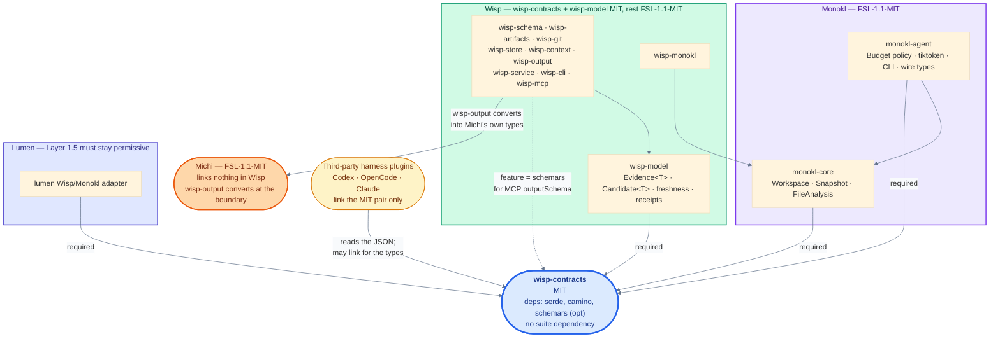

# `wisp-contracts` — the cross-repo vocabulary crate

> `wisp-contracts` is a member of the Wisp workspace at `crates/wisp-contracts`, published from this repository at its own version (D-027). This spec lives here permanently.

Named in Wisp D-010, D-021, and D-027, Monokl spec 08 §11, and Lumen doc 11. Specified nowhere until now.

---

## 1. Purpose

`wisp-contracts` is the crate three repositories link so they can name the same things. It holds the value types that cross a process, crate, or license boundary between Wisp, Monokl, and Lumen, plus the third-party harness plugins that read Wisp's output without linking anything above the permissive layer. Michi is not a consumer — Wisp D-006 keeps the Michi dependency running one way, with `wisp-output` converting these types into Michi's own rendering types. It computes nothing, validates no artifact, performs no I/O, and owns no result type. Its entire behavioral surface is `Display`, `FromStr`, `serde`, and comparison — the minimum needed for a value to survive a round trip and be compared on the far side. Everything else lives in the crate that does the work.

**The inclusion test**, from Wisp D-010 and Monokl 08 §11, restated as a single question:

> Must two repositories agree on what this *means*?

Yes, and it goes here. No, and it belongs to whichever crate computes it. `Provenance` is here because Monokl produces one and Wisp decides from it whether a cached pointer is still valid; a disagreement about what `inputs` means is a silent correctness bug in Wisp's freshness answer. `FileAnalysis` is not here because only Monokl ever holds one.

The second test, applied after the first passes: **does it carry behavior?** A shared type that carries behavior becomes a shared implementation, and a shared implementation across a permissive/copyleft boundary is the thing this crate exists to avoid.

### 1.1 What is in

| Type family | Members |
| :--- | :--- |
| Content identity | `Digest`, `DigestAlgorithm` |
| Analysis quality | `CapabilityPrecision`, `Scope` |
| Transport diagnostics | `Diagnostic`, `DiagnosticCode`, `DiagnosticKind`, `DiagnosticSeverity`, `LineSpan` |
| Result provenance | `Provenance`, `AnalyzerId`, `OperationId`, `InputRef`, `WorkspaceFingerprint`, `ObservedAt` |
| Budget accounting | `Budget`, `BudgetReport`, `OpBudget`, `SkipReason` |
| Symbol identity | `SymbolId`, `PackageId`, `Descriptor`, `Suffix` |

### 1.2 What is out, and why

| Excluded | Where it lives | Why not here |
| :--- | :--- | :--- |
| Artifact JSON schemas (`spec@1`, `plan@1`, `requirement@1`, …) | Authored in Wisp Plugins, vendored into Wisp `schemas/` at a pinned revision (D-010) | Only Wisp and Wisp Plugins consume them. Monokl, Michi, Lumen, and Prism never validate an artifact. Putting them here would make every consumer carry a JSON Schema validator for a format it does not read. Monokl 08 §9.1's diagram lists them under contracts; that is wrong and D-010 supersedes it — see §9. |
| `Evidence<T>`, `EvidenceSource`, `Candidate<T>`, `ArtifactFreshness`, `EvidenceFreshness` | `wisp-model` | Wisp's evidence algebra. Monokl has no opinion about it, and `Candidate<T>::confirm()` is behavior. |
| `Budget` allocation, `BudgetPolicy`, `apply_budget`, tiktoken | `monokl-agent` | Policy and a tokenizer. The crate holds the *limits record* and the *report*, not the allocator. See §6.5 for the seam. |
| `MonoklError`, Wisp's domain errors, `OpOutcome`, `OpResult`, `SymbolsResult`, `FileAnalysis`, `DependencyEdge`, `EdgeTarget` | `monokl-core` / `wisp-*` | Result types. Each side keeps its rich domain error and converts to `Diagnostic` at the boundary. A shared error type is the lowest-common-denominator collapse Monokl 06 §6 argues against. |
| `Result`, error enums for anything but parsing | nowhere | The crate exposes exactly two error types, both from `FromStr`. It has no fallible operations of its own. |
| Any trait | nowhere | A trait in a vocabulary crate is a coordination point that must be versioned in lockstep across every consumer repo. Values only. |
| Timestamps as an authority | nowhere | `ObservedAt` exists and is display-only. Hashes decide validity. `Provenance` has no API that consults it. |

### 1.3 Non-goals

- No `no_std` support. See §3.4.
- No stability guarantee for the *rendered text* of any `Display` output other than `Digest` and `SymbolId`, whose strings are the wire format.
- No canonical JSON serializer. Consumers that hash serialized bytes canonicalize on their own side; the crate guarantees only that `serde` round-trips.
- No compatibility with SCIP's `Index`/`Document`/`Occurrence` container. Only the symbol string grammar is adopted.

---

## 2. Workspace placement and module layout

Modelled on `callisto-model`: one module per concept, each `pub use`d flat from `lib.rs`, so consumers write `wisp_contracts::Digest` and never a module path.

```text
wisp/                        # the Wisp workspace root
  docs/spec/wisp-contracts/01-contracts.md      # this document
  crates/wisp-contracts/
    Cargo.toml
    README.md
    LICENSE-MIT
    CHANGELOG.md
    src/
      lib.rs                   # module decls, pub use, crate-level docs, auto-trait test
      digest.rs                # Digest, DigestAlgorithm, DigestParseError
      precision.rs             # CapabilityPrecision
      scope.rs                 # Scope, PartialScope
      diagnostic.rs            # Diagnostic, DiagnosticCode, DiagnosticKind, DiagnosticSeverity, LineSpan
      provenance.rs            # Provenance, AnalyzerId, OperationId, InputRef, WorkspaceFingerprint, ObservedAt
      budget.rs                # Budget, BudgetReport, OpBudget, SkipReason
      symbol.rs                # SymbolId, PackageId, Descriptor, Suffix, SymbolParseError
    tests/
      scip_corpus.rs           # drives fixtures/scip-symbols.json
      oci_digest.rs            # drives fixtures/oci-digests.json
      wire_snapshots.rs        # insta round-trip snapshots, one per type
      schema_snapshots.rs      # insta JSON Schema snapshots (feature = "schemars")
    fixtures/
      scip-symbols.json        # transcribed from sourcegraph/scip, Apache-2.0, attributed
      oci-digests.json         # transcribed from opencontainers/go-digest, Apache-2.0, attributed
    snapshots/                 # insta .snap files
```

One `LICENSE-MIT` and no `LICENSE-APACHE`: the crate is `MIT` alone (D-021). `CHANGELOG.md` is the crate's own, because its version moves on its own changesets and belongs to no Callisto version group.

`lib.rs` carries the same auto-trait assertion `callisto-model` uses, because every type here crosses a thread boundary inside `wisp-service`:

```rust
#[cfg(test)]
mod tests {
    use super::*;
    fn assert_send_sync_static<T: Send + Sync + 'static>() {}

    #[test]
    fn every_public_type_is_send_sync_static() {
        assert_send_sync_static::<Digest>();
        assert_send_sync_static::<CapabilityPrecision>();
        assert_send_sync_static::<Scope>();
        assert_send_sync_static::<Diagnostic>();
        assert_send_sync_static::<Provenance>();
        assert_send_sync_static::<BudgetReport>();
        assert_send_sync_static::<SymbolId>();
    }
}
```

---

## 3. `Cargo.toml`

```toml
[package]
name          = "wisp-contracts"
version       = "0.1.0"        # the crate's own; not the Wisp workspace version
edition       = "2024"
rust-version  = "1.96"
license       = "MIT"
description   = "Shared interchange vocabulary for Wisp, Monokl, and Lumen: content digests, analysis precision, provenance, budget reports, and SCIP-compatible symbol identity."
repository    = "https://github.com/orin-axi/wisp"
readme        = "README.md"
keywords      = ["orin-axi", "provenance", "scip", "developer-tools"]
categories    = ["development-tools", "encoding"]
publish       = true

[features]
default  = []
schemars = ["dep:schemars"]

[dependencies]
serde    = { version = "1", features = ["derive"] }
camino   = { version = "1", features = ["serde1"] }
schemars = { version = "1.2", optional = true }

[dev-dependencies]
serde_json = "1"
insta      = { version = "1", features = ["json"] }

[lints.rust]
unsafe_code       = "forbid"
unused_must_use   = "deny"
missing_docs      = "deny"

[lints.clippy]
all         = { level = "warn", priority = -1 }
pedantic    = { level = "warn", priority = -1 }
unwrap_used = "deny"
expect_used = "deny"
```

The version line above is the shape at first stable release. §10.4 and `docs/07-build-and-release.md` §7 record the separate decision to publish a `0.0.1` placeholder early so downstream repos can depend on a registry name rather than a git URL.

**Every field is written out rather than inherited.** The crate is a member of the Wisp workspace (D-027), so `version`, `license`, and `publish` would otherwise pick up `[workspace.package]` values that are wrong for it: the workspace version moves with the `wisp` fixed group, the workspace license is `FSL-1.1-MIT` (D-021), and the workspace sets `publish = false`. `wisp-contracts` belongs to no Callisto version group, so its version, its changelog, and its release cadence are its own.

### 3.1 Toolchain

`edition = "2024"` and `rust-version = "1.96"` match Wisp and Monokl exactly. Michi is on edition 2021 with the same `rust-version = "1.96"`, so a Michi crate can depend on an edition-2024 crate without change — editions are per-crate, not per-graph.

`missing_docs = "deny"` is added beyond the Wisp workspace lint set. Every public item in this crate is read by someone in another repository who cannot read the implementation, so an undocumented field is a real defect here in a way it is not inside `wisp-context`.

### 3.2 `serde` is required, not a feature

**Decision: `serde` is an unconditional dependency with `derive` on. There is no `serde` feature.**

Wisp D-010 says the types are "serde-derived because they are the wire format". Lumen doc 11 §5 says the same of `Provenance` specifically. Both specs state serde as a property of the crate rather than an option on it.

The argument against making it optional is stronger than the citation:

1. **Every named consumer serializes.** Wisp writes `Provenance` into `.wisp/` and into `wisp_check`'s input; `monokl-agent` builds wire types from it; the Lumen adapter reads it off an event stream and does nothing else. No consumer wants these types without serde.
2. **An optional serde on a diamond dependency is untestable in practice.** Cargo unions features graph-wide. In any workspace containing both Wisp and Monokl, serde is on. A `--no-default-features` build would be a configuration nobody ships, so its passing tells nobody anything.
3. **It would make the crate's contract conditional.** "This type is the wire format" and "serde is optional" cannot both be true. A consumer reading the spec would have to check a feature flag to know whether the documented JSON exists.

**Consequence to state, not hide:** `monokl-core` declares "no `serde` derives on result types" (Monokl 08 §9.1) and will nonetheless have serde in its dependency tree via this crate. That rule is about Monokl's *own* result types carrying presentation attributes and three compatibility clocks. It is not violated by linking a crate whose types are definitionally the wire shape.

### 3.3 `schemars` is optional and off by default

```toml
schemars = ["dep:schemars"]
```

The `dep:` prefix is required, not stylistic. Without it Cargo synthesizes an implicit feature named after the optional dependency, and per the Cargo SemVer reference removing an optional dependency is then possibly-breaking because a consumer may be enabling it through that implicit feature. `dep:` suppresses the implicit feature and keeps the escape hatch.

Default off, for one reason that outweighs convenience: `schemars::Schema` publicly wraps `serde_json::Value`, so enabling the feature makes `serde_json` a *public* dependency of `wisp-contracts`. A major bump of `serde_json` would then be a major bump of this crate for every consumer. Only Wisp needs it, to publish `outputSchema` for its MCP tools. Lumen and `monokl-core` do not, and should not pay for it.

Two mechanical rules the implementation must follow, both verified against schemars 1.2.2:

- **Every `#[schemars(...)]` attribute must be wrapped in `#[cfg_attr(feature = "schemars", schemars(...))]`.** A bare helper attribute is registered only by the `JsonSchema` derive, so with the feature off the crate fails with `error: cannot find attribute schemars in this scope`. Bare `#[serde(...)]` attributes need no wrapping — schemars reads them.
- **CI builds both ways.** `cargo hack --each-feature check`, plus a plain `cargo check` and `cargo check --all-features`. A default-on feature hides this class of break from every developer until an external consumer turns it off; a default-off feature hides the opposite half. Both matrices are cheap.

The manual `JsonSchema` impls for `Digest` and `SymbolId` (§4.6, §8.6) live inside `#[cfg(feature = "schemars")]` blocks and need no attribute wrapping at all.

### 3.4 `no_std`: rejected, deliberately

**Decision: the crate requires `std`. No `no_std` support, and no `std` feature.**

The Cargo SemVer reference is explicit that "switching from `no_std` support to requiring `std`" is a *major* change. Advertising `no_std` is a one-way door, so the decision has to be made now and made on evidence.

| Consideration | Finding |
| :--- | :--- |
| Named consumers | Wisp, `monokl-agent`, `monokl-core`, Lumen's adapter, third-party plugins. All hosted `std` targets. `wasm32-unknown-unknown` and `wasm32-wasip1` both have full `std`. |
| Types that force `std` | `InputRef.path` and `PartialScope.seeds`/`analysed` carry `camino::Utf8PathBuf`, which is `std`-only. Removing paths from the vocabulary is not on the table — freshness is computed from them. |
| `core::error::Error` | Stabilized in Rust 1.81, so the parse errors would have been free. Not the blocker. |
| Feature unification | `serde/std` gets enabled by anything else in the graph. A `no_std` build of this crate would be nominal and unverified in every real workspace. |
| Verification cost | An honest claim needs a dedicated `cargo build --target thumbv7em-none-eabi --no-default-features` CI job, recurring forever, guarding a configuration with no user. |

What the crate does instead, at zero cost: it is written as if `no_std + alloc` were the target. `BTreeMap`/`BTreeSet` over `HashMap`/`HashSet` (which is what deterministic JSON key order wants regardless), `core::fmt` and `core::str::FromStr` in `use` statements, no `std::io`, no filesystem, no ambient clock outside `ObservedAt::now()`. Adding `no_std` later is only a *minor* change per the same reference, so the option stays open and costs nothing to hold.

### 3.5 Public dependencies

The crate has exactly three, and the count is a design constraint rather than an accident. Every third-party type in a public signature is a semver liability shared by three repositories: once `camino::Utf8PathBuf` is in `InputRef`, a camino 2.0 forces a coordinated major bump everywhere.

| Dependency | Public? | Justification |
| :--- | :--- | :--- |
| `serde` | yes | Definitional. 1.x since 2017. |
| `camino` | yes | `Utf8PathBuf` in `InputRef`, `PartialScope`, `Diagnostic`. The alternative is `String`, which discards the UTF-8-validity invariant and forces a conversion at every boundary in three repos. Wisp already lists camino in `[workspace.dependencies]`; Monokl 08 uses it throughout; `callisto-model` uses it. 1.x since 2021. **Pinned at `"1"`; a camino 2.0 is a major bump of this crate.** |
| `schemars` (feature) | yes, when enabled | Transitively makes `serde_json` public. Contained by the default-off gate. |

**`smol_str` is deliberately not a dependency.** Monokl 08 §8.1 declares `PackageId { manager: SmolStr, name: SmolStr, version: SmolStr }` and `Descriptor { name: SmolStr, .. }`. This spec uses `String` instead. Three reasons: `smol_str` is a `0.x` crate, and a `0.x` public dependency in a crate whose entire job is stability is a standing major-bump hazard; the inline-string win is real inside Monokl's per-token analyzer loop but these types are constructed once per *result*, not per token; and it is a fourth public dependency for an allocation saving nobody has measured. Monokl keeps `SmolStr` internally and converts at the boundary. Flagged in §9.

**`thiserror` is not a dependency.** Two error types, both hand-written with `Display` and `core::error::Error`. `thiserror` 2.x is a fine crate and a needless coupling for eight lines of `match`.

---

## 4. `Digest` and `DigestAlgorithm`

### 4.1 Purpose

The single content-identity type across all three repos. Monokl's cache keys, Wisp's artifact receipts, `AnalyzerId.config_hash`, `OperationId.normalized_params`, and `InputRef.content` are all one type, and the algorithm is always visible in the string.

The problem it fixes: Monokl's current `ContentHash(String)` holds bare unprefixed blake3 hex. An unprefixed hash is unmigratable — change the algorithm or the width and existing `.monokl/cache.json` entries are indistinguishable from new ones, with no way to detect the mismatch except by recomputing everything. Nine bytes per entry buys a self-describing identifier forever, and the cache is already version-and-config-gated so the migration is free today and will not be later.

### 4.2 Grammar

Adopted verbatim from the OCI image-spec `descriptor.md` EBNF:

```ebnf
digest                ::= algorithm ":" encoded
algorithm             ::= algorithm-component (algorithm-separator algorithm-component)*
algorithm-component   ::= [a-z0-9]+
algorithm-separator   ::= [+._-]
encoded               ::= [a-zA-Z0-9=_-]+
```

with the per-algorithm restrictions OCI imposes on both algorithms this crate accepts:

> When the *algorithm identifier* is `sha256`, the *encoded* portion MUST match `/[a-f0-9]{64}/`. Note that `[A-F]` MUST NOT be used here.

> \[BLAKE3\] The hash output length MUST be 256 bits. \[…\] the *encoded* portion MUST match `/[a-f0-9]{64}/`.

**Deliberate divergence from OCI.** `descriptor.md` says "Implementations SHOULD allow digests with unrecognized algorithms to pass validation if they comply with the above grammar." This crate rejects them. A registry forwards digests it cannot verify and must stay permissive; this crate's consumers *compare* digests to decide whether a cached answer is still valid, and a digest whose algorithm nobody in the graph can compute is a value that can only ever produce a false negative. Rejecting at the parse boundary makes the failure loud and local.

**`sha512` is excluded.** It is OCI-registered, and it is 64 bytes, which would force `bytes` to be variable-length and cost `Copy`. Neither named boundary needs it. Adding it later would be a major change to the representation; the escape route is a `DigestLong` sibling type or a `bytes: DigestBytes` enum, and neither is worth pre-building.

### 4.3 Type

```rust
/// A content digest: an algorithm identifier and a 256-bit hash, together.
///
/// `Display` and `FromStr` implement the OCI descriptor grammar
/// (`algorithm ":" encoded`) restricted to 256-bit algorithms with
/// lowercase-hex encoding. Uppercase hex is rejected at parse, because a
/// case-varying digest string breaks both `Eq` and `Hash` — which is exactly
/// the failure mode that makes string identifiers risky.
///
/// The digest is over *canonical serialized bytes*. A consumer recomputing a
/// digest from a re-serialized document must reproduce the same bytes to get
/// the same value; the producing crate is responsible for canonicalization.
#[derive(Clone, Copy, Debug, PartialEq, Eq, PartialOrd, Ord, Hash, Serialize, Deserialize)]
#[serde(try_from = "String", into = "String")]
#[non_exhaustive]
pub struct Digest {
    /// The algorithm that produced `bytes`.
    pub algorithm: DigestAlgorithm,
    /// The raw 256-bit hash. Rendered as 64 lowercase hex characters.
    pub bytes: [u8; 32],
}

/// A 256-bit digest algorithm.
///
/// Both variants are registered in the OCI image-spec algorithm table.
/// `sha512` is registered there and deliberately not supported here: it is
/// 512 bits, which would make `Digest` variable-length, and no boundary in
/// the Wisp suite needs it.
#[derive(Clone, Copy, Debug, PartialEq, Eq, PartialOrd, Ord, Hash)]
#[non_exhaustive]
pub enum DigestAlgorithm {
    /// SHA-256. The only algorithm OCI requires implementations to verify,
    /// and the only one available from the standard library of every harness
    /// language (Node `crypto`, Python `hashlib`, `sha256sum` on `PATH`).
    Sha256,
    /// BLAKE3, 256-bit output. Fast; not in any language's standard library.
    Blake3,
}
```

### 4.4 Which algorithm at which boundary

The split is not about the portability of the *format* — `blake3:<hex>` is a well-formed, OCI-registered digest string. It is about standard-library reach, verified empirically rather than assumed:

| Runtime | sha256 | blake3 |
| :--- | :--- | :--- |
| Node `crypto.getHashes()` | yes | no (blake2 present) |
| Python `hashlib.algorithms_available` | yes | no (blake2b present) |
| shell on `PATH` | `sha256sum`, `shasum` | `b3sum` not installed |

| Boundary | Algorithm | Why |
| :--- | :--- | :--- |
| Monokl cache keys, `.wisp/` cache keys | `blake3:` | Monokl hashes every source file on every open. `blake3::Hash::to_hex` already emits lowercase hex; only the prefix was missing. |
| Anything crossing a process boundary to a third-party harness plugin — artifact `content_hash`, persistence receipts, `Provenance` inputs a plugin re-verifies | `sha256:` | A Codex, Claude, or OpenCode plugin verifying a Wisp receipt with zero dependencies can do it for SHA-256 and cannot for BLAKE3. Wisp `docs/01` makes that interoperability a first-class goal. |

State it as stdlib reach, not portability: the portability framing invites someone to correctly point out that BLAKE3 is OCI-registered and reopen a closed question. Wisp Q-012 asks whether BLAKE3 earns its place at all; that is a measurement about `.wisp/` cache keys and does not change this type.

### 4.5 Parse errors

Error identity and *ordering* both match `opencontainers/go-digest`, the reference implementation the fixture corpus comes from. The ordering is load-bearing: length is checked before the hex charset, which is why a wrong-length non-hex string reports `InvalidLength` and a right-length non-hex string reports `InvalidEncoding`.

```rust
/// Why a string is not a valid [`Digest`].
#[derive(Clone, Debug, PartialEq, Eq)]
#[non_exhaustive]
pub enum DigestParseError {
    /// No `:` separator, or an empty algorithm or encoded portion.
    InvalidFormat,
    /// The algorithm name is well-formed but not `sha256` or `blake3`.
    Unsupported {
        /// The algorithm name as written.
        algorithm: String,
    },
    /// The encoded portion is not 64 characters.
    InvalidLength {
        /// The length that was found.
        found: usize,
    },
    /// The encoded portion is 64 characters but is not lowercase hex.
    /// Uppercase hex lands here: OCI states `[A-F]` MUST NOT be used.
    InvalidEncoding,
}
```

Parse algorithm, in order:

1. Split on the **first** `:`. Missing separator, empty algorithm, or empty encoded portion gives `InvalidFormat`.
2. If the algorithm name fails `^[a-z0-9]+([+._-][a-z0-9]+)*$`, give `InvalidFormat`. `sha384__foo+bar:…` lands here (repeated separators); `sha384.foo+bar:…` is well-formed and lands in step 3.
3. If the algorithm name is not `sha256` or `blake3`, give `Unsupported { algorithm }`.
4. If the encoded portion is not exactly 64 characters, give `InvalidLength { found }`.
5. If any character is outside `[a-f0-9]`, give `InvalidEncoding`.

`impl core::error::Error for DigestParseError {}` with a hand-written `Display`. No `thiserror`.

### 4.6 Serde and schema

`Digest` serializes as a JSON string, via `Display`/`FromStr`. The `#[serde(try_from = "String", into = "String")]` pair in §4.3 is what makes the parse the single authority — there is no second path into a `Digest` from JSON. `DigestAlgorithm` is never serialized independently; it is a component of the string.

The published pattern and the validator share one constant, so they cannot drift:

```rust
/// The JSON Schema pattern published for [`Digest`]. Shared with the parser's
/// own table so the schema and the validator cannot diverge.
pub const DIGEST_PATTERN: &str = r"^(sha256|blake3):[a-f0-9]{64}$";

#[cfg(feature = "schemars")]
impl schemars::JsonSchema for Digest {
    fn schema_name() -> std::borrow::Cow<'static, str> { "Digest".into() }
    fn schema_id() -> std::borrow::Cow<'static, str> { "wisp_contracts::Digest".into() }
    fn inline_schema() -> bool { false }
    fn json_schema(_: &mut schemars::SchemaGenerator) -> schemars::Schema {
        schemars::json_schema!({
            "type": "string",
            "pattern": DIGEST_PATTERN,
            "title": "Digest",
            "description": "Content digest, `<algorithm>:<64 lowercase hex>`. Algorithms: sha256, blake3.",
        })
    }
}
```

### 4.7 Wire example

```json
"sha256:e58fcf7418d4390dec8e8fb69d88c06ec07039d651fedd3aa72af9972e7d046b"
```

```json
"blake3:af1349b9f5f9a1a6a0404dea36dcc9499bcb25c9adc112b7cc9a93cae41f3262"
```

The second is BLAKE3 of the empty input, taken from `go-digest/blake3/blake3_test.go`, and doubles as a self-test vector.

---

## 5. `CapabilityPrecision`

### 5.1 Type

```rust
/// How well an analyzer resolved a fact — the quality axis.
///
/// Orthogonal to [`Scope`], which is the completeness axis. Sourcegraph's
/// search-based navigation is imprecise but whole-tree; a scoped Monokl open
/// is precise but partial. One enum cannot carry both.
///
/// Discriminants are explicit and gapped so a future variant can be inserted
/// at its correct rank without renumbering — and therefore without silently
/// reordering every existing comparison in three repositories.
///
/// # Ordering is not the string order
///
/// `Unsupported < Heuristic < Structural < Exact` in Rust. Sorted as JSON
/// strings the order is `"exact" < "heuristic" < "structural" < "unsupported"`.
/// A consumer that must rank precisions on the far side ranks by this table,
/// never by the string.
#[derive(Clone, Copy, Debug, PartialEq, Eq, PartialOrd, Ord, Hash, Serialize, Deserialize)]
#[non_exhaustive]
#[serde(rename_all = "camelCase")]
pub enum CapabilityPrecision {
    /// The analyzer cannot answer this at all. An operation requiring more
    /// than this returns a skip, never an empty result that reads as "none".
    Unsupported = 10,
    /// Derived from syntax or path conventions without resolution. A Rust
    /// `use foo::Bar` where the first segment could be a submodule or an
    /// external crate is heuristic.
    Heuristic = 20,
    /// Derived from a real parse and a real symbol table, without full type
    /// resolution.
    Structural = 30,
    /// Derived from the language's own resolver. `oxc_resolver`'s module
    /// resolution for TypeScript is the reference case.
    Exact = 40,
}
```

Variants and their names are taken from `monokl/docs/spec/01-core-architecture.md:1323`, and the ladder `Unsupported < Heuristic < Structural < Exact` is stated in `04-analysis-fidelity.md:250`. The wire strings match `precision_label` in `03-multi-language-platform.md:1953`.

### 5.2 The rule the type exists to enforce

Wisp must never silently upgrade the confidence of a code relationship. Two consequences bind consumers:

- **No `max` across a set.** Combining a set of precisions takes the minimum. `Evidence::join` in `wisp-model` does exactly this (Wisp docs/02 §3.2).
- **No response-level scalar where edges differ.** A `dependents` result mixing an `Exact` TypeScript resolver edge with a `Heuristic` fallback edge has no honest single precision: `min` makes the exact edges unusable, `max` fabricates confidence. Precision is per-edge on `DependencyEdge` (Monokl 08 §8.3), per-op on `OpBudget`, and once on `Provenance` for a single-analyzer result. Michi renders whatever the caller put in the row and reduces nothing (Michi 07 §3).

Neither SCIP, LSIF, Kythe, nor Glean carries a confidence field anywhere — verified by a full read of all 962 lines of `scip.proto`. Per-edge precision has no interop encoding and is dropped on SCIP export. That is a documented lossy boundary (Monokl 08 §12), not a surprise.

### 5.3 Wire example

```json
"structural"
```

Inside an `OpBudget`:

```json
{ "tokens": 812, "bytes": 3104, "itemsReturned": 12, "itemsTotal": 40, "detailDegraded": true, "precision": "structural" }
```

---

## 6. `Scope`, `Budget`, `BudgetReport`, `OpBudget`, `SkipReason`

### 6.1 `Scope`

```rust
/// Over what file set a result was computed — the completeness axis.
///
/// Recorded on [`Provenance`] so "stale full" and "fresh partial" are
/// distinguishable. A result computed over 50 files at revision N and a result
/// computed over 50,000 files at revision N-3 are both wrong in different ways,
/// and a consumer cannot tell them apart without this.
#[derive(Clone, Debug, PartialEq, Eq, Hash, Serialize, Deserialize)]
#[non_exhaustive]
#[serde(tag = "kind", rename_all = "camelCase")]
pub enum Scope {
    /// The whole workspace was analysed.
    Complete,
    /// A seed-rooted closure was analysed.
    Partial(PartialScope),
}

/// The parameters and outcome of a partial analysis.
///
/// A separate struct rather than an inline variant payload: per the Cargo
/// SemVer reference, adding a field to an enum variant is a major change even
/// when the enum is `#[non_exhaustive]`, whereas adding one to a
/// `#[non_exhaustive]` struct is minor. This keeps the payload independently
/// versionable.
#[derive(Clone, Debug, Default, PartialEq, Eq, Hash, Serialize, Deserialize)]
#[non_exhaustive]
#[serde(rename_all = "camelCase")]
pub struct PartialScope {
    /// The files the closure was rooted at.
    pub seeds: Vec<Utf8PathBuf>,
    /// Import-closure depth from the seeds. Default 1.
    pub hops: u8,
    /// Fan-out cap per seed. Without it one hub module blows the budget on hop 2.
    pub max_neighbors_per_seed: u16,
    /// Absolute cap on analysed files.
    pub max_total_nodes: u32,
    /// The exact file set that was analysed. Not derivable from `seeds` and
    /// `hops` after the fact, because the caps may have bitten.
    pub analysed: Vec<Utf8PathBuf>,
}
```

Field names, semantics, and the `hops` default of 1 come from Monokl 08 §5.1 and its RepoGraph k-hop ablation in §5.3 (1-hop 29.67% resolve rate, 2-hop-flattened 26.00% — worse than no graph at all).

**Divergence from Monokl 08 §5.1**, which declares `Partial { seeds, hops, … }` as an inline struct variant. Hoisting the payload into `PartialScope` costs one level of nesting in the JSON and buys the ability to add a field without a major bump. For a type three repositories deserialize, that trade is one-sided. Flagged in §9.

Which operations are sound under `Partial` is Monokl's rule, not this crate's: forward-closure operations (`symbols`, `definition`, `explain`, `extract`, `search`) are sound and restricted to the analysed set; reverse-closure operations (`dependents`, `refs`) are not sound and return `SkipReason::Unsupported`. The crate carries the value; Monokl enforces the rule.

Wire example:

```json
{ "kind": "complete" }
```

```json
{
  "kind": "partial",
  "seeds": ["src/retry/policy.rs"],
  "hops": 1,
  "maxNeighborsPerSeed": 32,
  "maxTotalNodes": 200,
  "analysed": ["src/retry/policy.rs", "src/retry/mod.rs", "src/http/client.rs"]
}
```

### 6.2 `Budget`

```rust
/// The limits a batch was run under. A record of three numbers — the
/// allocation policy that spends them lives in `monokl-agent`.
#[derive(Clone, Copy, Debug, Default, PartialEq, Eq, Hash, Serialize, Deserialize)]
#[non_exhaustive]
#[serde(rename_all = "camelCase")]
pub struct Budget {
    /// Token ceiling for the whole batch.
    pub max_tokens: u64,
    /// Byte ceiling for the whole batch.
    pub max_bytes: u64,
    /// Item ceiling for the whole batch.
    pub max_items: u64,
}
```

### 6.3 `BudgetReport` and `OpBudget`

```rust
/// What a batch actually spent. One per response: a batch runs against one
/// snapshot under one budget.
#[derive(Clone, Debug, Default, PartialEq, Eq, Serialize, Deserialize)]
#[non_exhaustive]
#[serde(rename_all = "camelCase")]
pub struct BudgetReport {
    /// The limits this batch ran under.
    pub limits: Budget,
    /// Tokens consumed across the batch.
    pub tokens_used: u64,
    /// Bytes consumed across the batch.
    pub bytes_used: u64,
    /// Index-parallel to the request's operations. `per_op[i]` accounts for
    /// operation `i`, including operations that failed or were skipped.
    pub per_op: Vec<OpBudget>,
    /// True if anything was dropped or degraded anywhere in the batch.
    pub truncated: bool,
}

/// What one operation in a batch spent, and what it gave up.
#[derive(Clone, Debug, Default, PartialEq, Eq, Serialize, Deserialize)]
#[non_exhaustive]
#[serde(rename_all = "camelCase")]
pub struct OpBudget {
    /// Tokens consumed by this operation's result.
    pub tokens: u64,
    /// Bytes consumed by this operation's result.
    pub bytes: u64,
    /// Items actually returned.
    pub items_returned: u64,
    /// Items before truncation. `items_total > items_returned` is the only
    /// "there is more" signal. No marker string, ever — a rendered English
    /// truncation notice is presentation, and it does not survive a consumer
    /// that reads JSON.
    pub items_total: u64,
    /// `Full` detail was requested and `Lite` was served.
    pub detail_degraded: bool,
    /// This operation's precision. Not reduced to a batch-level value: a batch
    /// spanning an `Exact` TypeScript `refs` and a `Structural` Rust
    /// `dependents` has no honest single precision.
    pub precision: CapabilityPrecision,
}

/// What one operation in a batch produced, in units the producer computes for free. Not a budget account —
/// `OpBudget` is what a *caller* spent after allocating; `OpCost` is what `monokl-core` measured before any
/// budget existed. `QueryResponse.cost` is index-parallel to the request's operations.
#[derive(Clone, Debug, Default, PartialEq, Eq, Serialize, Deserialize)]
#[non_exhaustive]
#[serde(rename_all = "camelCase")]
pub struct OpCost {
    /// Bytes in this operation's result.
    pub bytes: u64,
    /// Items actually returned.
    pub items_returned: u64,
    /// Pre-ceiling count. `items_total > items_returned` is the only "there is more" signal.
    pub items_total: u64,
    /// Wall-clock milliseconds this operation took. An integer, not a `Duration`: a `Duration` serializes as a
    /// two-field object for the same reason `SystemTime` does (§5.3), and no non-Rust consumer expects it.
    pub elapsed_ms: u64,
    /// This operation's precision. Never reduced to a batch-level value.
    pub precision: CapabilityPrecision,
    /// The producer's work ceiling (`Limits` in monokl-core) — a memory guard, not a budget — cut this operation.
    pub ceiling_hit: bool,
}

/// Why an operation produced no result.
#[derive(Clone, Copy, Debug, PartialEq, Eq, Hash, Serialize, Deserialize)]
#[non_exhaustive]
#[serde(rename_all = "camelCase")]
pub enum SkipReason {
    /// The caller's budget ran out before this operation ran. Emitted by budgeting callers (`monokl-agent`,
    /// `wisp-context`), never by `monokl-core`, which holds no budget.
    BudgetExhausted,
    /// The operation is not sound under the current scope or precision.
    Unsupported,
    /// The batch deadline passed. Monokl's in-process substitute for
    /// cancellation.
    Deadline,
    /// The operation named a path or symbol outside the analysed set.
    NotIndexed,
}
```

Counts are `u64` rather than Monokl 08's `usize`. `usize` is platform-dependent and meaningless in JSON; a wire type must name its width.

### 6.4 Why `truncated` and `items_total` are not optional

Models cannot detect what is absent. On AbsenceBench, Claude 3.7 Sonnet reaches only 69.6% F1 at a 5K-token average context against near-perfect Needle-in-a-Haystack performance, because attention has no key corresponding to a gap. An itemized, machine-readable truncation record is the only way an agent learns material was omitted, and per Lumen doc 11 it is also the only way telemetry learns it. Both Wisp docs/02 §11 and Michi 07 state the same rule: never fail closed on overflow, always partial results plus counts plus a refinement hint.

### 6.5 Resolving the budget seam

Monokl 08 contradicts itself. §7.3 puts `budget: Budget` and `policy: BudgetPolicy` on `Snapshot::query(&QueryRequest)`, which is `monokl-core`. §9.1 puts `Budget`, `BudgetPolicy`, `apply_budget`, and tiktoken in `monokl-agent`. §11 lists `BudgetReport` and `OpBudget` in `wisp-contracts` — and `BudgetReport.limits` is a `Budget`, so `Budget` must be in contracts or `BudgetReport` cannot compile there.

**Resolution: `Budget` is in contracts; `BudgetPolicy` and `apply_budget` are not.**

The line is the inclusion test applied literally. `Budget` is three integers that Wisp sets, Monokl honors, and Lumen counts — three repositories agreeing on a meaning, with Michi rendering the result after `wisp-output` converts it into Michi's own budget type. Michi 07 §2's rendered block is the proof, since it prints `maxTokens: 8000` and `maxBytes: 2097152` verbatim from the report:

```text
budget:
  tokensUsed: 7412
  bytesUsed:  31208
  maxTokens:  8000
  maxBytes:   2097152
  truncated:  true
```

`BudgetPolicy` (`Weighted`/`Proportional`/`Ordered`) is an allocation *policy* whose variants Monokl 08 §7.3 itself describes as a parameter for benchmarking alternatives — a knob that will churn, on which nobody else has an opinion. `apply_budget` and tiktoken are behavior. Both stay in `monokl-agent`.

This does not settle what `monokl-core` measures versus what `monokl-agent` measures. It settles only where the *types* live, which is all this crate decides.

### 6.6 Wire example

```json
{
  "limits": { "maxTokens": 8000, "maxBytes": 2097152, "maxItems": 200 },
  "tokensUsed": 7412,
  "bytesUsed": 31208,
  "perOp": [
    { "tokens": 5120, "bytes": 21440, "itemsReturned": 12, "itemsTotal": 40, "detailDegraded": true,  "precision": "structural" },
    { "tokens": 2292, "bytes": 9768,  "itemsReturned": 5,  "itemsTotal": 5,  "detailDegraded": false, "precision": "exact" }
  ],
  "truncated": true
}
```

---

## 7. `Diagnostic` and friends

### 7.1 Transport shape, and nothing more

Monokl 08 §11 is explicit: `Diagnostic` belongs here "as the *transport* shape only. Monokl keeps `MonoklError`; Wisp keeps its own domain errors; both convert." SCIP has a `Diagnostic`, LSP has one, Monokl will have one, and they are not the same type. A shared diagnostic that tries to be the domain type becomes the lowest-common-denominator collapse Monokl 06 §6 argues against on SCIP's and CodeQL's precedent.

The discipline that keeps it a transport shape: **no field on `Diagnostic` may be something a consumer branches on to recover.** Recovery is a domain concern and needs the domain error. `Diagnostic` answers "what should the agent be told, and how loudly" and nothing else. `related`, `candidates`, `fix_suggestions`, and `data: serde_json::Value` are all deliberately absent — the ambiguous-import case carries its candidate set on `EdgeTarget::Ambiguous` in `monokl-core`, with the diagnostic alongside it, not inside it.

### 7.2 Types

```rust
/// A machine-readable note attached to a result. The transport shape only:
/// each side keeps its own richer domain error and converts at the boundary.
#[derive(Clone, Debug, PartialEq, Eq, Serialize, Deserialize)]
#[non_exhaustive]
#[serde(rename_all = "camelCase")]
pub struct Diagnostic {
    /// Stable, namespaced identity. See [`DiagnosticCode`].
    pub code: DiagnosticCode,
    /// How loudly to say it.
    pub severity: DiagnosticSeverity,
    /// The coarse class, for consumers that route without knowing every code.
    pub kind: DiagnosticKind,
    /// Human-readable, one sentence, no trailing period, no ANSI, no
    /// interpolated file paths — the path goes in `path`.
    pub message: String,
    /// The file this concerns, workspace-relative, forward slashes.
    #[serde(default, skip_serializing_if = "Option::is_none")]
    pub path: Option<Utf8PathBuf>,
    /// The lines this concerns. Requires `path`.
    #[serde(default, skip_serializing_if = "Option::is_none")]
    pub span: Option<LineSpan>,
}

/// A namespaced diagnostic identifier, e.g. `monokl::import-unresolved`.
#[derive(Clone, Debug, PartialEq, Eq, PartialOrd, Ord, Hash, Serialize, Deserialize)]
#[serde(transparent)]
pub struct DiagnosticCode(String);

/// How loudly to report a [`Diagnostic`].
///
/// Ordered `Info < Warning < Error`, with gapped explicit discriminants for
/// the same reason as [`CapabilityPrecision`]. The JSON string order differs
/// from the semantic order; rank by this enum, never by the string.
#[derive(Clone, Copy, Debug, PartialEq, Eq, PartialOrd, Ord, Hash, Serialize, Deserialize)]
#[non_exhaustive]
#[serde(rename_all = "camelCase")]
pub enum DiagnosticSeverity {
    /// Worth recording, not worth interrupting for.
    Info = 10,
    /// The result is usable but degraded, or an assumption was made.
    Warning = 20,
    /// The result is absent or wrong in the way the message describes.
    Error = 30,
}

/// The coarse class of a [`Diagnostic`], for consumers routing without a table
/// of every code.
///
/// Open by construction: an unrecognized kind deserializes into `Other` with
/// its original string intact, and re-serializes unchanged. A middle tier that
/// forwards a diagnostic it does not understand must not rewrite it.
#[derive(Clone, Debug, PartialEq, Eq, PartialOrd, Ord, Hash, Serialize, Deserialize)]
#[non_exhaustive]
#[serde(rename_all = "camelCase")]
pub enum DiagnosticKind {
    /// A reference, import, or symbol could not be resolved to any target.
    Unresolved,
    /// A reference resolved to more than one candidate. The candidate set
    /// travels on the result type, not here.
    Ambiguous,
    /// A resolution landed outside the analysed scope. Under `Scope::Partial`
    /// this is a diagnostic, never a missing edge.
    OutOfScope,
    /// The operation is not available at the current precision or scope.
    Unsupported,
    /// The result was served at reduced detail or after truncation.
    Degraded,
    /// A configuration input was missing, unreadable, or contradictory —
    /// a missing `tsconfig.json`, an unresolvable workspace root.
    Configuration,
    /// A file or directory could not be read.
    Io,
    /// A kind this build does not recognize, preserved verbatim.
    #[serde(untagged)]
    Other(String),
}

/// An inclusive line range, 1-based.
///
/// 1-based-inclusive because every surface that renders one — the CLI, a
/// briefing an agent reads, a Git diff hunk header, an editor jump — is
/// 1-based. Consumers bridging to LSP or SCIP, which are 0-based with an
/// exclusive end, convert at that boundary and nowhere else.
#[derive(Clone, Copy, Debug, PartialEq, Eq, PartialOrd, Ord, Hash, Serialize, Deserialize)]
#[non_exhaustive]
#[serde(rename_all = "camelCase")]
pub struct LineSpan {
    /// First line, 1-based, inclusive.
    pub start_line: u32,
    /// Last line, 1-based, inclusive. Equal to `start_line` for one line.
    pub end_line: u32,
}
```

`DiagnosticKind::Other(String)` uses the untagged-newtype idiom rather than `#[serde(other)]`. `#[serde(other)]` is lossy: it collapses every unknown value to one variant and re-serializes it as that variant's name, so a middle tier reading and re-emitting a document from a newer producer *destroys* the original string. Michi and Wisp are both middle tiers for Monokl diagnostics. The cost is that the published schema degrades to `anyOf: [enum, string]` — the enumeration becomes a hint rather than a constraint. That is the right trade for a forwarding path.

### 7.3 `DiagnosticCode` namespace convention

`code` is the precise, stable identity a consumer suppresses, counts, or documents against. `kind` is the coarse class it routes on without knowing the code. Both are needed: Wisp's briefing must decide "surface or suppress" for a Monokl diagnostic it has never seen, and Lumen must count code distributions across versions.

Grammar, enforced by `DiagnosticCode::new` and by `FromStr`:

```text
code       ::= namespace '::' segment ('::' segment)*
namespace  ::= [a-z][a-z0-9-]*
segment    ::= [a-z0-9][a-z0-9-]*
```

Lowercase, hyphen-separated segments, `::` between them, at least two segments. No underscores, no dots, no uppercase — a code is compared for equality across three repositories and two serialization hops, and one casing convention removes an entire class of near-miss bug.

| Namespace | Owner | Example |
| :--- | :--- | :--- |
| `monokl` | Monokl | `monokl::import-unresolved`, `monokl::scope-reverse-closure-unsupported`, `monokl::tsconfig-missing` |
| `wisp` | Wisp | `wisp::artifact-schema-invalid`, `wisp::freshness-indeterminate`, `wisp::budget-truncated` |
| `michi` | Michi | `michi::section-empty`, minted by `wisp-output` on Michi's behalf, since Michi does not link this crate (Wisp D-006) |
| `lumen` | Lumen | `lumen::event-dropped` |
| `contracts` | this crate | `contracts::digest-parse-failed`, `contracts::symbol-parse-failed` |

Rules the crate states and the owning repo enforces:

1. **A namespace is owned by exactly one repository.** A repository never emits a code in another's namespace, even when forwarding. Forwarding preserves the original code unchanged.
2. **A code is immutable once emitted.** Its meaning may be clarified; it may not be reused for a different condition. Retiring a code means ceasing to emit it, not redefining it.
3. **The code, not the message, is the contract.** Message text may change in any release. A consumer that regexes a message is on its own.

The crate does **not** hold a registry of every code. That would put Monokl's error taxonomy under Wisp's release cadence and force a contracts release for every new Monokl diagnostic. Each repository documents its own codes; this crate owns only the grammar and the namespace allocation table above.

### 7.4 Wire example

```json
{
  "code": "monokl::import-unresolved",
  "severity": "warning",
  "kind": "unresolved",
  "message": "import specifier `@internal/retry` did not resolve under the analysed scope",
  "path": "src/http/client.ts",
  "span": { "startLine": 12, "endLine": 12 }
}
```

---

## 8. `Provenance` and `SymbolId`

### 8.1 `Provenance`

Every result, and every operation inside a batch, carries one. The three questions it answers are PROV-DM's Agent / Activity / `used` split. The structure is borrowed; the vocabulary is not — `was_derived_from` buys recognizability at the cost of a name that does not say what it holds.

```rust
/// Everything needed to decide whether a stored result is still valid,
/// without recomputing it.
///
/// A result is current iff the workspace fingerprint matches (respecting
/// durability), the analyzer's config hash matches, and *every* input digest
/// still matches. That is a conjunction, and it is Glean's derived-fact rule:
/// a derived fact is visible iff every fact it was derived from is visible.
///
/// `Snapshot::provenance_is_current(&p)` must answer this without rebuilding
/// any index — one hash-map lookup per input, nothing more.
#[derive(Clone, Debug, PartialEq, Eq, Serialize, Deserialize)]
#[non_exhaustive]
#[serde(rename_all = "camelCase")]
pub struct Provenance {
    /// Who produced it.
    pub agent: AnalyzerId,
    /// What operation produced it, with normalized parameters.
    pub activity: OperationId,
    /// Which inputs it was derived from. A conjunction.
    pub inputs: Vec<InputRef>,
    /// The workspace revision it ran against.
    pub workspace: WorkspaceFingerprint,
    /// Over what file set. Distinguishes "stale full" from "fresh partial".
    pub scope: Scope,
    /// How well it was resolved.
    pub precision: CapabilityPrecision,
    /// Display only. Never consulted for validity — hashes decide, timestamps
    /// do not. There is no API on this type that reads it.
    pub observed_at: ObservedAt,
}

/// Who produced a result.
#[derive(Clone, Debug, PartialEq, Eq, Hash, Serialize, Deserialize)]
#[non_exhaustive]
#[serde(rename_all = "camelCase")]
pub struct AnalyzerId {
    /// The analyzer's name, e.g. `monokl-ts`, `monokl-rs`.
    pub name: String,
    /// The analyzer's version.
    pub version: String,
    /// Hash of the analyzer's resolved configuration. Required, not optional:
    /// a `tsconfig.json` change must invalidate a cached result without a
    /// version bump. Monokl's own cache is already version-and-config-gated;
    /// omitting this here would make `provenance_is_current` return true
    /// across a config change that the cache itself would have caught.
    pub config_hash: Digest,
}

/// What operation produced a result.
#[derive(Clone, Debug, PartialEq, Eq, Hash, Serialize, Deserialize)]
#[non_exhaustive]
#[serde(rename_all = "camelCase")]
pub struct OperationId {
    /// The operation name, e.g. `dependents`, `refs`, `symbols`.
    pub op: String,
    /// Hash of the operation's normalized parameters. Two operations over
    /// identical inputs produce different answers, so the query identity has
    /// to be here for a cached result to be re-validated.
    ///
    /// Normalization is the producing crate's responsibility and must be
    /// deterministic: sorted keys, resolved relative paths, defaults made
    /// explicit.
    pub normalized_params: Digest,
}

/// One input a result was derived from.
#[derive(Clone, Debug, PartialEq, Eq, Hash, Serialize, Deserialize)]
#[non_exhaustive]
#[serde(rename_all = "camelCase")]
pub struct InputRef {
    /// Workspace-relative path, forward slashes.
    pub path: Utf8PathBuf,
    /// The content digest at the time of analysis.
    pub content: Digest,
}
```

### 8.2 `WorkspaceFingerprint`

```rust
/// A two-tier workspace revision marker.
///
/// Durability is rust-analyzer's cheapest idea and needs none of Salsa's
/// machinery: tag inputs with a tier and keep a version *vector* instead of one
/// counter, so a local edit never revalidates dependency-derived queries.
///
/// # Invariant
///
/// Bumping `durable` also bumps `volatile`. The reverse does not hold. A change
/// touching only volatile inputs leaves `durable` alone, so a cached result
/// derived only from durable inputs — an import edge into a vendored package,
/// say — stays valid across an ordinary edit.
///
/// # Wire representation
///
/// Both fields serialize as 16-character lowercase hex strings, not JSON
/// numbers. A `u64` exceeds JavaScript's `Number.MAX_SAFE_INTEGER` (2^53 - 1)
/// and would be silently rounded by every JSON parser in a Node or browser
/// consumer — including Michi's own NAPI surface. A rounded fingerprint
/// compares unequal to itself and every freshness check downstream reports a
/// spurious miss.
#[derive(Clone, Copy, Debug, Default, PartialEq, Eq, Hash, Serialize, Deserialize)]
#[non_exhaustive]
#[serde(rename_all = "camelCase")]
pub struct WorkspaceFingerprint {
    /// Config hash, resolved analyzer set, and `node_modules`/`target`/
    /// vendored/outside-worktree content.
    #[serde(with = "crate::hex_u64")]
    pub durable: u64,
    /// Tracked workspace files.
    #[serde(with = "crate::hex_u64")]
    pub volatile: u64,
}
```

**Which tier absorbs configuration is stated here so neither side assumes the other carries it.** The workspace fingerprint's `durable` tier covers workspace-level inputs: the workspace root, the layout configuration, and the resolved analyzer set. `AnalyzerId.config_hash` covers per-analyzer configuration. Wisp already requires that configuration changes be part of the workspace fingerprint, so an index built with one layout is never silently reused under another; Monokl requires the same for `tsconfig.json` and feature flags. Without this paragraph both sides will assume the other one carries it, and neither will.

### 8.3 `ObservedAt`

```rust
/// When a result was observed. Display only.
///
/// Milliseconds since the Unix epoch, signed, serialized as a JSON number.
///
/// Not `std::time::SystemTime`: serde renders that as a two-field object
/// (`secs_since_epoch` / `nanos_since_epoch`) that no non-Rust consumer
/// expects and that a Python or Node plugin has to special-case. An epoch
/// integer is unambiguous, sortable, and constructible from every language's
/// standard library. Millisecond resolution is more than a display field needs.
///
/// Nothing in this crate compares two `ObservedAt` values for validity, and
/// nothing downstream may: `Provenance` is decided by hashes.
#[derive(Clone, Copy, Debug, Default, PartialEq, Eq, PartialOrd, Ord, Hash, Serialize, Deserialize)]
#[serde(transparent)]
pub struct ObservedAt(pub i64);

impl ObservedAt {
    /// Now, from the system clock. The only ambient-state call in the crate.
    #[must_use]
    pub fn now() -> Self { /* … */ }
}
```

This is a divergence from Monokl 08 §8.2's `observed_at: std::time::SystemTime`. Flagged in §9.

### 8.4 `Provenance` wire example

```json
{
  "agent": {
    "name": "monokl-ts",
    "version": "0.4.1",
    "configHash": "blake3:9f2a1c4e77b0d3856ab41f0e2c9d6b58730e1af42c5d9b06e3817fa4c2d0619b"
  },
  "activity": {
    "op": "dependents",
    "normalizedParams": "blake3:1b7c05de3a9f42688c1d0e5b7a3f92c4d68051ea7b3c9f20d4a86e1573b0cf29"
  },
  "inputs": [
    { "path": "src/retry/policy.ts", "content": "blake3:af1349b9f5f9a1a6a0404dea36dcc9499bcb25c9adc112b7cc9a93cae41f3262" },
    { "path": "tsconfig.json",       "content": "blake3:2d711642b726b04401627ca9fbac32f5c8530fb1903cc4db02258717921a4881" }
  ],
  "workspace": { "durable": "0f3a7c21b95e4d08", "volatile": "1b2c8ef05a736941" },
  "scope": { "kind": "complete" },
  "precision": "exact",
  "observedAt": 1788461750123
}
```

### 8.5 `SymbolId`

SCIP-compatible at the identity *string*, not at the container. SCIP's own `DESIGN.md` says it "is not meant as a *storage* format for querying" and declines to support navigation by itself, which is exactly Monokl's role — so adopting the `Index`/`Document`/`Occurrence` layout in memory would be adopting a format against its own stated purpose. Adopting the grammar is nearly free, gives a tested escaping story, makes `monokl index --format scip` an afternoon's work, and lets Wisp store a symbol pointer another tool could resolve.

Grammar, verbatim from `scip.proto`:

```text
<symbol>               ::= <scheme> ' ' <package> ' ' (<descriptor>)+ | 'local ' <local-id>
<package>              ::= <manager> ' ' <package-name> ' ' <version>
<scheme>               ::= any UTF-8, escape spaces with double space. Must not be empty nor start with 'local'
<manager>              ::= any UTF-8, escape spaces with double space. Use the placeholder '.' to indicate an empty value
<descriptor>           ::= <namespace> | <type> | <term> | <method> | <type-parameter> | <parameter> | <meta> | <macro>
<namespace>            ::= <name> '/'
<type>                 ::= <name> '#'
<term>                 ::= <name> '.'
<meta>                 ::= <name> ':'
<macro>                ::= <name> '!'
<method>               ::= <name> '(' (<method-disambiguator>)? ').'
<type-parameter>       ::= '[' <name> ']'
<parameter>            ::= '(' <name> ')'
<identifier-character> ::= '_' | '+' | '-' | '$' | ASCII letter or digit
<escaped-identifier>   ::= '`' (<escaped-character>)+ '`', must contain at least one non-<identifier-character>
<escaped-characters>   ::= any UTF-8, escape backticks with double backtick.
```

Three things every surveyed identity scheme excludes, and this one does too:

| Excluded | Why |
| :--- | :--- |
| **Path** | SCIP puts `relative_path` on `Document`. Path in the identity means a file rename invalidates every cached reference to a symbol that did not change, and `invalidate(&changed_paths)` would have to invalidate on rename even when no symbol moved. Path belongs on the occurrence. |
| **Kind** | SCIP separates the coarse 9-value descriptor suffix (identity) from the 87-value `SymbolInformation.kind` (metadata) and says so: "a Go struct has the symbol kind `Struct` while a Java class has the kind `Class` even if they both have the same descriptor." This matters more here than for SCIP: a `Heuristic` to `Structural` analyzer upgrade that reclassifies a symbol must not change its identity, or every stored Wisp `code_evidence_refs` row silently misses. Identity must be stable across precision upgrades — that is the point of having a precision ladder. |
| **Line** | Lines live on the occurrence. |

```rust
/// A stable symbol identity. `Display` emits the canonical string; `FromStr`
/// parses it, escaping included. The string is the wire format.
///
/// Ordering compares the canonical strings, not the fields, so a set sorted in
/// Rust and the same set sorted as JSON strings agree. Callers sorting large
/// sets should key by `to_string()` once rather than paying the render per
/// comparison.
#[derive(Clone, Debug, PartialEq, Eq, Hash, Serialize, Deserialize)]
#[serde(try_from = "String", into = "String")]
#[non_exhaustive]
pub enum SymbolId {
    /// A symbol addressable from outside its defining file.
    Global {
        /// The indexer's name, not the language — `monokl`, as rust-analyzer
        /// uses `rust-analyzer`. A namespace claiming "these strings were
        /// minted by these rules".
        scheme: String,
        /// The package the symbol belongs to.
        package: PackageId,
        /// Root-to-leaf ancestry chain. One descriptor per enclosing AST node.
        /// Never empty for a `Global`.
        descriptors: Vec<Descriptor>,
    },
    /// A binding local to an enclosing scope.
    ///
    /// Deliberately not SCIP's `local <ordinal>`. rust-analyzer resets its
    /// per-document counter, so inserting one binding renumbers every local
    /// below it — less stable than a line number, which is the property this
    /// type exists to avoid. This form derives from scope structure instead.
    Local {
        /// The symbol this binding is scoped to.
        enclosing: Box<SymbolId>,
        /// The binding's name.
        name: String,
        /// Distinguishes same-named bindings within one enclosing scope.
        /// Derived from scope nesting, not from encounter order.
        disambiguator: u32,
    },
}

/// The package a [`SymbolId::Global`] belongs to.
///
/// A `.` in any field is the SCIP placeholder for an empty value and parses
/// back as the empty string. The name collides with
/// `callisto_model::PackageId`, which is a different thing entirely; the two
/// crates are never linked into one module scope.
#[derive(Clone, Debug, Default, PartialEq, Eq, Hash, Serialize, Deserialize)]
#[non_exhaustive]
#[serde(rename_all = "camelCase")]
pub struct PackageId {
    /// Package manager, e.g. `cargo`, `npm`, `maven`. Empty when unknown.
    pub manager: String,
    /// Package name. Empty when unknown.
    pub name: String,
    /// Package version. Empty when unknown.
    pub version: String,
}

/// One link in a symbol's ancestry chain.
#[derive(Clone, Debug, PartialEq, Eq, Hash, Serialize, Deserialize)]
#[non_exhaustive]
#[serde(rename_all = "camelCase")]
pub struct Descriptor {
    /// The identifier, unescaped. Backtick-escaping is applied on render.
    pub name: String,
    /// Method disambiguator. Only meaningful when `suffix` is
    /// [`Suffix::Method`]; ignored for every other suffix.
    pub disambiguator: Option<String>,
    /// Which grammar production this descriptor is.
    pub suffix: Suffix,
}

/// The nine descriptor productions of the SCIP symbol grammar.
#[derive(Clone, Copy, Debug, PartialEq, Eq, PartialOrd, Ord, Hash, Serialize, Deserialize)]
#[non_exhaustive]
#[serde(rename_all = "camelCase")]
pub enum Suffix {
    /// `name/` — a module, package, or namespace.
    Namespace,
    /// `name#` — a type.
    Type,
    /// `name.` — a value, field, or function.
    Term,
    /// `name(disambiguator).` — a method.
    Method,
    /// `[name]` — a type parameter.
    TypeParameter,
    /// `(name)` — a value parameter.
    Parameter,
    /// `name:` — anything that fits no other production.
    Meta,
    /// `name!` — a macro.
    Macro,
}
```

**Correction to Monokl 08 §8.1**, which declares `scheme: &'static str`. A `&'static str` cannot be deserialized without leaking, so the type as written cannot round-trip through the wire format it is specified to be. `String` here. Flagged in §9.

### 8.6 String form, parsing, and serialization

`SymbolId` serializes as a JSON string via `#[serde(try_from = "String", into = "String")]`, for the same reason `Digest` does: the string is the interchange form a third-party plugin reads with a regex, and a Wisp `code_evidence_refs` column stores one value rather than a nested object.

**`SymbolId::Global`** emits and parses the SCIP grammar exactly, matching the Go reference implementation on every point where the Go and Rust bindings disagree:

| Point | Rule | Why the Go behavior |
| :--- | :--- | :--- |
| Identifier charset | ASCII only: `_ + - $` plus ASCII letters and digits | Go's `isSimpleIdentifierCharacter`. Rust's binding uses `char::is_alphabetic`, which accepts `nonSimpλeIdentifier` where Go rejects it. Two producers must not disagree about what needs escaping. |
| Space escaping | Doubled spaces are one literal space, in scheme, manager, package name, and version | Go's `writeGenericEscapedIdentifier`. The Rust binding does not space-escape on emit and is therefore not round-trip-safe for package fields containing spaces. |
| `.` placeholder | Normalized to the empty string on parse for manager, name, and version — never for scheme. Emitted for an empty value in any of the four | Go's `sw.normalize(".", "")` placement |
| Suffix name for `/` | `Namespace` | Go emits `Descriptor_Namespace`; the Rust binding emits `Suffix::Package`, which the proto marks `[deprecated]` |
| Empty package | `PackageId::default()`, always constructed | Go always allocates a `Package`; Rust returns none |
| Redundant escaping | `` `abc`. `` parses to name `abc` and re-emits unescaped as `abc.` | Neither reference parser enforces the proto's "must contain at least one non-identifier-character" rule. Treat it as a normalization, not a parse error, and assert the normalized form in the round-trip test rather than byte equality. |

**`SymbolId::Local`** is not expressible in the SCIP grammar. SCIP's `local <ordinal>` is unstable by construction, and this crate's `Local` carries a full enclosing symbol that cannot fit SCIP's `<simple-identifier>` remainder. It gets a distinct, deliberately-not-SCIP form:

```text
<wisp-local> ::= 'wisp-local' ' ' <escaped-name> ' ' <disambiguator> ' ' <enclosing-symbol>
```

`<escaped-name>` is space- and backtick-escaped by the same rules as a descriptor name; `<disambiguator>` is decimal digits; `<enclosing-symbol>` is the full remaining string, parsed recursively, and is last precisely because it contains spaces.

```text
wisp-local x 1 monokl cargo foo 0.1.0 module/func().
```

A SCIP parser fed this string reads scheme `wisp-local`, manager `x`, name `1`, version `monokl`, then fails on `cargo ` because a space is not a valid descriptor suffix character. It **rejects** rather than silently misreading, which is the property the form is chosen for. On SCIP export the local degrades to `local N`, a documented lossy boundary (Monokl 08 §12).

Published schema pattern — a well-formedness screen, not the grammar. `FromStr` is the authority:

```rust
/// Screening pattern published for [`SymbolId`]. Not the full grammar: a
/// string matching this may still fail `FromStr`. The parser is the authority.
pub const SYMBOL_ID_PATTERN: &str = r"^(wisp-local .+|local [A-Za-z0-9_+$-]+|[^ ]+( [^ ]*){3} .+)$";
```

### 8.7 Conventions and collision rules

| Case | Rule |
| :--- | :--- |
| **Rust impls** | Reuse rust-analyzer's encoding — a `Type` descriptor literally named `impl` with the self type and trait in type-parameter brackets: `monokl cargo foo 0.1.0 module/impl#[MyStruct][MyTrait]func().` — so two producers' strings for the same entity agree. The grammar has no impl concept; inventing a second convention would make the strings incomparable. |
| **Collisions** | Resolved by adding a disambiguator dimension, which is Kythe's VName rule: "As a collection of nodes grows, new nodes may arrive that differ from the existing nodes, but have the same VName. To maintain uniqueness, it is only necessary to add one or more additional dimensions." Never by falling back to a line or an ordinal. rust-analyzer needs a runtime `FxHashSet` to detect duplicate global symbols because the grammar cannot enforce uniqueness on its own; a silent collision corrupts every downstream cache in both projects and is nearly undiagnosable after the fact. The producing crate asserts uniqueness over its fixture corpus in debug builds. |
| **Nested items in function bodies** | Emit `SymbolId::Local { enclosing: <the function's id>, .. }`. rust-analyzer has four `FIXME` tests where a `fn inner` inside `pub fn func` emits a global `inner_func().` that collides across functions; that is a known-wrong case, not a precedent. |
| **Unpackaged workspaces** | When there is no manifest, the temptation is to put path back into the identity. Do not. Synthesize a package identity for the root — the root directory name plus a stable hash of the resolved root path — so identity stays path-independent inside the workspace. |
| **Shadowed bindings** | Two `let x` in nested blocks in one function share an enclosing symbol and a name. The disambiguator distinguishes them and must be derived from scope nesting depth and sibling index, not encounter order. This has no prior art — SCIP's form is unstable, LSIF's `UniquenessLevel::document` prescribes no form, Kythe pushes it into an opaque signature. It is the least-tested part of this type. |

### 8.8 Wire example

```json
"monokl cargo wisp-context 0.1.0 briefing/Compiler#compile()."
```

```json
"wisp-local seeds 0 monokl cargo wisp-context 0.1.0 briefing/Compiler#compile()."
```

Inside a Wisp evidence reference:

```json
{
  "symbol": "monokl npm @internal/retry 2.1.0 policy/RetryPolicy#",
  "path": "src/retry/policy.ts",
  "span": { "startLine": 14, "endLine": 61 }
}
```

---

## 9. Where this spec overrides its sources

Every divergence below is deliberate. Each quotes the line it changes.

| Source line | Change | Why |
| :--- | :--- | :--- |
| Monokl 08 §8.1: `scheme: &'static str` | `scheme: String` | A `&'static str` cannot be deserialized without leaking. The type as written cannot round-trip through the wire format it is specified to be. |
| Monokl 08 §8.1: `PackageId { manager: SmolStr, name: SmolStr, version: SmolStr }`, `Descriptor { name: SmolStr, … }` | `String` throughout | `smol_str` is a `0.x` public dependency in a crate whose job is stability. The inline-string win is real in Monokl's per-token loop and irrelevant for a type constructed once per result. Monokl keeps `SmolStr` internally and converts at the boundary. |
| Monokl 08 §8.2: `observed_at: std::time::SystemTime` | `observed_at: ObservedAt(i64)`, epoch milliseconds | serde renders `SystemTime` as a two-field object no non-Rust consumer expects. The field is display-only; an epoch integer is what every language can read. |
| Monokl 08 §5.1: `Partial { seeds, hops, max_neighbors_per_seed, max_total_nodes, analysed }` as an inline variant | `Partial(PartialScope)` with the fields on a `#[non_exhaustive]` struct | Adding a field to an enum variant is major even on a `#[non_exhaustive]` enum; adding one to a `#[non_exhaustive]` struct is minor. One level of JSON nesting buys independent versioning of the payload. |
| Monokl 08 §7.4: `Budget { max_tokens: usize, … }`, `OpBudget { tokens: usize, … }` | `u64` throughout | `usize` is platform-dependent and meaningless in JSON. A wire type names its width. |
| Monokl 08 §9.1 diagram, contracts box: "Pinned artifact JSON schemas (spec@1, plan@1, …)" | Removed | Contradicted by Monokl 08's own §11 ("Not in it: the Wisp Plugins artifact schemas") and by Wisp D-010, which is the later decision. The diagram is stale relative to its own prose. |
| Monokl 08 §7.3 places `Budget` on `monokl-core`'s `QueryRequest`; §9.1 places `Budget` in `monokl-agent`; §11 places `BudgetReport` (which embeds a `Budget`) in contracts | `Budget` in contracts; `BudgetPolicy` and `apply_budget` in `monokl-agent` | Three-way contradiction that made `BudgetReport` uncompilable as specified. See §6.5. |
| Monokl 08 §8.4: `Digest { algorithm, bytes: [u8; 32] }` with `DigestAlgorithm { Sha256, Blake3 }` alongside a table naming `sha512` as an OCI sibling | `sha512` explicitly excluded, with the escape route named | The 32-byte array already excluded it; the spec did not say so. Stating it prevents someone adding a variant that cannot fit. |
| OCI `descriptor.md`: "Implementations SHOULD allow digests with unrecognized algorithms to pass validation" | Unknown algorithms rejected at parse | A registry forwards what it cannot verify; this crate's consumers compare digests to decide validity, so an uncomputable algorithm can only produce false negatives. |
| Wisp docs/02 §3.1 and Monokl 08 do not name a `Diagnostic` shape at all | Full shape specified, with `code`/`kind` split and namespace grammar | Named in five places, defined in none. |
| Not in any source | `LineSpan` added to contracts | `Diagnostic` needs a location, and Wisp's `code_evidence_refs` stores symbol identity, path, and range (docs/02 §7). 1-based inclusive, stated explicitly, because the off-by-one at this boundary is the most likely defect in the whole crate. |
| Not in any source | `WorkspaceFingerprint` serializes as hex strings | A `u64` exceeds JavaScript's safe integer range and is silently rounded by Michi's own NAPI consumers. A rounded fingerprint never compares equal, so every freshness check downstream reports a spurious miss. |

---

## 10. Stability policy

### 10.1 What this crate promises

`wisp-contracts` reaches `1.0.0` at Wisp Milestone 0, when Wisp, Monokl, and Lumen have each linked it once and round-tripped every type. Before that it is `0.y.z`, where per the Cargo SemVer reference a `0.y` bump is the major channel. `docs/07-build-and-release.md` §7 covers the `0.0.1` name-reservation release that precedes even `0.1.0`.

After `1.0.0`:

- **The JSON wire format is the contract.** A field's serialized key, a variant's serialized string, and the grammar of `Digest` and `SymbolId` are covered. The Rust API is covered too, but the wire format is what a third-party plugin depends on and it is the one that cannot be fixed by recompiling.
- **The published leniency rule**, stated so it is a specified feature rather than an accident, in rustc's own words: optional values may be `null`; new fields may be added; enumerated fields may add new values. Consumers ignore what they do not recognize.
- **No `deny_unknown_fields` on any type in this crate.** It converts an additive change into a lockstep three-repo deploy, and the failure is total rather than degraded — the consumer loses the fields it *does* understand. Zero of the five surveyed wire-format crates use it, including `serde-sarif`, whose bundled schema declares `additionalProperties: false` in 52 places and whose Rust deserializer still shrugs. It also propagates into the published schema, where `additionalProperties: false` blocks extension by `allOf`. Config types get it; wire types never do.

### 10.2 Classification table

Applied to this crate, from the Cargo SemVer reference.

| Change | Semver | Note |
| :--- | :--- | :--- |
| Adding a variant to a `#[non_exhaustive]` enum | minor | The entire reason every enum here is `#[non_exhaustive]` from day one. |
| Adding a variant to a non-`non_exhaustive` enum | major | Does not arise: there are none. |
| Adding a field to a `#[non_exhaustive]` struct | minor | Same. |
| Adding a field to an enum *variant* | major | True even when the enum is `#[non_exhaustive]`. This is why `Scope::Partial` wraps a struct. |
| Adding `#[non_exhaustive]` to an existing type | major | One-way door. Everything carries it before `1.0.0`; nothing acquires it after. |
| Removing `#[non_exhaustive]` | minor, and never done | It only relaxes, but it permanently forfeits future field additions. |
| Renaming a serde key, or changing `rename_all` | **major** | Invisible to `cargo semver-checks` and to any Rust-only test. The snapshot suite in §11 is the only thing that catches it. |
| Renaming a Rust field while pinning the wire key with `#[serde(rename)]` | major (Rust API), wire-compatible | Avoid: the mismatch between source and wire is a permanent readability tax. |
| Adding a serde variant string to an open enum (`DiagnosticKind`) | minor | Old consumers get `Other(s)` and forward it unchanged. |
| Changing `CapabilityPrecision` or `DiagnosticSeverity` discriminants | major | Gapped discriminants exist so insertion never requires this. |
| Adding a trait impl (`Serialize`, `Display`, `Ord`, `From`) | minor | The glob-import caveat is a known forwards-compatibility hazard and not treated as major. |
| Adding a blanket impl | major in practice, and forbidden here | Effectively unremovable and collides with downstream impls. |
| Adding an inherent method | possibly-breaking | Can shadow a trait method with a different signature and change runtime behavior silently. Reviewed case by case. |
| Adding a Cargo feature | minor | |
| Removing a Cargo feature | major | |
| Bumping a public dependency's major (`camino` 1 to 2, `serde` 1 to 2) | major | The reason the public dependency count is capped at three. |
| Raising `rust-version` | minor | The reference recommends treating an MSRV bump as minor. This crate tracks Wisp's `rust-toolchain.toml` and does not lead it. |
| Adding `no_std` support | minor | The option §3.4 keeps open. |
| Removing `no_std` support | major | Never arises, because it is never claimed. |

### 10.3 How a `@2` of a type coexists

**Decision: a new type name, not a `version` field.**

When `Provenance` needs an incompatible shape, the crate ships `ProvenanceV2` as a distinct type alongside `Provenance`, marks `Provenance` `#[deprecated(since = "…", note = "…")]`, and removes it in the following major release. The two live side by side for exactly one major cycle.

Rejected alternative: a `version: u8` discriminant field on one type, with variants readable per version.

| | New type | `version` field |
| :--- | :--- | :--- |
| Migration failure mode | compile error at every construction and read site | runtime branch a consumer can forget |
| Shape honesty | each type's fields all exist | fields that exist only for one version, `Option` for the rest |
| Reader cost | none | every read site matches on the version first |
| Wire discrimination | the containing struct's field type says which | a magic field every parser must check before it can parse |

The compile-error property is the whole posture of this crate: it exists so that a disagreement between two repositories is caught by `cargo build` rather than by a briefing that quietly reports a stale claim as fresh. A `version` field converts a compile error into a runtime branch, which is the wrong direction.

The wire side follows from the Rust side without extra machinery. A document containing a `Provenance` and a document containing a `ProvenanceV2` are distinguished the same way any two typed fields are: by what the enclosing struct declares. A consumer that must accept both during a migration window declares `#[serde(untagged)] enum AnyProvenance { V2(ProvenanceV2), V1(Provenance) }` **in its own crate**, ordered newest-first, and this crate does not ship that enum — an untagged enum tries variants in order and the first success wins, so shipping one here would make adding a field to `ProvenanceV2` silently reroute documents into the `V1` arm.

Scope of the rule: it applies to composite types (`Provenance`, `BudgetReport`, `Diagnostic`, `Scope`). It does not apply to `Digest` or `SymbolId`, whose wire form is a self-describing string — a new digest algorithm is a new prefix, and a new symbol form is a new grammar production, both additive.

### 10.4 Release cadence

`wisp-contracts` releases **first, alone, and rarely**. It is the only crate in the suite with no dependency on any other suite crate, so it is always the head of the dependency order Callisto releases in. `docs/07-build-and-release.md` §5 carries that order and the Callisto gaps behind it.

| Rule | Detail |
| :--- | :--- |
| Consumers pin caret once `1.0.0` lands | `wisp-contracts = "1"`. An `=1.2.3` pin in any consumer makes two consumers in one workspace unresolvable and defeats the whole point. Before `1.0.0`, `0.0.x` requires an exact pin, because `0.0.x` releases are semver-incompatible with each other by definition. |
| Cross-repo resolution before publication | `git` + `rev` in committed manifests, with a gitignored local `[patch]` for co-development. `docs/07-build-and-release.md` §2 carries the mechanism and the lockfile hazard. |
| A contracts release never bundles a consumer change | If a Monokl change requires a contracts change, the contracts release ships and is published before the Monokl change is merged. |
| Additive releases do not force consumer upgrades | A minor bump reaches consumers through their existing caret pin. Only a major bump requires coordination. |
| A major bump is a suite event | Three repositories, planned, with a migration note in `CHANGELOG.md` naming every affected type. Expected frequency: not more than once a year, and ideally never after `1.0.0`. |
| `cargo semver-checks` gates every release | Plus the wire-snapshot suite (§11), because `semver-checks` reads the Rust API and cannot see a renamed serde key. |

---

## 11. The conformance corpus

The crate has almost no behavior, so its test suite is almost entirely conformance and round-tripping. That is correct: the failure mode this crate exists to prevent is two repositories disagreeing about a string.

### 11.1 SCIP symbol corpus

**No machine-readable corpus exists.** `sourcegraph/scip` has no `testdata` for symbols anywhere. Its only vectors are hard-coded literals in `bindings/go/scip/symbol_test.go` (10 valid, 10 invalid), `bindings/go/scip/symbol_formatter_test.go` (1 emit case, 3 round-trip), and `bindings/rust/src/symbol.rs`'s test module (5 more valid, 5 emit-only). `reprolang/testdata/snapshots/` is end-to-end indexer output for a toy language, not grammar vectors.

The crate therefore **transcribes them into `fixtures/scip-symbols.json`**, under Apache-2.0 with attribution to `sourcegraph/scip` in the file header and in `README.md`, citing the two Go test files and `scip.proto` as the source of truth.

```json
{
  "_source": "Transcribed from sourcegraph/scip bindings/go/scip/{symbol_test.go,symbol_formatter_test.go} and bindings/rust/src/symbol.rs. Apache-2.0.",
  "valid": [
    { "symbol": "a b c d method().",
      "scheme": "a", "package": { "manager": "b", "name": "c", "version": "d" },
      "descriptors": [{ "name": "method", "disambiguator": null, "suffix": "method" }],
      "roundTrips": true },
    { "symbol": "a b  c d e f.",
      "note": "double space escapes one literal space, landing in manager",
      "scheme": "a", "package": { "manager": "b c", "name": "d", "version": "e" },
      "descriptors": [{ "name": "f", "disambiguator": null, "suffix": "term" }],
      "roundTrips": true },
    { "symbol": "lsif-java maven package 1.0.0 java/io/File#Entry.method(+1).(param)[TypeParam]",
      "descriptorCount": 7, "roundTrips": true },
    { "symbol": "cxx . todo-pkg todo-version gfx/Rect#x(455f465bc33b4cdf).",
      "note": ". placeholder normalizes to empty manager",
      "package": { "manager": "", "name": "todo-pkg", "version": "todo-version" },
      "roundTrips": true },
    { "symbol": "a b c d `F⃗`.",
      "note": "combining character forces backtick escaping",
      "roundTrips": true }
  ],
  "invalid": [
    { "symbol": "", "error": "EmptySymbol" },
    { "symbol": "lsif-java maven package 1.0.0", "error": "EndOfSymbol", "context": "packageVersion" },
    { "symbol": "lsif-java maven package 1.0.0 java/io/File#Entry.trailingstring", "error": "UnrecognizedDescriptor" },
    { "symbol": "lsif-java maven package 1.0.0 java/io/File#Entry.nonSimpλeIdentifier.", "error": "UnrecognizedDescriptor",
      "note": "Go rejects; the Rust binding accepts. This crate follows Go." },
    { "symbol": "lsif-java maven package 1.0.0 java/io/File#Entry.[Unterminated", "error": "ByteNotFound", "expected": "]" },
    { "symbol": "local 🧠", "error": "InvalidLocalIdentifier" }
  ]
}
```

The full transcription carries all 10 Go valid cases, all 10 Go invalid cases, the 3 round-trip strings, and the 5 Rust-only valid cases. `tests/scip_corpus.rs` drives it:

| Assertion | Detail |
| :--- | :--- |
| Parse | Every `valid` entry parses to the declared structure, field by field. |
| Round-trip | Every entry with `roundTrips: true` re-renders byte-identical. Entries with redundant escaping (`` `abc`. ``) assert the *normalized* form instead, since neither reference parser enforces the proto's minimum-escaping rule. |
| Reject | Every `invalid` entry fails, with the declared error variant. Error *messages* are not asserted — the Go reference does not assert its own, and one of them (`expectedSimpleIdentifierError{""}`) never names the offending input, which is a bug not to copy. |
| No panic | Every invalid input is additionally fed through `FromStr` under `catch_unwind`, mirroring Go's `require.NotPanics`. |
| Property | `proptest` on `SymbolId` values: `parse(render(s)) == s` for all generated symbols, with a generator that produces names requiring escaping at a meaningful rate. This is where the escaping bugs live. |
| Wisp-local | Every `wisp-local` form round-trips, and every one is additionally asserted to be **rejected** by the SCIP global-symbol production, so a SCIP parser cannot silently misread one. |
| Collision | A fixture of distinct declarations asserts no two produce the same `SymbolId` string. |

### 11.2 OCI digest vectors

Also no downloadable corpus. `opencontainers/go-digest/testdigest/testdigest.go` exists but is Go-only and explicitly disclaimed as "not a stable interface". The crate transcribes the 17 cases from `digest_test.go`, the 6 registration cases from `algorithm_test.go`, the 2 BLAKE3 vectors from `blake3/blake3_test.go`, and the 4 usable example rows from `descriptor.md` into `fixtures/oci-digests.json`.

The truncated `sha512:401b09eab3c013d4ca54922bb802bec8fd5318192b0a75f201d8b372742...` row in the OCI spec's own example table is **not** transcribed. It is literally truncated with an ellipsis and is not a valid digest.

```json
{
  "_source": "Transcribed from opencontainers/go-digest {digest,algorithm,blake3/blake3}_test.go and image-spec descriptor.md. Apache-2.0.",
  "valid": [
    { "input": "sha256:e58fcf7418d4390dec8e8fb69d88c06ec07039d651fedd3aa72af9972e7d046b", "algorithm": "sha256" },
    { "input": "blake3:af1349b9f5f9a1a6a0404dea36dcc9499bcb25c9adc112b7cc9a93cae41f3262", "algorithm": "blake3",
      "note": "BLAKE3 of the empty input" }
  ],
  "invalid": [
    { "input": "",                                       "error": "InvalidFormat" },
    { "input": "     ",                                  "error": "InvalidFormat" },
    { "input": "sha256:",                                "error": "InvalidFormat" },
    { "input": ":",                                      "error": "InvalidFormat" },
    { "input": "d41d8cd98f00b204e9800998ecf8427e",       "error": "InvalidFormat", "note": "missing colon" },
    { "input": "sha384__foo+bar:d3fc78...801d",          "error": "InvalidFormat", "note": "repeated separators" },
    { "input": "foo:d41d8cd98f00b204e9800998ecf8427e",   "error": "Unsupported", "algorithm": "foo" },
    { "input": "sha512:abcdef0123456789abcdef0123456789abcdef0123456789abcdef0123456789", "error": "Unsupported",
      "note": "well-formed and OCI-registered; this crate supports 256-bit only" },
    { "input": "sha256:abcdef0123456789",                "error": "InvalidLength", "found": 16 },
    { "input": "sha256:d41d8cd98f00b204e9800m98ecf8427e","error": "InvalidLength", "found": 32,
      "note": "length is checked before charset, matching go-digest ordering" },
    { "input": "sha256:E58FCF7418D4390DEC8E8FB69D88C06EC07039D651FEDD3AA72AF9972E7D046B", "error": "InvalidEncoding",
      "note": "uppercase hex; OCI: [A-F] MUST NOT be used" }
  ]
}
```

Two divergences from `go-digest` that the fixture encodes deliberately: `sha512:` is `Unsupported` here where go-digest would accept it, and `sha384.foo+bar:…` is `Unsupported` in both but reaches that verdict through this crate's step 3 rather than go-digest's availability check. Both follow from §4.2's closed-algorithm decision.

An additional assertion outside the fixture: `DIGEST_PATTERN` compiles as a regex and accepts exactly the `valid` set and rejects exactly the `invalid` set, so the published schema and the parser are proven not to have drifted.

### 11.3 Serde round-trip snapshots

One `insta` snapshot per public type, plus one for a fully-populated `Provenance` and one for a fully-populated `BudgetReport`, in `tests/wire_snapshots.rs`.

| Assertion | Why |
| :--- | :--- |
| `to_value(x)` matches a committed `.snap` | The only thing that catches a renamed serde key or a changed `rename_all`. `cargo semver-checks` reads the Rust API and is blind to both. |
| `from_value(to_value(x)) == x` for every type | Round-trip closure. |
| A document with three unknown extra fields deserializes successfully and ignores them | Proves the forward-compatibility promise in §10.1 rather than assuming it. |
| `Option` fields absent, present-as-`null`, and present-with-a-value all deserialize | The three states rustc's leniency sentence promises. |
| `DiagnosticKind::Other("something-new")` round-trips byte-identical | Proves the untagged fallback preserves the original string, which `#[serde(other)]` would not. |
| `WorkspaceFingerprint { durable: u64::MAX, volatile: u64::MAX }` serializes as two 16-char hex strings and round-trips | Proves the JavaScript-safe-integer fix. A regression here is invisible in Rust and catastrophic in Node. |
| `CapabilityPrecision` and `DiagnosticSeverity` sorted order asserted explicitly | Declaration-order `Ord` is invisible in JSON, in the schema, and in any test that only round-trips. Reordering variants "for readability" silently inverts every comparison in three repositories. |
| Key ordering asserted sorted in every serialized object | `schemars/preserve_order` enables `serde_json/preserve_order` graph-wide, flipping `serde_json::Map` from `BTreeMap` to `IndexMap` for the entire build and silently changing key order in every canonical artifact — which changes digests without a source change. This test fails loudly if anyone in any of the three repos turns it on. |

### 11.4 Schema snapshots

`tests/schema_snapshots.rs`, gated on `feature = "schemars"`. One committed `.snap` per type, so a schema change is a reviewable diff rather than a surprise at an MCP client. Generated with `SchemaSettings::draft2020_12().with(|s| s.meta_schema = None)`, because MCP embeds `outputSchema` inside a tool descriptor and a stray `$schema` key is at best noise.

Michi 07 states the binding consequence: "MCP makes conformance binding once a schema is declared — servers MUST return conforming structured results, clients SHOULD validate." A schema that drifts from the type is a protocol violation, not a documentation lapse.

### 11.5 Build matrix

| Check | Command |
| :--- | :--- |
| Default features | `cargo check` |
| All features | `cargo check --all-features` |
| Every feature independently | `cargo hack --each-feature check` |
| Lints | `cargo clippy --all-features -- -D warnings` |
| Tests | `cargo test --all-features` |
| API semver | `cargo semver-checks check-release` |
| Docs | `cargo doc --all-features --no-deps` with `missing_docs` denied |

No `no_std` target job, per §3.4 — the crate does not claim it, so there is nothing to verify.

---

## 12. Who depends on `wisp-contracts`



| Consumer | Feature | What it uses |
| :--- | :--- | :--- |
| `wisp-model` | default | `Provenance`, `Digest`, `CapabilityPrecision`, `Scope`, `AnalyzerId`, `SymbolId` — inside `Evidence<T>` and `EvidenceSource`. Wisp docs/02 §2.2 forbids `wisp-model` depending on Monokl types; this crate is what makes that possible. |
| `wisp-mcp`, `wisp-output` | `schemars` | Publishing `outputSchema` for `wisp_brief`, `wisp_artifacts`, `wisp_check` (D-019). |
| `monokl-core` | default | `SymbolId` in `Op`, `Provenance` on every result, `CapabilityPrecision` per edge, `Scope`, `Digest` for cache keys, `Diagnostic` on `EdgeTarget`. |
| `monokl-agent` | default | `BudgetReport`, `OpBudget`, `SkipReason` when building wire types. |
| Lumen Wisp/Monokl adapter | default | `Digest`, `Provenance`, `CapabilityPrecision`, `Diagnostic`, `SkipReason`. Depends on this crate and on neither `wisp-model` nor `monokl-core`, because Lumen's Layer 1.5 must stay `MIT OR Apache-2.0` at the package-license level with `deny.toml` `[bans]` enforcement behind it, and an adapter depending on `monokl-core` could not live there. |
| Third-party harness plugins | default, or none | Read the JSON directly. A plugin in Rust may link the crate; one in Python or Node parses the documented shapes. This is the reason the license is permissive and the reason `sha256:` is the interchange algorithm. |

**Michi is not on this list.** Wisp D-006 keeps Michi free of every Wisp dependency: Michi's envelope slots take Michi-native rendering types, and `wisp-output` converts `BudgetReport`, `OpBudget`, and `Provenance` into them at the boundary. That is what lets Michi publish before anything in this repository does — `docs/07-build-and-release.md` §5.

**Nothing depends on `wisp-contracts` in the other direction.** It has no suite dependency, which is what lets Lumen's permissive layer link it and what puts it early in the release order.

---

## 13. Provenance of this spec

Primary sources, all read directly rather than summarized:

| Source | What it supplies |
| :--- | :--- |
| `sourcegraph/scip` — `scip.proto` (962 lines), `bindings/go/scip/{symbol_parser,symbol_formatter,identifier,symbol_test,symbol_formatter_test}.go`, `bindings/rust/src/symbol.rs`, `docs/DESIGN.md` | The symbol grammar in §8.5 verbatim, the Go/Rust divergence table in §8.6, and the corpus in §11.1 |
| `opencontainers/image-spec` — `descriptor.md`, `schema/defs-descriptor.json`; `opencontainers/go-digest` — `{digest,algorithm,digest_test,algorithm_test,blake3/blake3_test}.go` | The digest grammar and per-algorithm restrictions in §4.2, the parse-error ordering in §4.5, and the corpus in §11.2 |
| The Cargo SemVer reference | Every row of §10.2, the `dep:` rule in §3.3, and the `no_std` one-way-door argument in §3.4 |
| serde documentation (enum representations, container and field attributes, no-std) and schemars 1.2.2 source | The `#[serde(untagged)]` open-enum idiom in §7.2 and the `cfg_attr` wrapping rule in §3.3, both compiled and run against Rust 1.96 / serde 1.0.229 / schemars 1.2.2 |
| Monokl spec 08 §5, §7.3–7.4, §8, §9, §11, §12; Monokl spec 01 line 1323 | The type inventory this spec edits, and every divergence recorded in §9 |
| Wisp docs/02 §2.1, §3, §4, §11, §12; docs/04 D-006, D-010, D-021, D-027, Q-012; Michi spec 07 and 06; Lumen doc 11 §5 | The inclusion test, the consumer table in §12, and the licensing record in §14 |
| `callisto-model` — `Cargo.toml`, `src/lib.rs`, `src/diagnostic.rs`, `README.md` | The module layout and auto-trait assertion in §2 |

**Fixture attribution.** `fixtures/scip-symbols.json` transcribes test vectors from `sourcegraph/scip`, Apache-2.0. `fixtures/oci-digests.json` transcribes test vectors from `opencontainers/go-digest` and examples from `opencontainers/image-spec`, both Apache-2.0. Each fixture carries the attribution in its `_source` field and is repeated in the crate `README.md`. Neither upstream ships a machine-readable corpus, which is why transcription rather than vendoring is the mechanism.

---

## 14. Open

**The `SymbolId` licensing question is decided, and the trade-off is recorded.** From Monokl 08 §11 and Wisp D-021: `SymbolId`'s grammar, parser, and `Display` are the piece of Monokl most plausibly considered valuable intellectual property, and they ship `MIT` in this crate. The technical argument and the licensing instinct pointed in opposite directions, and the technical argument won because a permissive interchange core was chosen over protecting the grammar.

The technical argument is why the type is specified here: Wisp docs/02 §2.2 forbids `wisp-model` from depending on Monokl implementation types, so if `SymbolId` lived only in `monokl-core` then Wisp would either violate that rule or store symbols as untyped strings and lose the parse — and a `code_evidence_refs` table full of unparsed strings is a table that cannot detect a malformed pointer.

The counter-argument, accepted as a cost rather than refuted: the grammar plus a conformant parser is most of what makes Monokl's identity story portable, and exporting it under MIT lets anyone build a competing indexer that produces comparable strings. The *grammar* itself is already public — it is Apache-2.0 in `scip.proto` and this spec quotes it — so what actually moves is the parser implementation and the Rust-impl and local-binding conventions, which are Monokl's own additions.

Three alternatives were available and are recorded with their costs, in case the trade is ever revisited:

| Option | Consequence |
| :--- | :--- |
| `SymbolId` moves to `monokl-core` | Wisp stores symbols as opaque strings, loses the parse, and either violates its own `wisp-model` dependency rule or gives up typed symbol pointers. |
| `SymbolId` splits: the type here, the parser in `monokl-core` behind a trait | Reintroduces a trait into a crate that has none, and a consumer holding a `SymbolId` it cannot render is a worse type than a string. |
| A separate permissive `wisp-symbols` crate | Isolates the licensing question to one crate. Costs a further repository in an already-polyrepo release. |

**Still open, and out of this spec's scope:**

- **Nested items in function bodies.** §8.7 says emit a `Local`. Whether Monokl's `ra_ap_syntax` path can always determine the enclosing function cheaply is an implementation question with no answer yet.
- **The shadowed-binding disambiguator.** §8.7 names the rule and admits it has no prior art. Two `let x` in nested blocks in one function is the case to design against, and it needs a real fixture before `1.0.0`.
- **Whether `blake3` earns its place at all** (Wisp Q-012). If `.wisp/` cache keys are the only consumer and briefing cost is dominated by Git and Monokl, one algorithm removes a dependency and a class of "which hash is this" bugs. That is a measurement, not a literature question, and if the answer is no then `DigestAlgorithm` loses a variant — a major change, so the measurement should happen before `1.0.0`.
- **Whether `Diagnostic` needs a structured payload after all.** This spec says no on the transport-shape argument. The first time Wisp wants to render a Monokl ambiguity with its candidate list and finds it cannot, that decision gets revisited — and the right fix will be a Monokl wire type, not a field here.
